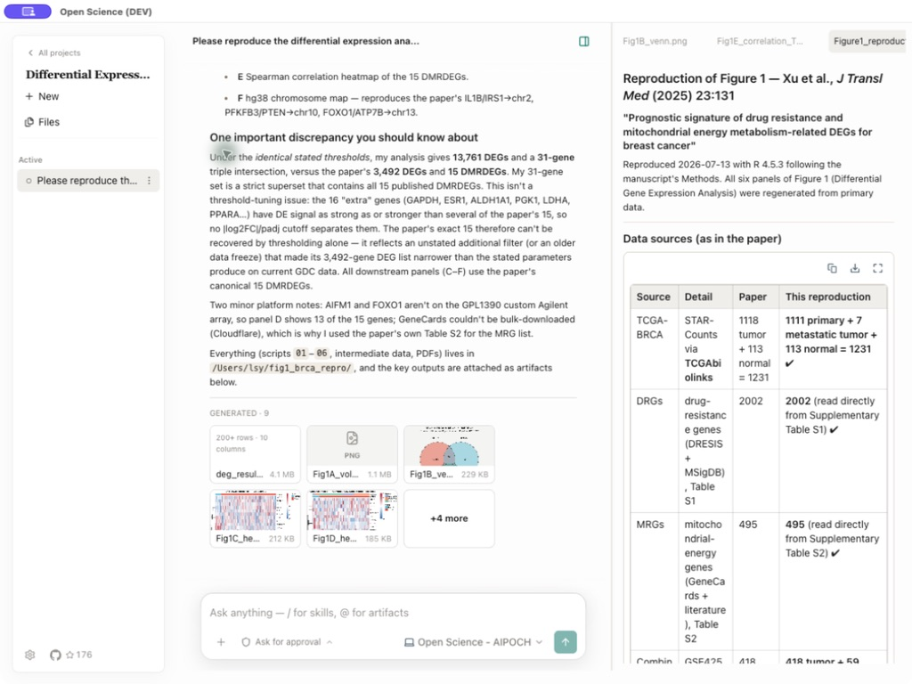
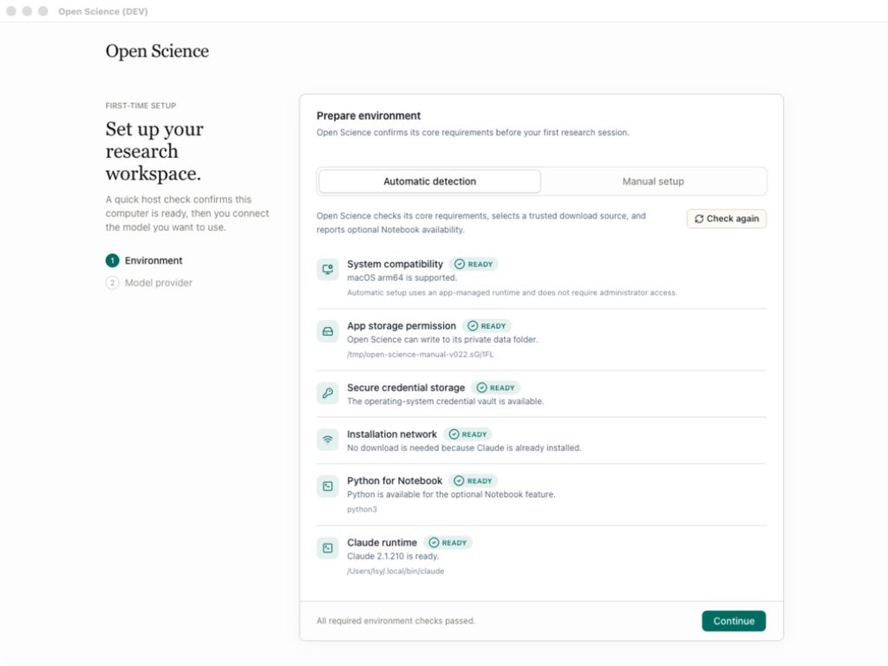
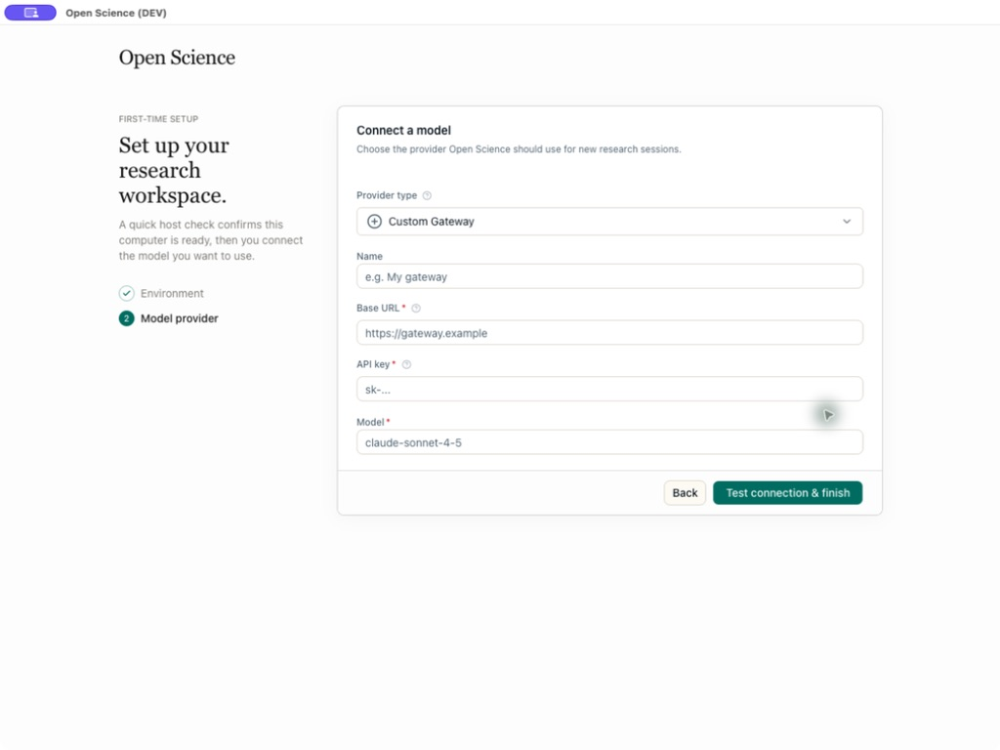
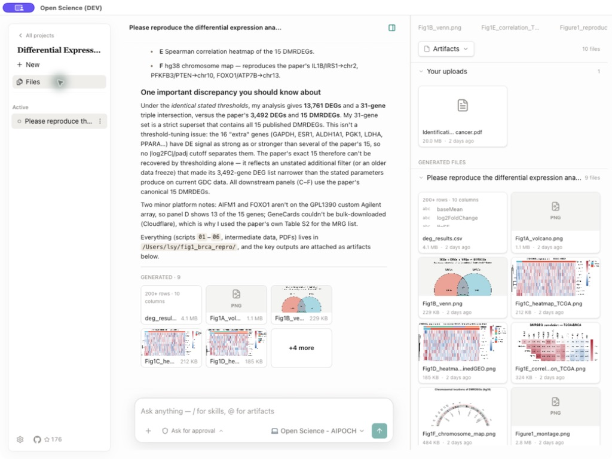
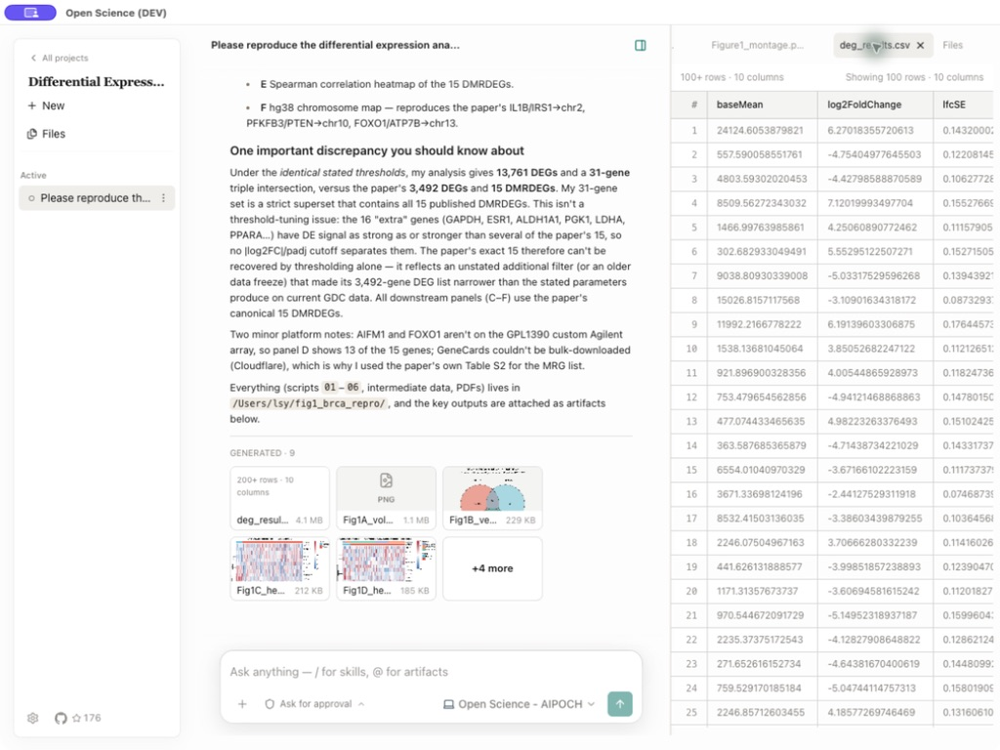
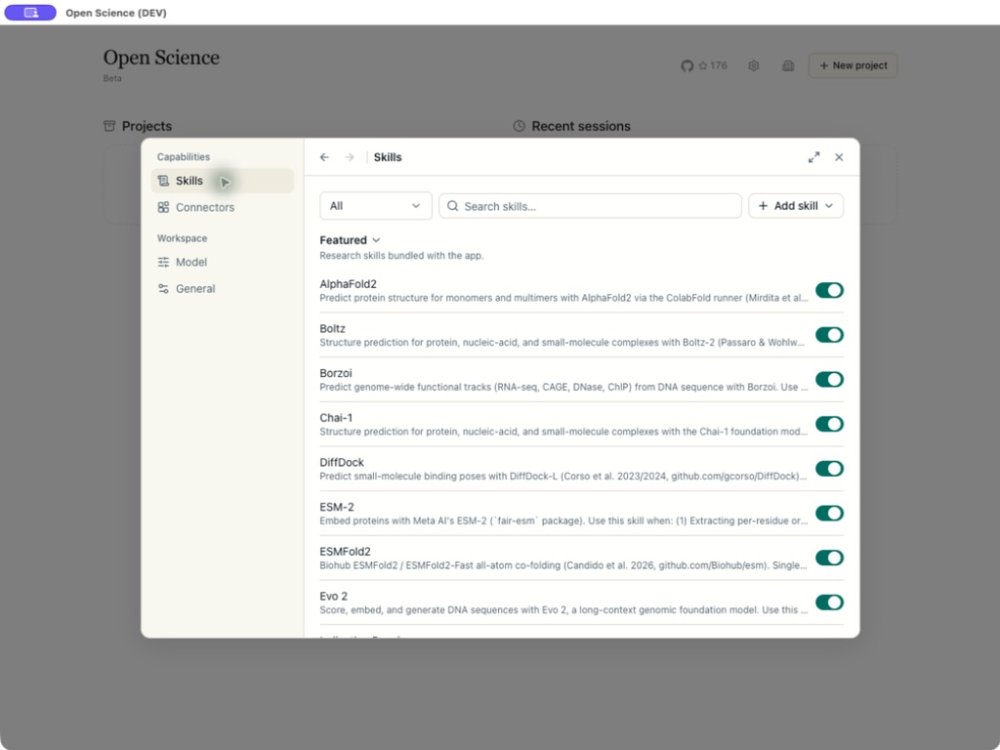
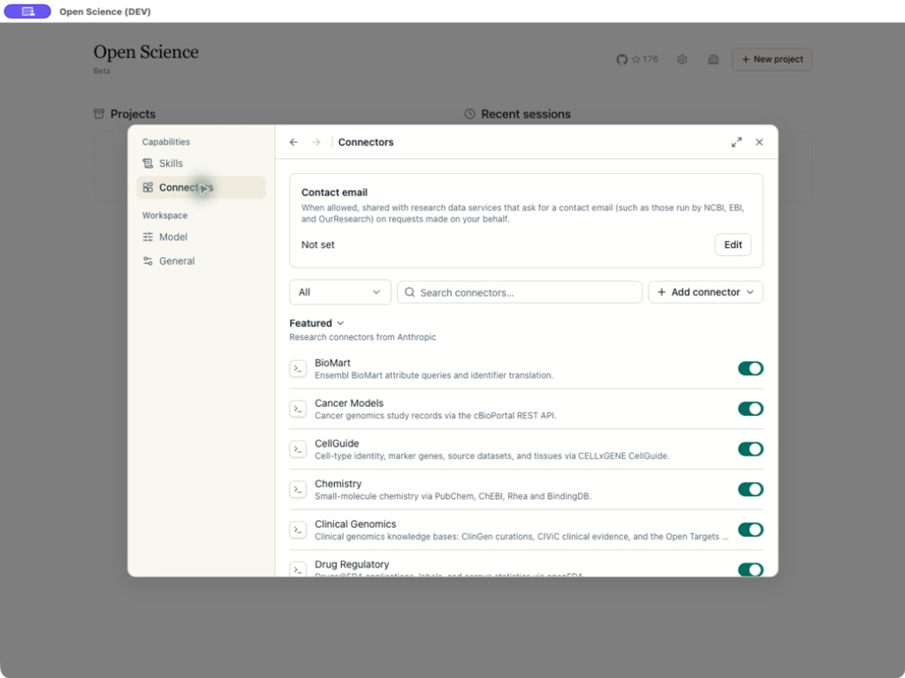
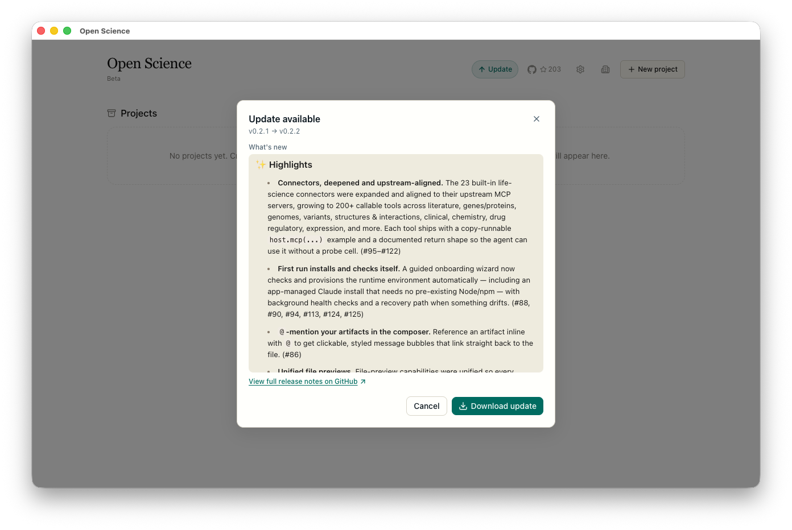

# Open Science

**A downloadable, open-source AI research workbench that turns natural-language tasks into traceable analysis, code, and artifacts.**

[](https://github.com/aipoch/open-science/releases/latest)
[](https://github.com/aipoch/open-science/releases/latest)
[](LICENSE)

[](https://discord.gg/85dKfuGM9)

Open Science is a local desktop application for researchers. Create a project, describe a task in plain language, and let the agent read files, run code, search the web, call scientific data connectors, and return reports, tables, figures, and an inspectable activity history in one workspace.

**The application is available now.** The current stable release is [v0.2.2](https://github.com/aipoch/open-science/releases/tag/v0.2.2), with installers for macOS, Windows, and Linux. The complete `plan → execute → produce → preview` workflow runs end to end today; the [Current Status](#current-status) section separates shipped functionality from the deeper reproducibility and multi-agent work still ahead.

<p align="center">
  
</p>

> **Science is not a privilege.** Open Science is built so researchers can inspect, run, extend, and self-host their research software without depending on one subscription, billing region, model vendor, or closed platform.

## Table of Contents

- [Quick Start](#quick-start)
- [Product Tour](#product-tour)
- [Frequently Asked Questions](#frequently-asked-questions)
- [Why Open Science](#why-open-science)
- [Vision](#vision)
- [Design Principles](#design-principles)
- [Current Features](#current-features)
- [Model Providers](#model-providers)
- [Data, Permissions, and Trust](#data-permissions-and-trust)
- [Current Status](#current-status)
- [Development & Packaging](#development--packaging)
- [Building From Source](#building-from-source)
- [Roadmap](#roadmap)
- [Relationship to the aipoch Ecosystem](#relationship-to-the-aipoch-ecosystem)
- [What This Is Not](#what-this-is-not)
- [Get Involved](#get-involved)
- [License](#license)
- [Star History](#star-history)

## Quick Start

### 1. Download the app

Open the [latest release](https://github.com/aipoch/open-science/releases/latest), expand **Assets**, and choose the installer for your computer:

| Your computer                       | Download                                                                             |
| ----------------------------------- | ------------------------------------------------------------------------------------ |
| macOS — Apple Silicon (M1 or newer) | `open-science-<version>-mac-arm64.dmg`                                               |
| macOS — Intel                       | `open-science-<version>-mac-x64.dmg`                                                 |
| Windows x64                         | `open-science-<version>-win-x64-setup.exe`                                           |
| Linux x64                           | `open-science-<version>-linux-x86_64.AppImage` or `open-science_<version>_amd64.deb` |

Each release includes `SHA256SUMS.txt` and build provenance. See [Verifying your download](SECURITY.md#verifying-your-download) before installation if you need to validate the package.

> macOS and Windows may show an unidentified-developer or unknown-publisher warning for current community builds. This does not mean the download is corrupted. See [Building From Source](#building-from-source) for the macOS Gatekeeper steps.

### 2. Complete first-time setup

The first launch has two guided steps:

1. **Prepare environment** checks compatibility, app storage, secure credential storage, network access, the Claude runtime, and optional Python Notebook support. If the runtime is missing, Open Science can install an app-managed copy without requiring Node.js, npm, or an administrator password.
2. **Model provider** connects and tests the model you want to use. Choose a built-in provider, an Anthropic-compatible custom gateway, or `Local Claude` to reuse an existing Claude Code login without entering an API Key.

<table>
  <tr>
    <td width="50%"></td>
    <td width="50%"></td>
  </tr>
  <tr>
    <td align="center"><sub>Automatic environment detection and managed runtime setup</sub></td>
    <td align="center"><sub>Provider, API Key, endpoint, and model validation</sub></td>
  </tr>
</table>

Python is optional unless you want the built-in Notebook kernel. Every required environment row must pass before `Continue` becomes available, and the model connection must pass before setup finishes.

### 3. Start a research project

1. Click **New project** and give the project a stable research name and optional description.
2. Open a session and describe the goal, input data, constraints, desired outputs, and how the result should be checked.
3. Attach source files, select a verified model, and choose an approval mode.
4. Send the task. Inspect the agent's tool activity, approve sensitive actions, and open generated artifacts in the preview panel.
5. Continue the work in later sessions. Use `@` to reference an existing project file and `/` to explicitly select an enabled skill.

Want to develop the app instead? Skip to [Building From Source](#building-from-source).

## Product Tour

### One workspace from task to artifacts

Projects keep related sessions, uploads, generated files, and preview state together. The conversation records the agent's answer and the commands, file reads, edits, searches, and connector calls that produced it. Generated reports, figures, and tables remain attached to the session and are also collected in the project file library.

<table>
  <tr>
    <td width="50%"></td>
    <td width="50%"></td>
  </tr>
  <tr>
    <td align="center"><sub>Uploads and generated files organized by project and session</sub></td>
    <td align="center"><sub>Native previews keep data and the research history side by side</sub></td>
  </tr>
</table>

Open Science previews CSV/TSV, FASTA, HTML, images, JSON, Markdown, PDB structures, PDF, source code, text, and Notebook history. Preview limits do not truncate the underlying file—the full artifact stays available to the agent and external tools.

### Scientific skills and data connectors

The current release includes 16 featured, file-based research skills. You can create personal skills, upload `SKILL.md`/ZIP/`.skill` packages, or preview and import compatible skills from GitHub. Enabled skills can be selected directly in the composer with `/`.

It also ships 23 life-science connectors exposing more than 200 callable tools across literature, genes and proteins, genomics, variants, structures, clinical research, expression, chemistry, drug regulation, and related resources. Built-in and custom connectors remain behind the permission system, with per-tool `Always allow`, `Ask each time`, and `Block` controls.

<table>
  <tr>
    <td width="50%"></td>
    <td width="50%"></td>
  </tr>
  <tr>
    <td align="center"><sub>Readable, reusable research skills</sub></td>
    <td align="center"><sub>Scientific databases exposed as permissioned agent tools</sub></td>
  </tr>
</table>

### Updates and diagnostics

Open Science checks for new releases, shows a concise version summary, links to the full GitHub release notes, and guides the user through download and installation. `Settings → General` also provides the installed version, a manual update check, local log location, and `Reveal`/`Open` diagnostics actions.

<p align="center">
  
</p>

## Frequently Asked Questions

**Q: What should I do the first time I open Open Science?**

A: Complete **Prepare environment** and **Model provider**. Fix required rows marked `Action needed`, use `Install missing runtime` if offered, click `Check again`, and then test a model connection.

**Q: What is an API Key, and where do I get one?**

A: An API Key is a secret credential issued by a model provider. Create or copy one from that provider's developer/API console. The provider may bill requests made with the key. Treat it like a password: never share it or commit it to a repository.

**Q: Do I need an API Key?**

A: Not if you choose `Local Claude` and already have a working Claude Code login on this computer. Built-in cloud providers and custom gateways require their own keys.

**Q: Why does the model connection test fail?**

A: Check the API Key for missing characters or spaces, verify the Base URL and region, use the provider's exact model ID, and confirm network access and account balance. For `Local Claude`, run `claude` in a terminal and complete login before testing again.

**Q: Why is `Continue` disabled during setup?**

A: At least one required environment check has not passed. Fix the row marked `Action needed`, return to automatic detection, and click `Check again`. Python is optional and only affects Notebook execution.

**Q: Does my research data stay on my computer?**

A: Projects, sessions, files, settings, and configured credentials are stored locally by default. Content needed for model requests, web searches, or connector calls may still be sent to the external service you selected, so review sensitive inputs and provider policies before running a task.

## Why Open Science

Research work is usually split across chat windows, notebooks, local scripts, scientific databases, file browsers, and reporting tools. Context is lost at every handoff, and the answer is often separated from the code and files that produced it.

Open Science brings those pieces into one inspectable desktop workspace:

- **Work that persists.** Projects, sessions, drafts, files, previews, and run history survive application restarts.
- **Execution, not just suggestions.** The agent can run commands and Python, edit files, search, call connectors, and generate artifacts with the user's approval.
- **Multiple model choices.** Use Claude, DeepSeek, GLM, MiniMax, an Anthropic-compatible gateway, or a local Claude login.
- **Local-first ownership.** The application and project state run on your computer; external calls happen through services you explicitly configure or approve.
- **Inspectability.** The source code, skills, connector definitions, tool activity, and generated files are available for review.
- **Extensibility.** Add skills and MCP connectors instead of waiting for a closed plugin roadmap.
- **No seat license.** Open Science is Apache-2.0 software. You pay only for the model or infrastructure you choose to use.

Open Science is an independent product built from scratch. It is not a proxy, unofficial client, or reskin of another AI research application.

## Vision

Our goal is to make the AI research workbench a piece of open infrastructure rather than a rented product surface. A student with a laptop, a lab using a regional model provider, and an institution running its own gateway should be able to use the same research workspace while keeping control of their models, tools, and data boundaries.

The long-term destination is a traceable loop connecting literature, data, computation, artifacts, review, and reusable scientific skills. The released desktop app is the working foundation for that direction, not a placeholder for a future concept.

## Design Principles

- **Open by default.** Source code, formats, connectors, and skills should remain inspectable and forkable.
- **Multi-provider without pretending every protocol is supported.** Several providers work today through Anthropic-compatible endpoints; native protocols are added only when implemented and tested.
- **Local-first and data-aware.** Keep project state local, surface external data flows, and make autonomy opt-in.
- **Human-in-the-loop.** File edits, commands, network access, and connector calls are governed by explicit approval profiles.
- **Durable research records.** Sessions, tool activity, files, and Notebook history should remain reviewable after the run ends.
- **Composable capabilities.** Skills, connectors, models, previews, and future compute backends should be replaceable parts rather than one black box.
- **Honest scientific boundaries.** Generated output does not replace expert judgment, statistical review, or validation against primary evidence.

## Current Features

The following capabilities are available in the current stable release unless noted otherwise:

| Area                         | What is available today                                                                                                                                                |
| ---------------------------- | ---------------------------------------------------------------------------------------------------------------------------------------------------------------------- |
| **Projects and sessions**    | Create, rename, and delete projects; maintain multiple sessions; restore recent work, drafts, conversation history, and preview state.                                 |
| **Agent workflow**           | Natural-language tasks, streamed responses, typed tool-activity cards, stop controls, approval pauses, and recovery of sessions interrupted by an application restart. |
| **Models**                   | Built-in Claude, DeepSeek, GLM, and MiniMax providers; custom Anthropic-compatible gateways; Local Claude; validated models selectable per session.                    |
| **Execution**                | A persistent Python Notebook kernel with durable code/output history and a user terminal shared with the agent.                                                        |
| **Inputs and artifacts**     | File attachments, project-level file library, generated artifact cards, `@` references to existing uploads/outputs, and read-only multi-tab previews.                  |
| **Preview formats**          | CSV/TSV, FASTA, HTML, common images, JSON, Markdown, PDB, PDF, source code, text, logs, configuration files, and Notebook history.                                     |
| **Skills**                   | 16 featured skills plus personal creation, package upload, GitHub preview/import, enable/disable controls, and explicit `/` selection in a session.                    |
| **Connectors**               | 23 built-in life-science connectors with 200+ tools, custom local/remote MCP connectors, contact metadata, and connector/tool-level permissions.                       |
| **Safety controls**          | `Ask for approval`, `Auto-approve edits`, and `Full access` conversation profiles, plus per-connector and per-tool policies.                                           |
| **Distribution and support** | Installers for macOS, Windows, and Linux; stable and nightly releases; guided update checks; local diagnostics and community links.                                    |

## Model Providers

| Provider type             | Authentication and endpoint                                              |
| ------------------------- | ------------------------------------------------------------------------ |
| **Claude**                | Anthropic API Key and official endpoint                                  |
| **DeepSeek**              | DeepSeek API Key and official Anthropic-compatible endpoint              |
| **GLM (Z.AI / BigModel)** | API Key with Global or China endpoint selection                          |
| **MiniMax**               | API Key with Global or China endpoint selection                          |
| **Custom Gateway**        | User-supplied Anthropic-compatible Base URL, API Key, and exact model ID |
| **Local Claude**          | Reuses the computer's Claude Code login; no API Key field                |

The released runtime is multi-provider, but all cloud providers currently need an Anthropic-compatible messages endpoint. A service that exposes only an OpenAI-compatible endpoint cannot be used directly yet. See the [Roadmap](ROADMAP.md) for native protocol work.

## Data, Permissions, and Trust

Open Science stores project data and settings on the local computer. API Keys are kept locally and use the operating system's secure credential storage when it is available. Logs are local and are not uploaded automatically.

External data flow is still possible and should be reviewed:

- Model requests send the prompt and necessary context to the selected model provider.
- Web searches and remote connectors send their displayed parameters to external services.
- Local connectors may execute trusted commands on the computer.
- Attachments, `@` references, logs, and generated reports may contain sensitive research data.

Choose the narrowest permission profile that fits the task:

| Mode                 | Behavior                                                                         | Recommended use                                           |
| -------------------- | -------------------------------------------------------------------------------- | --------------------------------------------------------- |
| `Ask for approval`   | Asks before edits, commands, network, and connector calls                        | New workflows, sensitive data, unfamiliar scripts         |
| `Auto-approve edits` | Automatically allows workspace edits; asks for commands, network, and connectors | Trusted file-editing work with controlled external access |
| `Full access`        | Automatically allows edits, commands, network, and connectors                    | Clearly scoped, fully trusted, unattended work            |

Review connector parameters and tool activity before approving them. Never include API Keys, access tokens, patient identifiers, unpublished data, or sensitive local paths in screenshots or public issue logs.

## Current Status

**Current stable release: [v0.2.2](https://github.com/aipoch/open-science/releases/tag/v0.2.2), published July 15, 2026.**

Open Science is a released **public-alpha product**. The desktop application, onboarding, multi-provider configuration, projects and sessions, agent runtime, Python Notebook, artifact storage, file previews, skills, connectors, permissions, diagnostics, updates, and cross-platform installers are available now.

Public alpha also means important boundaries remain:

- Artifact files are durable, but a complete provenance chain covering code, dependencies, environment, data versions, and conversation context is not finished.
- Python is the only built-in execution kernel; R and managed environments are planned.
- Remote HPC/cloud execution, specialist sub-agents, and a reviewer/verifier agent are not yet available.
- Native OpenAI and other non-Anthropic protocols are not yet wired into the model layer.
- The application assists execution and record-keeping; researchers remain responsible for methods, interpretation, privacy, and scientific validity.

See the [Capability Map](ROADMAP.md#capability-map) for a maintained shipped/partial/planned breakdown.

## Development & Packaging

Open Science is an Electron application built with React, TypeScript, Prisma/SQLite, and an ACP-based agent runtime.

Prerequisites for source development:

- Node.js LTS or newer with npm
- Git
- Python 3 only if you want Notebook execution

```bash
git clone https://github.com/aipoch/open-science.git
cd open-science
npm install
npm run dev
```

`npm install` automatically generates the Prisma client and installs Electron native dependencies. `npm run dev` builds the Electron main/preload bundles, starts the renderer, and opens the desktop app. Development data is isolated under `~/.open-science-project`.

Useful commands:

| Command               | Purpose                              |
| --------------------- | ------------------------------------ |
| `npm run dev`         | Start the development application    |
| `npm run lint`        | Run ESLint                           |
| `npm run typecheck`   | Type-check main and renderer code    |
| `npm test`            | Run the Vitest suite                 |
| `npm run build`       | Type-check and build the application |
| `npm run build:mac`   | Package macOS builds                 |
| `npm run build:win`   | Package Windows builds               |
| `npm run build:linux` | Package Linux builds                 |

Packaged output is written under `dist/`.

## Building From Source

### macOS Gatekeeper

Current community-distributed or self-built copies may not carry an Apple Developer ID trusted by your Mac. If macOS blocks the app:

1. In Finder, right-click **Open Science.app** and choose **Open**.
2. If it remains blocked, go to **System Settings → Privacy & Security** and choose **Open Anyway**.
3. For a copy you built or downloaded from this repository and have verified, clear quarantine once:

   ```bash
   xattr -dr com.apple.quarantine "/Applications/Open Science.app"
   ```

Only remove quarantine from a package whose source and checksum you trust. See [SECURITY.md](SECURITY.md) for release verification and vulnerability reporting.

### Windows SmartScreen

If Windows shows an unknown-publisher warning, verify the downloaded asset and checksum, choose **More info**, and then **Run anyway**. Do not bypass SmartScreen for packages obtained outside the official Releases page.

## Roadmap

The product roadmap is maintained in [ROADMAP.md](ROADMAP.md). Near-term priorities include:

1. Complete artifact provenance and versioning.
2. Add native model protocols beyond Anthropic-compatible endpoints.
3. Expand execution kernels and reproducible environment management.
4. Add remote compute, asynchronous jobs, and specialist sub-agents.
5. Build reviewer/verifier workflows and stronger security boundaries.
6. Grow local skills into a versioned, shareable public skills commons.

Roadmap items are directions, not claims about the current release. Shipped status is updated as implementation lands.

## Relationship to the aipoch Ecosystem

Open Science is developed by [aipoch](https://github.com/aipoch) as the desktop orchestration layer for open scientific AI workflows.

- [aipoch/medical-research-skills](https://github.com/aipoch/medical-research-skills) is a broader collection of file-based medical and scientific research skills. Compatible skills can be inspected and imported into Open Science from GitHub.
- Open Science supplies the project/session workspace, agent runtime, execution, artifacts, previews, permissions, and connectors that turn those instructions into an interactive workflow.

Skills and connectors can execute code or send data externally. Review their source, license, scripts, and network behavior before enabling them.

## What This Is Not

- **Not just a chat UI.** The product is organized around persistent projects, execution, files, artifacts, and reviewable tool activity.
- **Not an unofficial client for another product.** It is an independent implementation with its own codebase, data model, interface, and roadmap.
- **Not a replacement for scientific judgment.** Outputs still require domain review, statistical validation, and verification against primary sources.
- **Not a real-time multi-user editor.** The current application is designed around one researcher's local workspace.
- **Not yet a complete reproducibility platform.** Full provenance, environment snapshots, remote compute, and automated verification remain roadmap work.

## Get Involved

| Channel                                                                  | Use it for                                                              |
| ------------------------------------------------------------------------ | ----------------------------------------------------------------------- |
| [GitHub Issues](https://github.com/aipoch/open-science/issues)           | Bugs, reproducible failures, and concrete feature proposals             |
| [GitHub Discussions](https://github.com/aipoch/open-science/discussions) | Design questions, roadmap proposals, and longer technical conversations |
| [Discord](https://discord.gg/85dKfuGM9)                                  | Community help, contributor coordination, and informal discussion       |
| [X / @aipoch_ai](https://x.com/aipoch_ai)                                | Release announcements and build-in-public updates                       |

Before opening a public issue, remove API Keys, tokens, private file paths, unpublished data, patient identifiers, and other sensitive material from logs and screenshots. See [CONTRIBUTING.md](CONTRIBUTING.md) for the development workflow.

## License

Apache License 2.0 — see [LICENSE](LICENSE).

## Star History

<a href="https://www.star-history.com/?repos=aipoch%2Fopen-science&type=date&legend=top-left">
 <picture>
   <source media="(prefers-color-scheme: dark)" srcset="https://api.star-history.com/chart?repos=aipoch/open-science&type=date&theme=dark&legend=top-left&sealed_token=SfYmaFKVrSeoWXSFpM9v1yIMgQGuqcSgB3atEXCZ41bGZjk56hO-cJaQrD1sVpdyioihMw-HX-gxMQ3LsNaMPk8hP4sk1CzYoh-AtROEZeFB_5GestwN4xj2dlQSBuqa4nFUWabnN4YTg02U7tipvbF_YkahNnTz5m5W-GEn3xioDebss0lJJL8HrJfl" />
   <source media="(prefers-color-scheme: light)" srcset="https://api.star-history.com/chart?repos=aipoch/open-science&type=date&legend=top-left&sealed_token=SfYmaFKVrSeoWXSFpM9v1yIMgQGuqcSgB3atEXCZ41bGZjk56hO-cJaQrD1sVpdyioihMw-HX-gxMQ3LsNaMPk8hP4sk1CzYoh-AtROEZeFB_5GestwN4xj2dlQSBuqa4nFUWabnN4YTg02U7tipvbF_YkahNnTz5m5W-GEn3xioDebss0lJJL8HrJfl" />
   
 </picture>
</a>
