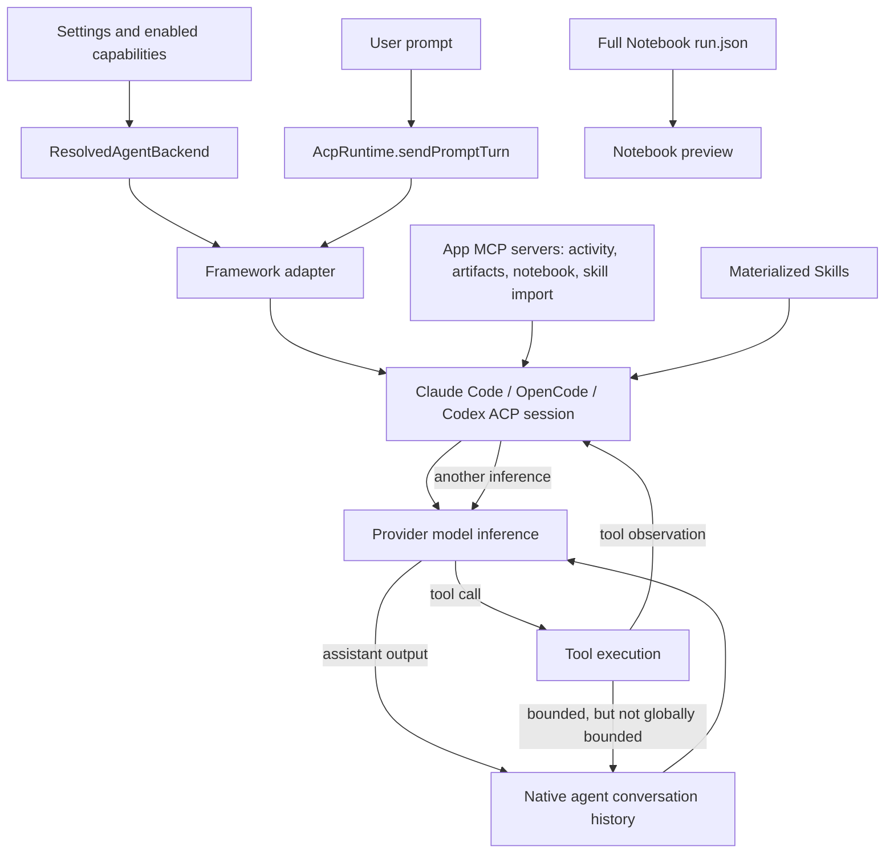
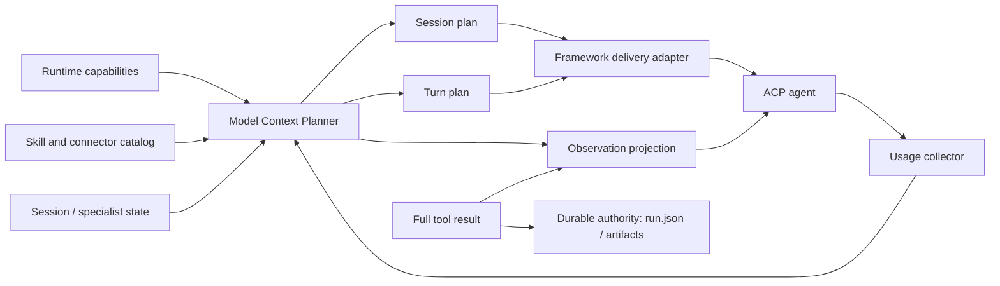
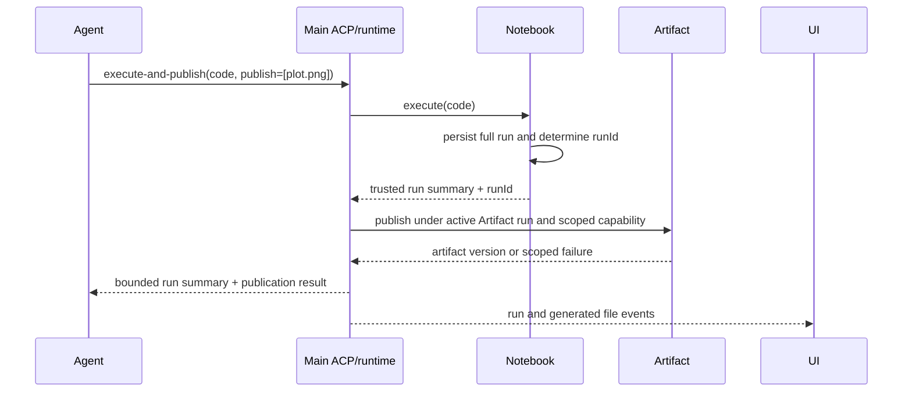
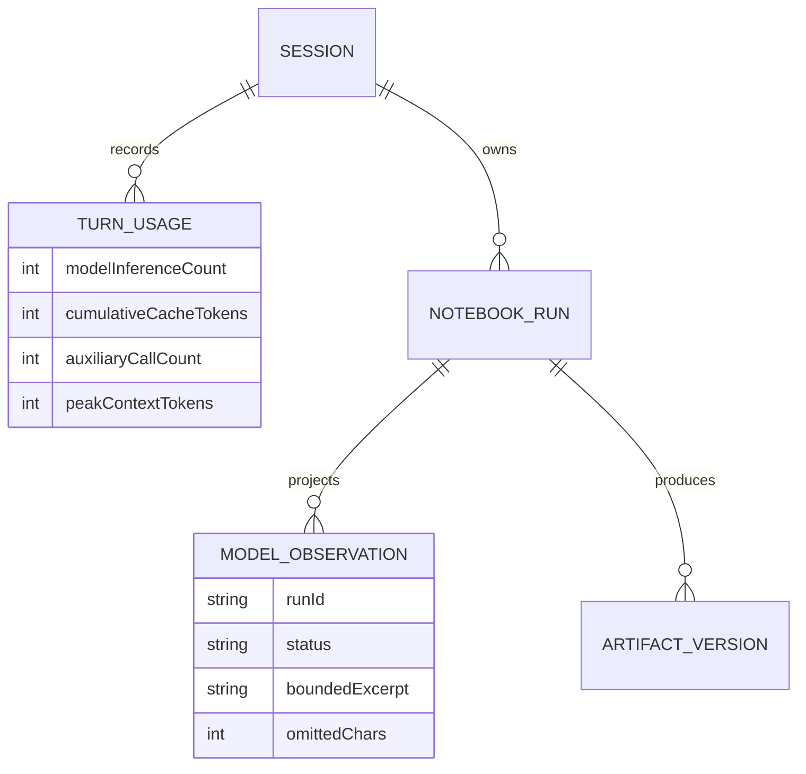

# ACP agent context and token optimization design

- Date: 2026-08-01
- Status: Draft for review
- Scope: Claude Code, OpenCode, Codex Responses, Codex bridge, app-owned MCP tools, Skills, conversation history, and Notebook results
- Change type: Architecture and model-facing interface design; no implementation is included in this change

## 1. Executive summary

The Usage popover reports cumulative token traffic across every model inference in one user turn. It
does **not** report one 184k or 227k context window. The supplied captures show four model inferences
per user turn, with an average of 40,064 and 52,128 cache-category tokens per inference respectively.
The second turn therefore reported 12,064 more cache-category tokens per inference than the first, a
30.1% increase.
That delta is consistent with prior messages, tool calls, Notebook results, and generated-file handling
remaining in the conversation.

The current implementation already makes connector details progressive: the baseline contains only
connector calling conventions and native Skill discovery exposes names and descriptions, while a full
`mcp-*` Skill enters context only when selected. The main opportunities are elsewhere:

1. **Reduce model inference count.** A control-only `begin_activity_group` tool can add a complete model
   round trip before useful work. Notebook execution and `write_artifact_file` are also separate tool
   loops even when one operation could execute and publish a file atomically. Removing one inference
   saves the entire static prefix and retained history once, which is often more valuable than trimming
   hundreds of prompt tokens.
2. **Stop repeating stable guidance.** Claude carries app guidance once in session metadata, but
   OpenCode and Codex currently prepend the complete app guidance to every user turn. Those copies
   become ordinary history and accumulate.
3. **Make app tool declarations deep and demand-driven.** With all app facilities enabled, app-owned
   MCP schemas alone are approximately 4.6k-4.9k tokens per inference; Notebook contributes
   3.5k-3.8k of that, plus another 1.6k-1.7k of Notebook guidance. A small capability gateway and
   on-demand operation documents can replace the fixed long-tail schema catalog.
4. **Bound the entire Notebook observation, not each field independently.** The current 8,000-character
   per-field limit is necessary but not sufficient. A spike produced an 834,886-character agent-facing
   result after current truncation because an `outputs[]` array can contain many independently capped
   entries. A state result containing the same run in `runs` and `recentRuns` serialized to 1,669,799
   characters.
5. **Keep Skill discovery metadata-only and make loaded documents smaller.** The 24 bundled connector
   Skills total about 102k tokens if all full documents are loaded. One selected connector document is
   currently 1.4k-8.1k tokens. The catalog should remain name + description only, and large connector
   documents should be split or queried at the operation level.
6. **Expose attributable cost.** The product should distinguish cumulative token traffic, current
   context size, model inference count, selector overhead, and app-owned versus agent-owned context.

The recommended seam is an app-owned **Model Context Planner**. Framework adapters remain responsible
for transport, while the planner owns section lifecycle, budgets, deduplication, observation projection,
and diagnostics. This creates one deep module rather than four independent sets of trimming rules.

## 2. Change disclosure

This proposal intentionally calls out changes that would be user- or architecture-visible before any
implementation begins.

| Area | Proposed change | User-visible effect |
| --- | --- | --- |
| Architecture | Add a Model Context Planner between runtime capabilities and framework adapters | No new user step; framework behavior becomes consistent |
| Architecture | Replace long-tail app MCP declarations with a compact capability gateway plus on-demand operation documents | Tool activity names remain human-readable; internal model-facing tool names may change |
| Architecture | Infer activity groups in the host instead of requiring a control-only model tool call | Activity titles may initially be derived from the first real tool rather than authored separately by the model |
| Architecture | Add atomic execute-and-publish support for Notebook outputs | A plot task can appear as one combined execution step instead of Notebook + file-write steps |
| Data model | Add optional per-turn inference and overhead fields to `AcpTurnTokenUsage` | Existing session files remain readable; no Prisma migration is required |
| Data relationship | Keep `NotebookRun` as full-output authority and retain only bounded excerpts plus a `runId` reference in model context | Notebook preview remains full fidelity; the agent may request a range or field when more detail is needed |
| User interface | Clarify that cache tokens are cumulative and show average cached input per inference | Usage numbers become easier to interpret; no workflow change |
| User interaction | Optional diagnostics can show context categories and hidden selector traffic | Off by default; no prompt content is logged |

Phase 1 can be implemented without a persistent data migration. New usage fields are optional and can
be sanitized exactly like the current optional `turnCount`. A later durable observation ledger would be
a separate schema decision and is not required for the initial optimization.

## 3. Evidence and terminology

### 3.1 Supplied captures

| Capture | Model inferences | Input | Cache | Output | Total traffic | Average cached tokens per inference |
| --- | ---: | ---: | ---: | ---: | ---: | ---: |
| Initial plot | 4 | 22,669 | 160,256 | 1,303 | 184,228 | 40,064 |
| Follow-up `ggplot2` plot | 4 | 17,679 | 208,512 | 1,084 | 227,275 | 52,128 |

Important interpretations:

- `Cache` is cumulative cache traffic across four model inferences, not four unique copies stored in
  the conversation.
- `Total` is useful for provider traffic or billing analysis but must not be labeled as live context
  size.
- The 48,256 increase in cumulative cache traffic on the follow-up is exactly 12,064 per inference.
  The stable agent/system prefix should be similar, so the increase points to dynamic retained context.
- The displayed total does not necessarily include auxiliary calls made outside the ACP turn. In
  particular, Codex bridge and compatibility modes can issue a separate Skill-selection request whose
  usage is currently discarded.

### 3.2 Terms used in this document

- **User turn**: one submitted user message and all work until the agent stops.
- **Model inference**: one provider model request inside that user turn. A tool loop usually causes
  another inference after each tool result.
- **Current context**: the input visible to one model inference.
- **Token traffic**: the sum of uncached input, cached input reads/writes, and output over one or more
  inferences.
- **Stable section**: content expected to remain byte-identical for a session or backend generation.
- **Turn section**: content specific to one user turn.
- **Observation**: a tool result or external fact returned to the model.
- **Reference**: a stable identifier such as `runId` that lets the model retrieve more of an observation
  without retaining its full payload in every later inference.

### 3.3 Read-only spikes

Temporary Vitest files were created, run, and deleted; they are not part of this change.

| Measurement | Claude tokenizer | OpenCode tokenizer | Codex tokenizer |
| --- | ---: | ---: | ---: |
| App MCP schemas, all four app servers | 4,893 | 4,571 | 4,645 |
| Notebook MCP schema only | 3,770 | 3,523 | 3,579 |
| Notebook system guidance | 1,736 | 1,627 | 1,628 |
| Connector baseline conventions | 411 | 382 | 386 |

Additional findings:

- The 24 fully rendered bundled connector Skills total approximately 102,106 Anthropic tokens.
- Individual connector Skills range from about 1,402 to 8,148 tokens; the median is about 4,047.
- Current Notebook projection allowed a synthetic 100-output run to retain 834,886 serialized
  characters after per-field clipping.
- A state-shaped response with that run in both `runs` and `recentRuns` retained 1,669,799 characters.

These measurements cover app-owned text. The reconciled `other` category in `ContextUsageTracker`
contains framework system prompts, framework tool declarations, serialization wrappers, and tokenizer
drift. A live benchmark is still required before assigning exact percentages to those sources.

## 4. Current architecture and context flow



The app normally sends only the new user prompt over ACP. The framework's native agent owns the
conversation history and reconstructs the full provider request. The app replays a bounded 12,000-
character text transcript only after an unresumable restart, framework switch, or context reset; tool
effects are deliberately omitted from that fallback preamble.

### 4.1 Static context

Static or mostly static context includes:

- the framework's own system prompt and built-in tool declarations;
- app system guidance for continuity, large files, activity grouping, artifacts, Notebook, Skill
  import, connector conventions, and optional specialist identity;
- app MCP tool schemas;
- the native Skill catalog, normally names and descriptions rather than full bodies;
- project, working-directory, permission, model, and environment metadata added by the framework.

Even when prompt caching works perfectly, every model inference still reads this prefix and the Usage
view accumulates those reads.

### 4.2 Dynamic context

Dynamic context includes:

- user and assistant messages;
- tool calls and their arguments;
- Notebook summaries and control-plane output;
- loaded full Skill documents;
- attachment previews and image inputs;
- compaction summaries and framework-specific state.

Dynamic content is the likely source of the 12,064-token per-inference increase between the supplied
captures.

### 4.3 Multiplicity

For a context of size `C`, a user turn with `N` model inferences reads approximately `N * C` context
tokens before accounting for cache misses and incremental suffixes. Therefore:

```text
turn traffic ≈ inference count × retained context + new suffixes + output
```

This makes control-only tool loops a first-class performance problem. Saving 500 static tokens across
four inferences saves about 2,000 token reads. Removing one inference from a 50k context saves about
50,000 token reads.

## 5. Framework-by-framework assessment

### 5.1 Claude Code

Current behavior:

- `claude_code` is selected as both the system-prompt preset and the complete built-in tool preset.
- App guidance is appended once through session metadata. Only the short activity reminder is repeated
  in each user prompt.
- Skills use Claude's native progressive loader. The baseline catalog is metadata; full `SKILL.md`
  enters context when loaded. Specialists can pass a native Skill whitelist.
- All enabled app MCP schemas are attached at session creation and remain visible for every inference.
- The SDK exposes `tools: string[]`, `disallowedTools`, and `excludeDynamicSections`, but the app
  currently selects the complete built-in tool set and does not request a cache-stable system split.

Optimization assessment:

| Candidate | Expected value | Risk / validation |
| --- | --- | --- |
| Remove model-driven activity declaration | Very high when it currently adds an inference | Verify visible grouping remains understandable |
| Atomic Notebook execute-and-publish | Very high for generated files | Verify artifact provenance and approval semantics |
| Narrow built-in tools by session capability | Potentially high static reduction | Must benchmark task success; reconnect/resume may be required to add tools |
| Replace long-tail app MCP schemas with a gateway | High app-owned reduction | Validate tool-choice accuracy and permissions |
| Set `excludeDynamicSections: true` | Improves cache stability across sessions | Does not reduce unique context size; working-directory context moves to a user message |
| Keep Skill catalog metadata-only and split large leaf docs | Medium, grows with loaded Skills | Verify native Skill discovery after splitting |

Claude is the best initial target for an activity-group and execute-and-publish experiment because its
reported `num_turns` exposes the exact inference-count change.

### 5.2 OpenCode

Current behavior:

- Connector conventions are written once to OpenCode's generated `instructions` configuration.
- The remaining app system guidance is prepended in full to every user prompt because OpenCode has no
  ACP session system-prompt preset in the current adapter.
- Each repeated prefix becomes normal conversation history, so it is both paid on the current turn and
  retained on later turns.
- Skills are materialized into the isolated OpenCode config and loaded through its native Skill tool.
- All app MCP schemas are attached at session creation.
- Whole-turn usage is reconstructed by comparing OpenCode assistant message snapshots before and after
  the prompt.

Optimization assessment:

| Candidate | Expected value | Risk / validation |
| --- | --- | --- |
| Move stable app guidance to OpenCode `instructions` | High and low complexity | Confirm instructions load once and remain cache-stable on the pinned OpenCode version |
| Leave only turn-specific specialist/activity text in prompt prefix | High over multi-turn sessions | Ensure specialist switching updates the intended session only |
| Activity inference and atomic publish changes | Very high | Use message-count delta as evidence |
| Compact app capability gateway | High | Verify OpenCode stdio MCP and generic argument behavior |
| Framework-native history compaction earlier than 90% | Medium for long sessions | Avoid quality loss on short sessions |

OpenCode should not receive a new copy of the same 1k-3k app guidance on every user turn. This is the
clearest adapter-specific defect in the current lifecycle.

### 5.3 Codex Responses

This category covers Codex talking directly to OpenAI Responses or a protocol-compatible Responses
provider without Chat translation.

Current behavior:

- App guidance is prepended in full to every user prompt and becomes retained history.
- Codex owns its base instructions and built-in tools. A small app-owned base instruction file is used
  only when Open Science must synthesize custom model metadata; trusted bundled models use Codex's
  native catalog.
- App MCP schemas are attached at session creation.
- Skills are materialized in the isolated Codex home and native Skill guidance is retained.
- Official OpenAI and subscription paths remain direct. Some non-official Responses providers use a
  local compatibility proxy for namespaced tool flattening.
- ACP normally exposes only latest-request usage; the managed adapter patch aggregates the whole user
  turn and model inference count.

Optimization assessment:

| Candidate | Expected value | Risk / validation |
| --- | --- | --- |
| Add a version-gated persistent app-instruction channel | High over multi-turn sessions | Codex config semantics differ by native version and provider path |
| Keep only specialist identity and true turn reminders in prompt prefix | High | Switching must not leak identity across sessions sharing a process |
| Activity inference and atomic publish changes | Very high | Validate with managed model-turn counter |
| App capability gateway | High | Codex namespace/freeform support differs across provider paths |
| Prefer direct Responses when supported | High versus bridge fallback | Provider capability detection must remain conservative |

Persistent instruction support should be represented as a framework capability, not as
`if (framework.id === 'codex')` branches in `AcpRuntime`.

### 5.4 Codex bridge

This category covers the Codex agent using the local Responses-to-Chat bridge for a provider that only
supports Chat Completions.

Current behavior adds all Codex costs above plus:

- Responses instructions and developer items are converted to Chat system messages and merged.
- Namespaced tools are flattened to Chat function names.
- `previous_response_id` is deliberately unsupported, so the bridge cannot rely on provider-side
  Responses state; Codex sends the usable history on each request.
- When no Skill was explicitly selected, the app can send a separate provider request containing up to
  128 Skill names/descriptions and a `select_skills` function. The chosen full Skill paths are then
  attached to the ACP prompt.
- The selector request's usage and latency are not included in the displayed ACP turn usage.
- Provider prompt-cache behavior is heterogeneous and cannot be assumed.

Optimization assessment:

| Candidate | Expected value | Risk / validation |
| --- | --- | --- |
| Count selector usage as auxiliary turn traffic | High observability value | Providers expose different usage shapes |
| Add a local lexical negative gate before remote selection | Avoids a hidden model call for obviously unrelated prompts | Synonym-blind false negatives; must fall back for ambiguous domain requests |
| Cache selector decisions by normalized prompt intent + catalog hash | Medium | Never reuse across materially different prompts or catalog revisions |
| Prefer explicit user-selected Skills and skip selector | Already safe and deterministic | No change needed |
| Split large selected connector Skills | High after selection | More catalog entries can itself increase metadata size |
| Trigger earlier compaction on full-replay bridges | Medium to high in long sessions | Requires quality benchmark and provider-specific thresholds |

Bridge mode should be presented internally as a compatibility path with a larger cost surface, not as
behavior identical to native Responses.

## 6. Root causes and priorities

| Priority | Root cause | Why it matters |
| ---: | --- | --- |
| P0 | Model-driven activity metadata can create a control-only inference | One inference can add another 40k-52k cache-category tokens in the supplied scenario |
| P0 | Notebook execution and artifact publication require separate tool loops | Common chart/export tasks pay another complete inference |
| P0 | Notebook projection has field caps but no global budget | One result can still exceed 800k characters and then persist in history |
| P1 | OpenCode and Codex repeat stable app guidance every user turn | Copies accumulate linearly in ordinary conversation history |
| P1 | App MCP declarations are session-global | About 4.6k-4.9k app-owned tokens are read on every inference even in chat-only turns |
| P1 | Usage UI shows cumulative cache without per-inference interpretation | A healthy cache hit can look like a single oversized context |
| P2 | Loaded connector Skills are coarse-grained | One relevant method can load 1.4k-8.1k tokens |
| P2 | Codex bridge selector is an unreported extra model call | Real token traffic and latency exceed the visible usage |
| P2 | Framework-owned system/tool residual is opaque | App changes cannot be prioritized against the true largest sections |

## 7. Design goals and non-goals

### Goals

- Reduce cumulative cache/input traffic for the supplied two-turn chart workflow by at least 30% on
  every framework where activity and publication loops can be combined, without reducing task success.
- Reduce attributable app-owned stable context by at least 50% in a chat-only turn.
- Keep a default Notebook observation below 4,000 estimated tokens in total, regardless of output count
  or field count.
- Keep baseline Skill/connector discovery to name, description, revision/hash, and location only.
- Load a full Skill or operation schema only when explicitly selected or confidently required.
- Preserve full Notebook output and provenance outside model context.
- Measure model inferences and every auxiliary provider call without logging prompt or result content.
- Keep all four frameworks behind one planning interface and framework-specific delivery adapters.

### Non-goals

- Treat cache reads as inherently wasteful. Cached input can be much cheaper than uncached input; the
  objective is to remove unnecessary context and inferences, not to suppress useful caching.
- Replace native agent compaction or history management in the first phase.
- Persist full provider request bodies for diagnostics.
- Introduce embeddings, a local model, or a new remote routing provider in the first phase.
- Dynamically mutate MCP server lists unless all pinned framework adapters prove that behavior reliable.
- Remove exact Notebook output from `run.json` or the renderer preview.

## 8. Proposed architecture

### 8.1 Model Context Planner seam



The planner is a deep module: callers provide capabilities, lifecycle stage, and facts; the planner
hides tokenization, section hashing, per-framework delivery policy, budgets, and truncation strategy.
Framework adapters remain adapters at the delivery seam rather than owning independent content policy.

Illustrative interface:

```ts
type ContextPlanRequest =
  | { stage: 'session'; framework: FrameworkContextCapabilities; capabilities: CapabilitySet }
  | { stage: 'turn'; sessionId: string; prompt: PromptFacts; specialist?: SpecialistFacts }
  | { stage: 'observation'; sessionId: string; observation: ContextObservation }
  | { stage: 'replay'; sessionId: string; messages: ReplayMessage[] }

type ContextPlan = {
  sections: ContextSection[]
  estimatedTokens: number
  omitted: ContextOmission[]
}

interface ModelContextPlanner {
  plan(request: ContextPlanRequest): Promise<ContextPlan>
}
```

The union keeps one external interface while allowing stage-specific internal seams. Tests use this
same interface and assert observable plans, not private heuristics.

### 8.2 Section lifecycle

```ts
type ContextSection = {
  id: string
  revision: string
  scope: 'backend' | 'session' | 'turn' | 'observation'
  priority: 'required' | 'high' | 'normal' | 'optional'
  delivery: 'persistent-instruction' | 'turn-prefix' | 'tool-declaration' | 'tool-result'
  content: string
  estimatedTokens: number
  contentHash: string
}
```

Rules:

1. A stable section has a stable `id`, `revision`, and hash.
2. A section is emitted once at the longest safe scope supported by the framework.
3. Turn prefixes contain only facts that actually changed or reminders proven necessary.
4. No secret, prompt text, or tool output is stored in diagnostics; IDs, hashes, lengths, and token
   estimates are sufficient.
5. If a framework lacks a persistent channel, the adapter emits a compact reference/reminder rather
   than the full stable body on every turn whenever the framework can load it from config.

### 8.3 Framework context capabilities

```ts
type FrameworkContextCapabilities = {
  persistentInstructions: 'session-meta' | 'config-file' | 'managed-patch' | 'none'
  mutableToolCatalog: boolean
  nativeSkills: boolean
  nativeCompaction: boolean
  reportsInferenceCount: boolean
  reportsCacheBreakdown: boolean
  requiresFullHistoryReplay: boolean
}
```

Capabilities are resolved from the pinned adapter/native version. This prevents an optimization for one
Codex or OpenCode version from silently applying to an incompatible version.

### 8.4 Context tiers

| Tier | Contents | Default lifecycle |
| --- | --- | --- |
| 0: invariants | Safety, continuity, permission facts | Persistent, short |
| 1: capability index | Capability/Skill name, one-line description, revision | Persistent metadata only |
| 2: selected instructions | Exact Skill or operation instructions | On demand for the current task |
| 3: observations | Bounded head/tail, status, counts, file changes, stable reference | One tool result, compactable |
| 4: durable detail | Full run output, large datasets, artifacts | Never inline by default; retrieve by reference |

## 9. Proposed changes

### 9.1 Remove control-only activity model turns

Current behavior asks the model to call `begin_activity_group` before real work. The host should instead
open a group when it receives the first visible tool call after an assistant/user boundary.

Proposed grouping algorithm:

1. Start a group on the first real tool call.
2. Use a deterministic title from the tool's existing title and operation metadata.
3. Keep consecutive tool calls in the group until assistant prose, an explicit plan boundary, a long
   wait, or a materially different tool category.
4. Allow a real tool call to carry an optional `activityTitle` in app-owned gateway metadata, so the
   model can improve the title without a separate tool call.

Remove the activity MCP schema, system append, and per-turn reminder after the host-derived UI passes
visual and accessibility tests.

Expected impact: one fewer model inference per coherent tool group when the framework currently emits
the activity declaration alone.

### 9.2 Atomic Notebook execute-and-publish

Extend the Notebook execution request with an optional publication declaration:

```ts
type PublishOutputRequest = {
  path: string
  filename?: string
  mimeType?: string
}

type NotebookExecuteRequest = ExistingNotebookExecuteRequest & {
  publish?: PublishOutputRequest[]
  activityTitle?: string
}
```

`publish` is a model-facing request to the main ACP/runtime orchestration layer. It is not authority for
the Notebook MCP server to write an Artifact directly.

Execution flow:



The main ACP/runtime layer remains the Artifact owner and coordinator. It already owns the active
Artifact run, app session/project/branch provenance, current-run handoff, and scoped RPC capability. The
Notebook run remains the producer authority, but only the runtime may translate the trusted execution
result into a publication request. Before publication it must apply the existing Artifact permission
path, validate the requested source against the session Notebook data root, verify that the returned
`runId` produced or last modified the file, and bind the Artifact version to the active Artifact run.

Publication occurs only after a successful run and uses the exact trusted `runId`; partial failure
reports execution success and publication failure separately and still seals/revokes the active
Artifact run through the existing lifecycle. A future implementation may issue a narrower one-shot
capability to an internal publisher, but it must be scoped to the project, app session, Artifact run,
Notebook session, allowed publication method, and validated source path. Existing
`write_artifact_file` remains for non-Notebook sources and ad hoc later publication.

Expected impact: common chart/report/export workflows lose one full tool loop and one model inference.

### 9.3 Globally bounded Notebook observations

Replace independent field caps with a total observation budget. The projector should preserve, in
order:

1. `runId`, status, language/runtime, timestamps, and `cwdAfter`;
2. error type plus traceback head and tail for failed runs;
3. stdout/stderr head and tail with total character and line counts;
4. output MIME/type/count summaries;
5. created/changed working-file metadata;
6. artifact references;
7. a retrieval hint for omitted fields.

Default budget: 4,000 estimated tokens for an execution result and 2,000 for a state query. A hard
serialized-byte ceiling protects tokenizer failure cases. Budgeting is aggregate across nested arrays,
not per element.

Add a narrow retrieval operation:

```ts
read_notebook_run({
  runId,
  field: 'stdout' | 'stderr' | 'traceback' | 'outputs' | 'workingFiles',
  offset?,
  limit?
})
```

The retrieval result is also globally bounded. For analysis-sized data, instructions continue to direct
the agent to `handoff` files and Notebook computation instead of repeated model-context reads.

### 9.4 Persistent stable guidance

- **Claude Code:** keep the current session metadata append, but separate stable instructions from the
  short turn reminder. Evaluate `excludeDynamicSections` for cross-session cache stability.
- **OpenCode:** place all stable app guidance in the generated `instructions` file, not only connector
  conventions. Keep specialist identity and genuinely turn-specific facts in the prompt prefix.
- **Codex:** introduce a version-gated managed persistent instruction channel. Use config/model
  instructions only when their scope is isolated to the backend generation. Fall back to a compact
  turn prefix when the pinned version cannot guarantee that scope.
- **Codex bridge:** use the same Codex persistent channel before Chat translation; ensure system-message
  merging preserves a stable prefix order.

The planner records section hashes so tests can prove that a stable section is not copied into the
second user turn.

### 9.5 Compact app capability gateway

Dynamic MCP `tools/list_changed` behavior is not portable across the pinned adapters, so the design
must not depend on it. Instead, expose a small stable gateway and keep exact operation contracts in
on-demand Skills/resources.

Illustrative model-facing interface:

```ts
open_science({
  capability: 'notebook' | 'artifacts' | 'skill-import',
  operation: string,
  args: Record<string, unknown>,
  activityTitle?: string
})
```

The gateway implementation performs exact internal schema validation, permission checks, typed routing,
and UI projection. The model first sees only capability names and one-line descriptions. When it selects
a capability, it loads the operation document containing exact schemas and examples.

The gateway tool name is never the permission identity. `capability`, `operation`, and `args` are
untrusted model input. Before asking the permission broker, the main process resolves the tuple through
an immutable host-owned operation registry:

```ts
type ContextOperationDescriptor = {
  capability: string
  operation: string
  schema: JsonSchema
  permissionIdentity: {
    family: string
    operation: string
    effect: 'read' | 'execute' | 'write' | 'import'
  }
  execute(args: unknown, trustedContext: TrustedOperationContext): Promise<unknown>
}
```

An unknown tuple fails closed. The broker and approval UI receive the resolved operation identity and
validated presentation, never only `open_science`. Remembered grants remain keyed to the same
operation/family semantics as the current typed tool, so approval for a Notebook read cannot authorize
execution, Artifact publication, or Skill import. Operations with meaningfully different side effects
or approval presentation remain separate typed tools instead of being forced behind the gateway. The
gateway is a declaration-compression adapter, not an authorization-compression mechanism.

To protect model accuracy, use a hybrid rollout:

- retain one or two strongly typed hot-path tools such as `notebook_execute` during the experiment;
- move administration and rare operations behind the gateway first;
- compare success, retries, malformed arguments, and token traffic;
- move the hot path only if the gateway is not worse.

This is a real seam only because there are multiple adapters (native typed tools and the gateway) used
for production comparison and tests.

### 9.6 Skill and connector progressive disclosure

Keep the baseline catalog limited to:

```ts
type SkillDescriptor = {
  name: string
  description: string
  revision: string
  source: 'featured' | 'personal' | 'connector'
}
```

Do not include full `SKILL.md`, tool schemas, examples, or return shapes in baseline context.

For large connector Skills:

1. Keep a short connector index with use cases and operation names.
2. Move exact schema/returns/examples to operation-level documents or a bounded `describe` call.
3. Load at most the chosen operation family, not every tool in the connector.
4. Replace loaded content by stable section ID when a more specific document supersedes an index; do
   not retain both indefinitely when the framework permits replacement.

For Codex bridge selection:

- always honor explicit user-selected Skills without a selector call;
- run a cheap local negative gate for prompts with no scientific/tool intent;
- use the remote selector only for ambiguous candidates;
- report selector input/cache/output and latency as auxiliary usage;
- derive the selector candidate set only after applying the current session's enabled Skills and
  effective specialist allowlist;
- key any selector cache by a keyed normalized-intent digest, catalog revision hash, provider/model,
  policy version, opaque session ID, backend generation ID, and effective allowlist revision or digest;
- store only selected Skill names and revisions, then re-resolve and revalidate every cached selection
  against the current effective allowlist immediately before attaching Skill inputs. A missing Skill,
  revision mismatch, or disallowed selection invalidates the entry and fails closed to a fresh
  selection rather than attaching it;
- clear session entries when the session ends and naturally invalidate them when the backend,
  specialist, allowlist, catalog, provider/model, or selection policy revision changes.

The local gate must favor false positives over false negatives. A domain request with unknown synonyms
still reaches the remote selector.

### 9.7 History and compaction

Phase 1 keeps native agent history. The planner adds thresholds based on attributable observations:

- compact or replace large prior tool observations before compressing user/assistant prose;
- keep IDs, exact filenames, error codes, and artifact/run references verbatim;
- never summarize a large dataset into prose when it can remain a referenced file;
- trigger earlier compaction for bridge providers that replay full history and lack effective caching;
- preserve the existing 12,000-character fallback preamble as a recovery path, not the normal context
  strategy.

Provider-native compaction remains authoritative. Host-side observation projection reduces the material
that native compaction later has to summarize.

### 9.8 Usage and diagnostics

Extend the durable, optional projection:

```ts
type AcpTurnTokenUsage = {
  inputTokens: number
  cacheTokens: number
  cachedReadTokens?: number
  cachedWriteTokens?: number
  outputTokens: number
  turnCount?: number
  auxiliaryCallCount?: number
  auxiliaryInputTokens?: number
  auxiliaryCacheTokens?: number
  auxiliaryOutputTokens?: number
  peakContextTokens?: number
}
```

The Usage popover should show:

- `4 model inferences` rather than the ambiguous `4 turns`;
- `208,512 cumulative cache tokens`;
- `52,128 average cached tokens per inference` when inference count is known;
- cache read/write separately when available;
- auxiliary selector traffic separately;
- a short explanation that cumulative traffic is not current context size.

The existing Composer context breakdown remains the live context view. Add section IDs/hashes and
provider residual only to opt-in diagnostics. Never store raw prompt sections.

## 10. Data model and relationship details

### 10.1 Phase 1

No Prisma change.

- `AcpTurnTokenUsage` gains optional fields.
- Session JSON remains backward compatible through sanitization.
- Full Notebook run data remains in `run.json`.
- Agent-facing observations carry `runId` and bounded excerpts.
- Artifact provenance continues to reference `producerRunId`.



`MODEL_OBSERVATION` is conceptual and ephemeral in Phase 1; it does not require a new database table.

### 10.2 Optional later observation ledger

A durable ledger may be justified if agents need range retrieval across app restarts independent of
Notebook `run.json`. That would require a separate design covering retention, integrity, migration, and
privacy. It is not necessary for the proposed result bounding because `run.json` already provides the
durable authority.

## 11. Security and privacy

- Store only counts, stable section IDs, hashes, adapter/version, and timing in diagnostics.
- Never log prompt text, Skill bodies, tool arguments, connector data, file contents, credentials, or
  absolute protected paths.
- The gateway must preserve the existing permission broker; generic `args` must be validated against
  an internal exact schema, and the resolved host-owned `(capability, operation)` identity must be
  authorized before execution. Grants must never key only on the generic gateway tool name.
- Execute-and-publish remains under main ACP/runtime Artifact ownership. It must reuse the active
  Artifact run, scoped RPC capability, project/session/branch provenance, path validation, producer-run
  verification, write sealing, and capability revocation.
- A referenced Notebook run remains scoped to the same app session/project and existing permission
  context.
- Selector caches must not contain prompt text or full Skill bodies. Scope entries to the opaque
  session, backend generation, provider/model, catalog/policy revision, and effective specialist
  allowlist digest. Revalidate selected names and revisions against the current allowlist immediately
  before attachment; a cache hit is never an authorization decision.
- Stable instruction files must stay inside the existing app-owned isolated framework homes.

## 12. Rollout plan

### Phase 0: measurement and reproducible benchmark

1. Add local-only context manifest metrics and auxiliary call accounting.
2. Record inference count, peak context, cumulative traffic, app-attributable sections, and residual.
3. Add canonical scenarios:
   - chat-only two-turn question;
   - Python plot, then style-only follow-up;
   - R/ggplot2 plot, then style-only follow-up;
   - one connector query feeding a Notebook analysis;
   - explicit Skill selection;
   - automatic Skill selection in Codex bridge mode;
   - large stdout and many-output Notebook runs;
   - resume, compaction, and framework switch.
4. Run every scenario on the same model/provider where cross-framework comparison is possible.

### Phase 1: eliminate unnecessary inference loops

1. Implement host-derived activity groups behind a flag.
2. Add Notebook execute-and-publish behind a flag.
3. Compare inference count, generated artifacts, provenance, permissions, and UI grouping.
4. Remove the activity MCP declaration only after parity is proven.

### Phase 2: bound dynamic observations

1. Add aggregate Notebook result budgets and `read_notebook_run`.
2. Cover high-output arrays, duplicate state arrays, errors, images, working files, and Unicode.
3. Verify full renderer output remains unchanged.

### Phase 3: deduplicate stable context

1. Move OpenCode stable app guidance to instructions.
2. Add version-gated Codex persistent instruction delivery.
3. Evaluate Claude cache-stable dynamic-section separation.
4. Assert stable section hashes appear once per session, not once per user turn.

### Phase 4: reduce tool and Skill catalogs

1. Move cold Notebook/admin tools behind the capability gateway.
2. Split or describe large connector operation documents on demand.
3. Add Codex bridge selector negative gate and usage accounting.
4. Expand only after task-success and malformed-call gates pass.

### Phase 5: provider-aware compaction

Tune compaction using measured retained observations and provider cache behavior. Do not ship a single
global threshold for native Responses, Anthropic, OpenCode providers, and Chat bridges.

## 13. Validation and acceptance criteria

### Correctness gates

- The four framework paths complete the canonical scenarios with no reduction in expected artifacts or
  answer correctness.
- Notebook preview and `run.json` retain full output byte-for-byte.
- A truncated observation clearly reports omitted amount and retrieval method.
- `read_notebook_run` cannot cross session/project scope.
- Execute-and-publish uses the exact producer `runId` and handles partial failure.
- Execute-and-publish routes publication through the main ACP/runtime-owned active Artifact run and
  existing scoped authorization/provenance checks; the Notebook server cannot publish directly.
- Specialist identity and allowed Skills never leak across sessions sharing a backend process. Selector
  cache tests cover session end, backend restart, specialist/allowlist change, stale Skill revision, and
  a cached Skill that is no longer allowed; every stale or out-of-scope hit is rejected before attach.
- Gateway validation and operation-scoped permission behavior match the current typed tools; a grant
  for one operation cannot authorize another capability or effect family.

### Performance gates

- Chart generation scenarios use at least one fewer model inference after activity-group migration and
  at least one additional fewer inference when execute-and-publish applies.
- Default Notebook observations never exceed 4,000 estimated tokens or the hard byte ceiling.
- A chat-only second turn does not contain a second full copy of stable app guidance.
- App-owned stable context decreases by at least 50% in the chat-only benchmark before long-tail typed
  tools are removed globally.
- The supplied two-turn plot shape improves cumulative input + cache traffic by at least 30%, or the
  rollout is held for further analysis.
- Codex selector calls are visible in auxiliary usage and skipped for clear non-Skill prompts.

### Quality gates

- Tool selection, malformed argument rate, retries, and task completion are no worse than baseline
  within the agreed benchmark tolerance.
- Activity grouping remains understandable with keyboard and screen-reader navigation.
- Generated file presentation remains unchanged apart from fewer internal steps.

## 14. Required follow-up spikes

1. **Activity inference spike:** prove whether `begin_activity_group` is emitted alone on each pinned
   adapter and measure the exact inference delta when host grouping replaces it.
2. **Atomic publication spike:** implement a narrow plot-only prototype and verify Artifact provenance,
   main-runtime ownership, scoped capability issuance/revocation, path and producer-run validation,
   partial failure, and renderer events.
3. **Claude tool subset spike:** compare the complete `claude_code` preset with a minimal coding/data
   set across canonical tasks.
4. **OpenCode instruction lifecycle spike:** prove that stable instructions are injected once and are
   not duplicated in subsequent message history.
5. **Codex persistent instruction spike:** test subscription, direct official Responses, compatibility
   Responses, and Chat bridge paths against the pinned native binary.
6. **Gateway accuracy spike:** move only cold Notebook tools, measure malformed calls and retries, and
   keep typed hot paths as the control adapter.
7. **Skill granularity spike:** compare connector-level versus operation-family documents for catalog
   size, discovery recall, and loaded token cost.
8. **Selector isolation spike:** exercise two sessions and specialists over one backend process, then
   prove that backend restart, allowlist changes, and stale Skill revisions invalidate cached selection
   before any full Skill input is attached.
9. **Compaction quality spike:** compare reference-preserving observation compaction with current native
   compaction on exact IDs, filenames, error messages, and follow-up edits.

## 15. Alternatives considered

### Only improve prompt caching

Rejected as the primary strategy. Better cache stability can reduce price and latency, but every
inference still reads the same tokens, the context window remains occupied, and cumulative cache usage
continues to look large.

### Only lower the Notebook per-field limit

Rejected. Independent limits do not bound arrays, nested structures, duplicate state views, or the total
serialized observation.

### Disable all tools for simple prompts using an LLM classifier

Deferred. A classifier can cost another inference and introduce false negatives. Explicit user choices,
host-known capabilities, and a compact gateway are safer first steps.

### Depend on dynamic MCP tool-list mutation

Rejected as a cross-framework foundation. Support and refresh semantics differ across adapters and
versions. It may be used as an adapter-specific optimization after capability probing, not as the common
interface.

### Put every connector schema into MCP

Rejected. The existing `host.mcp` + progressive Skill approach deliberately avoids approximately 102k
tokens of full connector documentation. The design preserves and deepens that approach.

### Summarize and delete full Notebook output

Rejected. Full output is part of the inspectable scientific record. The model-facing projection should
be small while durable Notebook and Artifact evidence remains exact.

## 16. Decision summary

1. Optimize **inference count first**, then retained dynamic content, then stable declarations.
2. Add one Model Context Planner seam; do not distribute budgeting logic across four framework adapters.
3. Replace model-authored control-only activity calls with host-derived grouping.
4. Combine Notebook execution and publication when the intended outputs are known.
5. Apply a global token/byte budget to every model-facing Notebook observation.
6. Deliver stable guidance once at the longest framework-supported lifecycle.
7. Keep Skill catalogs to name + description; load smaller exact documents only on demand.
8. Treat Codex bridge selectors as real auxiliary model calls and account for them.
9. Preserve full Notebook output and provenance outside model context.
10. Roll out per adapter behind measurable correctness, quality, and token-traffic gates.

## 17. Relevant implementation locations

- Framework delivery: `src/main/agent-framework/claude-code.ts`, `opencode.ts`, `codex.ts`
- Session and turn assembly: `src/main/acp/runtime.ts`
- Context estimates and provider residual: `src/main/acp/context-usage-tracker.ts`
- App MCP static schemas: `src/main/acp/context-usage-static-context.ts`
- Notebook guidance and result projection: `src/main/notebook/mcp-server.ts`
- Connector baseline and generated Skills: `src/main/connectors/skill-doc.ts`
- Codex bridge Skill selection: `src/main/settings/responses-bridge.ts`
- Codex Responses compatibility selection: `src/main/settings/native-responses-compatibility.ts`
- Managed Codex usage and Skill input patch: `src/main/settings/managed-codex.ts`
- Usage UI: `src/renderer/src/pages/workspace/WorkspaceMessageItem.tsx`
- Live context UI: `src/renderer/src/pages/workspace/ComposerContextUsage.tsx`
- Recovery replay budget: `src/shared/history-preamble.ts`
