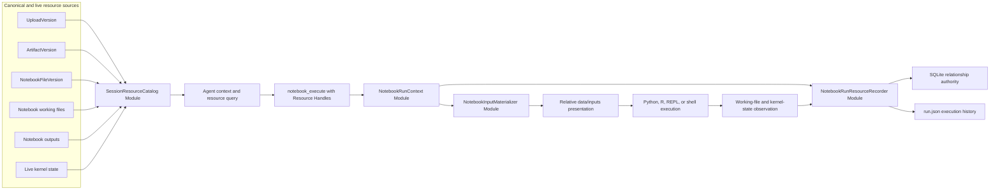
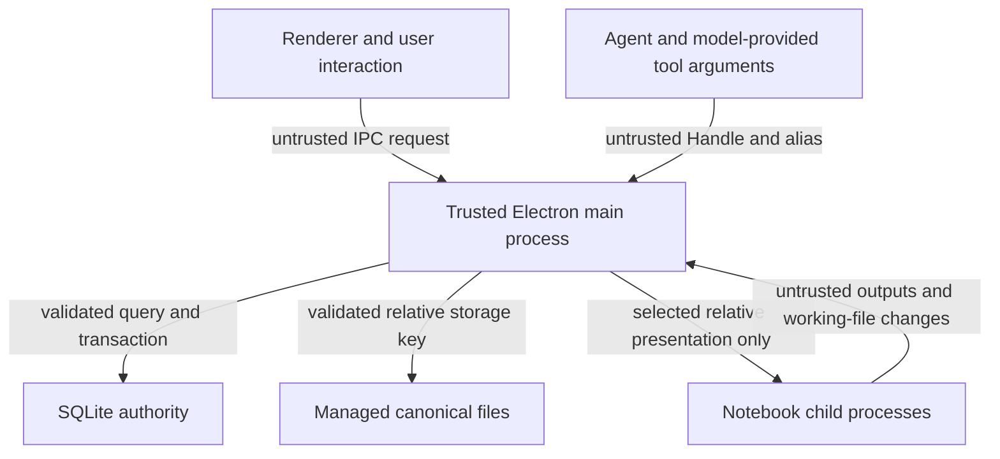
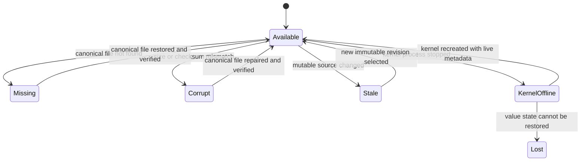
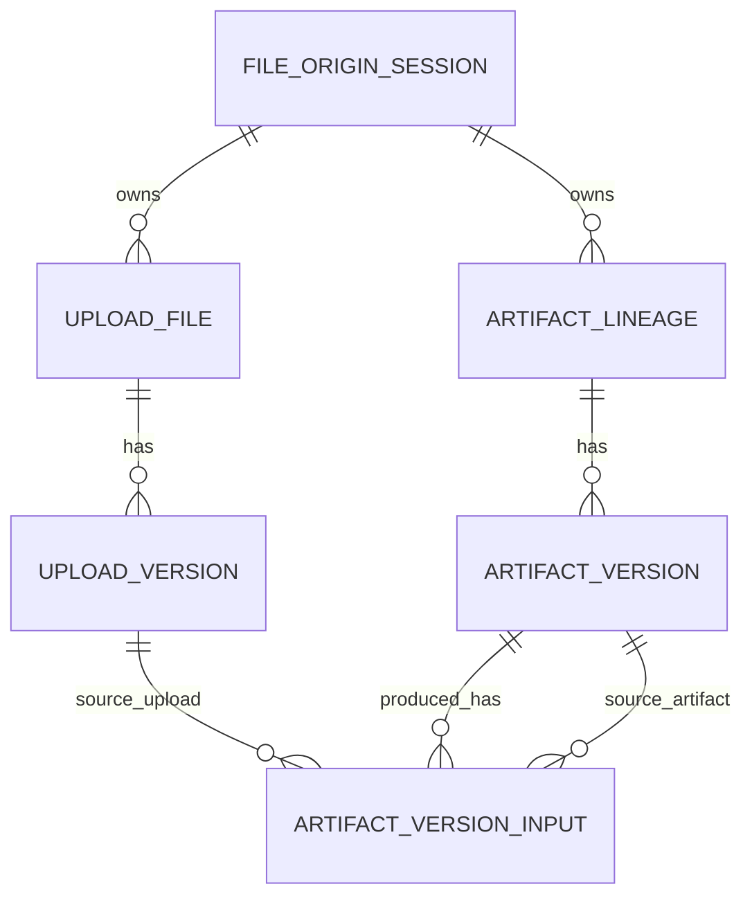
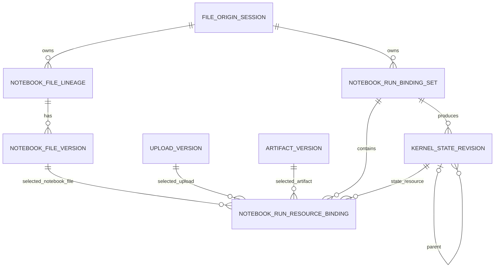
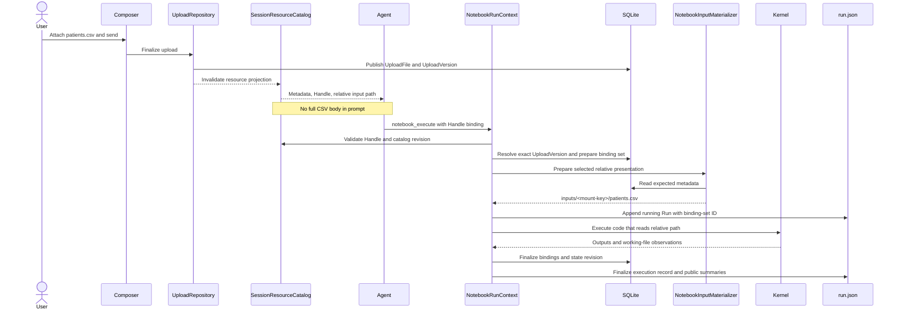
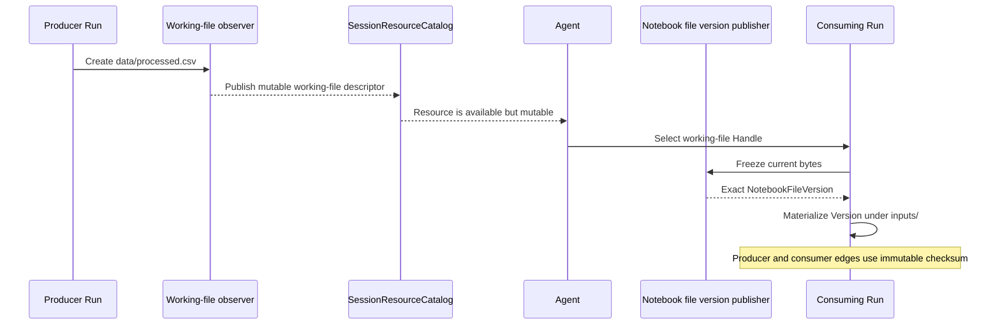
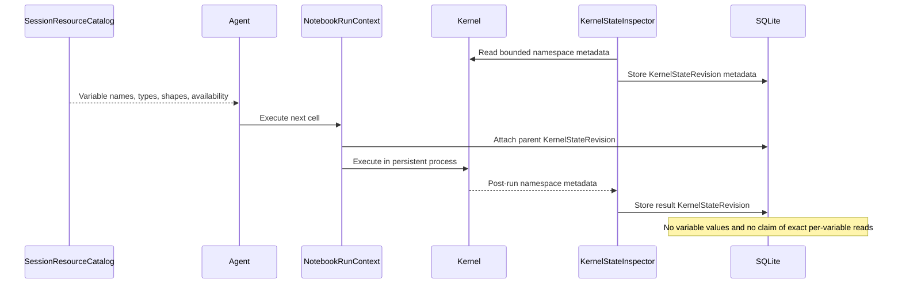
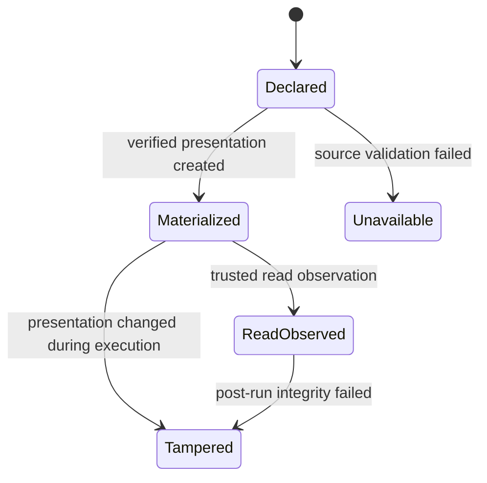
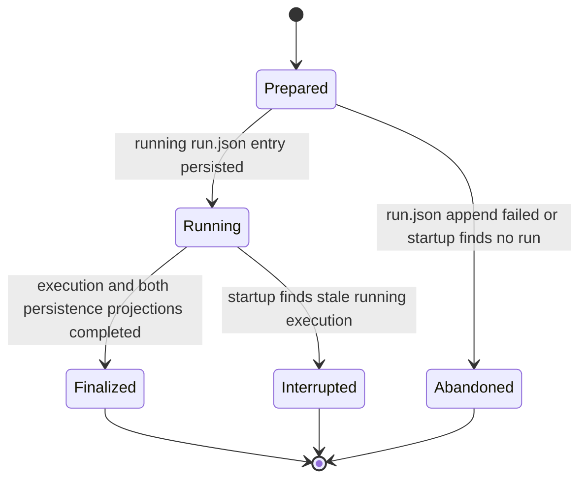

# Notebook Session Resource and File Input Architecture Specification

| Field | Value |
| --- | --- |
| Status | Proposed |
| Audience | Open Science maintainers and reviewers |
| Scope | Agent resource awareness, Notebook file input binding, run lineage, SQLite metadata, interaction design, and storage migration |
| Last updated | 2026-07-29 |

## Executive summary

Open Science currently has most of the primitives required to identify immutable file inputs: user uploads and generated artifacts have version rows in SQLite, Notebook turns can register those versions, and Notebook runs can persist input metadata. The missing link is the execution contract. Small text and tabular files can still be embedded in full in the model prompt, the agent is not given a durable resource-oriented view of its Session, and a Python or R cell has no production path that turns a registered file Version into a safe relative input path.

This specification introduces four deep Modules with small Interfaces:

1. **SessionResourceCatalog** gives the agent a bounded metadata-only view of resources that are available in the current Session and Project.
2. **NotebookRunContext** accepts explicit resource Handles for one execution, validates their authority, owns the run lease, and records the exact relationships established for that run.
3. **NotebookInputMaterializer** exposes selected immutable Versions through system-owned relative paths below the Notebook working directory without changing the canonical files.
4. **NotebookRunResourceRecorder** persists durable run-to-resource relationships and reconciles the SQLite relationship authority with `run.json` execution history.

The main behavioral decisions are:

- User uploads remain canonical under `uploads/`; generated artifact Versions remain canonical under `artifacts/`.
- Uploads are never projected into `data/raw/` and never routed through `OPEN_SCIENCE_HANDOFF_DIR`.
- A Notebook call receives only the resources explicitly selected for that call. Resource visibility never implies resource use.
- Agent-facing calls carry opaque, Session-authorized resource Handles. The agent does not send trusted `UploadVersion.id`, `ArtifactVersion.id`, or storage paths.
- Notebook code reads a system-provided relative path under `inputs/`. It does not reconstruct file content as literals and does not embed a machine-specific absolute path.
- The initial materialization implementation uses independent byte copies. It does not use symbolic links or hard links. Reflinks may be added later only as an implementation optimization.
- Materialized input files are disposable cache. Marker-confirmed cache entries are excluded from Storage Migration and rebuilt lazily from canonical Versions when a run needs them.
- SQLite stores identities and relationships, not file bytes, cache contents, or variable values.
- Persistent Python, R, and control-plane state is modeled as a coarse `KernelStateRevision`. Individual variable reads are not claimed unless a trustworthy observer exists.

## Problem statement

### Current behavior

The current implementation has the following relevant behavior:

- `UploadVersion` and `ArtifactVersion` are immutable identities backed by checksummed files in app-managed storage.
- The SQLite database is stored at `<configRoot>/open-science.db`; file bytes live below the relocatable data root.
- `NotebookInputRegistry.registerTurn` resolves current-turn uploads and referenced artifacts to exact Versions and verifies their files.
- `NotebookInputRegistry.openRun` creates an execution-scoped lease and currently initializes associations as `turn-attached`.
- The local RPC method `resolveNotebookInput` can validate a Version against an active lease and return its path, but no production Python or R read path calls it.
- `NotebookRunRecord.inputFiles` persists registered Version metadata, while `ArtifactVersionInput` stores file inputs copied into Artifact provenance.
- `working-file-observer.ts` observes files created or changed during a run. It does not observe reads.
- Notebook processes retain variables while their kernel process remains alive, but variable values disappear after restart, runtime switch, hard timeout, or migration-triggered shutdown.
- Notebook initialization creates `data/raw/` and `data/processed/`, but user uploads are not automatically copied into either directory.
- The data kernel working directory is the Notebook Session `data/` directory.
- Text-like attachments up to 512 KiB may be embedded in full in an ACP resource block. This makes it easy for an agent to reproduce CSV, TXT, JSON, or similar contents as Notebook literals instead of reading the source file.
- Storage Migration moves `artifacts/`, `notebooks/`, `uploads/`, and `workspaces/`, and validates those files against the fixed SQLite authority before and after the copy.

### User-visible failure mode

A representative failure looks like this:

1. The user uploads a small CSV or TXT file.
2. The full file content is placed into the agent prompt.
3. The agent generates a Notebook cell containing the values directly in a list, dictionary, table constructor, or multiline string.
4. The Notebook result may be numerically correct, but its code is no longer connected to the uploaded Version.
5. A later edit, rerun, restart, migration, or provenance review cannot reliably establish which file Version the code intended to use.

The same structural problem appears for previously generated artifacts, Notebook intermediate files, and persistent variables: the agent needs to know what exists, but the system must not silently claim that everything visible was used by every run.

## Goals

- Ensure file-backed Notebook analyses read files rather than reconstructing file content as code literals.
- Give the agent metadata awareness of current Session resources without placing every resource's contents into the prompt.
- Establish an explicit, validated association between one Notebook call and the exact resource Versions selected for that call.
- Provide portable relative input paths for Python and R code.
- Preserve current canonical upload and artifact storage layouts.
- Keep `OPEN_SCIENCE_HANDOFF_DIR` limited to explicit cross-kernel and connector data transfer.
- Model Notebook outputs, intermediate files, and live variables in the Session resource view.
- Distinguish resource availability, selection, materialization, observed access, production, and ambient kernel state in provenance.
- Make reruns independent of an in-memory turn registry by persisting exact run bindings.
- Keep input cache out of Storage Migration and rebuild only the inputs actually needed after a move.
- Make pre-existing missing canonical content a finite, actionable condition rather than an endless migration or materialization retry.
- Preserve cross-platform behavior on macOS, Windows, and Linux.

## Non-goals

- Capturing arbitrary file reads anywhere on the host filesystem.
- Claiming exact per-variable read lineage for dynamic Python, R, or JavaScript execution.
- Persisting live variable values in SQLite.
- Making `data/raw/` the canonical location for uploads.
- Treating handoff files as uploaded inputs.
- Migrating or eagerly rebuilding disposable input cache.
- Automatically replaying Notebook code as part of Storage Migration.
- Exposing database Version IDs, `contentStorageKey`, or absolute managed-storage paths to the agent as trusted selectors.
- Providing deterministic environment reconstruction; this feature strengthens input lineage but does not replace environment lock and replay work.

## Terminology

| Term | Definition |
| --- | --- |
| Resource | A file Version, Notebook working-file revision, Notebook output, or kernel-state descriptor that can be shown in a Session resource view. |
| Canonical Version | Immutable, checksummed bytes and metadata that are authoritative for later validation and reconstruction. |
| Resource Handle | Opaque, Session-authorized selector issued to the agent. A Handle is not a database ID or filesystem path. |
| Resource descriptor | Metadata-only projection returned by the SessionResourceCatalog. |
| Run binding | A durable relationship between a Notebook Run and an exact resource identity. |
| Materialization | Creation or validation of a disposable local input presentation copied from canonical bytes. |
| Input presentation | System-owned relative path below `data/inputs/` exposed to one Notebook execution. |
| Working file | Mutable file created or edited below the Notebook Session workspace. |
| Notebook file Version | Immutable snapshot created when a mutable Notebook file must become an exact later input. |
| Kernel state revision | Coarse metadata record describing the persistent interpreter state before or after a run. |
| Handoff | Explicit disk channel used to transfer connector or control-plane results between kernels. It is not upload storage. |

## Requirements

### Functional requirements

- Every data-capable file attachment must have a resource descriptor and an immutable source identity before it can be selected for Notebook execution.
- CSV, TSV, TXT, JSON, JSONL, FASTA, and similar data-capable attachments must not be fully embedded merely because their byte size is small. A bounded preview may be supplied for orientation.
- A Notebook execution that reads a managed file must declare its Resource Handle in the execution request.
- The trusted main process must map the Handle to an exact source Version and reject a forged, expired, cross-Project, or unauthorized Handle.
- The execution bridge must provide the exact relative input path before the cell begins executing.
- Materialization must complete and verify the expected size and checksum before execution begins.
- The system must record the selected Version independently of the relative presentation path.
- A Run that does not declare a resource must not acquire a provenance input edge merely because the resource was visible in the Session.
- A mutable Notebook working file selected as a later input must be frozen to an immutable Notebook file Version before the consuming Run begins.
- Python, R, and control-plane persistent processes must expose variable metadata without placing variable values in the agent resource digest.
- Rerun must reuse stored exact resource identities unless the caller explicitly supplies replacements.
- Legacy Notebook histories must remain readable.

### Quality requirements

- Handle validation and Version lookup must fail closed.
- Cache deletion, eviction, or non-migration must not delete or invalidate canonical resources.
- One corrupt cache entry must be repairable without scanning or rebuilding every resource.
- Resource listing must be bounded and paginated.
- Resource metadata must never expose secrets from process environment variables or arbitrary host paths.
- Storage Migration must not scan, copy, or verify marker-confirmed input cache entries.
- Pre-existing missing canonical content must produce a finite report and explicit user decision.
- A file copied during migration must still fail the migration if its destination bytes do not match the source.
- SQLite schema changes must be additive, idempotent, and compatible with older `run.json` documents.
- New run relationship persistence must be recoverable after a crash between SQLite and `run.json` writes.

## Architecture decisions

| Decision | Selected approach | Rationale |
| --- | --- | --- |
| Canonical user upload location | `uploads/<project>/<session>/<file>/versions/<version>/content` | Reuses the existing immutable UploadVersion authority. |
| Notebook input path | System-provided relative path below `data/inputs/` | Portable for code and compatible with ordinary data libraries. |
| `data/raw/` semantics | No automatic upload projection; compatibility directory only | Avoids mixing canonical inputs with Notebook-owned files and avoids duplicate migration. |
| Handoff semantics | Connector/control-plane/kernel transfer only | Keeps transport distinct from user-upload identity and lineage. |
| Agent selector | Opaque Resource Handle | Prevents trust in guessed Version IDs and storage paths. |
| Materialization | Independent byte copy with atomic publish and checksum verification | Cross-platform, canonical bytes cannot be mutated through the presentation. |
| Symbolic link | Rejected | Path escape risk, Windows limitations, and fragile migration semantics. |
| Hard link | Rejected | A write through the input path could mutate canonical bytes. |
| Reflink | Deferred optimization behind the same Interface | Copy-on-write is not universal and does not itself enforce read-only behavior. |
| Cache migration | Exclude marker-confirmed entries and rebuild lazily | Prevents duplicate copy/verify cost and migration blockage. |
| Run association | Explicit binding set per Run | Resource visibility remains separate from resource use. |
| Variable lineage | Whole KernelStateRevision | Exact variable reads are not reliably observable across supported languages. |
| SQLite role | Identity and relationship authority; no bytes or cache | Fits the existing architecture and keeps migration paths relative. |

## Architecture overview



### Trust seams



The trusted main process is the seam at which a model-supplied Handle becomes an internal Version identity. Neither the renderer nor the agent can inject `registeredInputFiles`, `inputRunLeaseId`, internal Version IDs, or storage keys.

## Module design

### SessionResourceCatalog Module

**Responsibility**

- Compose available resource metadata from SQLite, Notebook history, workspace observation, and live kernel inventory.
- Issue bounded, opaque Handles authorized for the active Project and Session.
- Provide current-turn priority resources, recent Session resources, and paginated Project search.
- Hide physical storage paths, database IDs, and resource content.

**Interface**

The external Interface has two operations:

1. `snapshot`: return a bounded digest plus a catalog revision.
2. `query`: page or search descriptors under the same Session authorization.

Callers do not need to know which Adapter supplied a descriptor. Internal Adapters include the current `ManagedFile` read model, Notebook run history, Notebook working-file inventory, and live kernel inspection.

**Invariants**

- A descriptor's Handle is scoped to one active app Session and Project.
- A Handle is an authorization selector, not durable lineage.
- Handle refresh after restart is allowed; durable reruns use internal identities from stored run bindings.
- Project files originating in another Session are searchable, but are not included in the default current-Session digest unless the user referenced them.
- Resource descriptors never include file contents, absolute paths, `contentStorageKey`, or environment-variable values.

### NotebookRunContext Module

**Responsibility**

- Open exactly one run relationship context from an execution request.
- Validate selected Handles against the active catalog lease.
- Resolve exact immutable source identities.
- Freeze mutable Notebook files before use.
- Prepare the binding set and input presentation.
- Attach the prior KernelStateRevision when applicable.
- Finalize or interrupt relationships when execution ends.

**Interface**

1. `openRun`: accepts Session identity, prompt provenance, kernel identity, optional rerun identity, and selected Handle bindings; returns an execution context with relative paths.
2. `completeRun`: accepts normalized execution outcome, working-file observations, and kernel-state observation; returns the durable run resource summary.

All Version queries, cache repair, SQLite transactions, and crash-recovery state remain behind this Interface.

**Invariants**

- The complete set of selected resources is immutable after execution begins.
- A Handle that does not match the active Session catalog lease is rejected before code executes.
- The Run is linked to internal Version IDs, not to Handle strings or filenames.
- Rerun uses the original binding set unless explicit replacement bindings are supplied.
- A current-turn attachment that was not selected is available but not a run input.

### NotebookInputMaterializer Module

**Responsibility**

- Validate canonical file availability, size, and checksum.
- Build the selected relative input presentation.
- Atomically replace corrupt or stale presentations.
- Apply read-only permissions where supported.
- Verify post-run integrity and mark tampering evidence.
- Remove or evict presentations without touching canonical content.

**Interface**

1. `prepare`: given an immutable source descriptor and requested safe presentation name, return a verified relative path.
2. `finish`: verify integrity and return final evidence state.
3. `evictSession`: remove disposable presentations for a Session.

Filesystem and in-memory test Adapters satisfy internal seams; these are not exposed to agent or renderer callers.

### NotebookRunResourceRecorder Module

**Responsibility**

- Persist run relationship state in SQLite.
- Add the corresponding binding-set reference and public summaries to `run.json`.
- Reconcile crashes between the two persistence mechanisms.
- Project eligible file inputs into `ArtifactVersionInput` when an Artifact Version is created.

**Interface**

1. `prepare`: insert an idempotent prepared binding set.
2. `markRunning`: record that the matching running Run exists in `run.json`.
3. `finalize`: store final associations and evidence.
4. `reconcileSession`: repair or mark incomplete records after startup.

This Module provides Locality for dual-persistence recovery. Callers do not perform direct ordered writes to SQLite and `run.json` themselves.

### KernelStateInspector Module

**Responsibility**

- Capture metadata about the persistent namespace before and after supported kernel runs.
- Never serialize arbitrary variable values into SQLite or model context.
- Mark state as unknown or lost when a process terminates without a trustworthy post-run observation.

**Interface**

1. `parentRevision`: obtain the current coarse state revision for a process key.
2. `captureResult`: produce a new revision descriptor after execution.

Python, R, and control-plane REPL inspection are separate Adapters because their introspection mechanisms vary. Bash has no persistent-state Adapter.

## Resource model

### Resource kinds

| Resource kind | Canonical identity | Durability | Notebook input eligible | Default catalog visibility |
| --- | --- | --- | --- | --- |
| Upload Version | `UploadVersion.id` | Immutable durable | Yes | Current Session uploads and explicitly referenced Project uploads |
| Artifact Version | `ArtifactVersion.id` | Immutable durable | Yes | Current Session artifacts and explicitly referenced Project artifacts |
| Notebook file | Logical working path | Mutable Session | Not until frozen | Current Session |
| Notebook file Version | `NotebookFileVersion.id` | Immutable durable | Yes | Current Session |
| Notebook output | Run ID plus output ordinal | Durable metadata, bounded payload | No direct file input | Current Session |
| Kernel variable descriptor | Process key, revision, and name | Ephemeral value, durable metadata | Reused through kernel state, not file binding | Live Session only; last-known metadata may be shown offline |
| Kernel state revision | `KernelStateRevision.id` | Durable metadata, ephemeral value | Automatic execution context | Current Session and provenance views |
| Handoff file | Relative handoff path and observed revision | Mutable Session transport | Only when explicitly selected or promoted | Current Session |

### Resource descriptor

| Field | Meaning |
| --- | --- |
| `handle` | Opaque active-Session selector passed back to a tool. |
| `catalogRevision` | Catalog revision against which the Handle was issued. |
| `kind` | Resource kind from the preceding table. |
| `displayName` | User-facing name. |
| `originProjectId` | Owning Project. |
| `originSessionId` | Session where the resource originated. |
| `versionNumber` or `revision` | User-readable version metadata where applicable. |
| `contentType` | MIME or logical output type. |
| `sizeBytes` | Byte size for file-backed resources. |
| `checksum` | Checksum for immutable or observed file-backed resources. |
| `producerRunId` | Producing Notebook Run when known. |
| `durability` | `immutable-durable`, `mutable-session`, or `ephemeral`. |
| `availability` | `available`, `missing`, `corrupt`, `stale`, `kernel-offline`, or `lost`. |
| `capabilities` | `preview`, `notebook-input`, `artifact-source`, `rerun-source`, or `state-context`. |
| `suggestedRelativePath` | System-generated relative path for file input; absent for non-file resources. |

### Availability lifecycle



### Run association strengths

| Association | Meaning | May UI call it “used”? |
| --- | --- | --- |
| `available` | Resource appeared in the catalog. No Run edge exists. | No |
| `declared` | Agent or user selected the Handle for this Run. | “Selected”, not “read” |
| `materialized` | Verified bytes were presented to the Run at the recorded relative path. | “Provided”, not necessarily “read” |
| `read-observed` | A trustworthy language or OS observer saw an open/read under the selected presentation. | Yes, with observer type shown |
| `produced` | The Run created the observed file or state revision. | Yes |
| `modified` | The Run changed an existing working file. | Yes |
| `kernel-state-parent` | The persistent process began the Run with this coarse state revision. | “Execution context”, not individual variable use |
| `kernel-state-result` | The Run produced this state revision. | Yes |
| `legacy-turn-attached` | Old history recorded all turn attachments without stronger evidence. | No; label as legacy evidence |

The system must not silently upgrade `declared` or `materialized` to `read-observed`. Python audit hooks or future OS observers may provide stronger evidence for some runs, but cross-language behavior must remain truthful when they cannot.

## Persistence architecture

### Sources of truth

| Concern | Source of truth | Notes |
| --- | --- | --- |
| Project, upload, artifact, and file-Version identity | SQLite | Existing authority at `<configRoot>/open-science.db`. |
| Canonical file bytes | Relocatable data root | Addressed through validated relative storage keys. |
| Notebook execution code and outputs | `run.json` | Continues to move with `notebooks/`. |
| Run-to-resource relationships | SQLite binding tables | `run.json` carries the binding-set ID and public projection. |
| Artifact input relationships | `ArtifactVersionInput` | Derived transactionally from finalized run bindings during Artifact creation. |
| Resource Handles | In-memory catalog lease | Reissued after restart; never a durable identity. |
| Session resource search rows | Rebuildable SQLite projection | May be reconstructed from authorities and Notebook history. |
| Input presentations | Marker-confirmed filesystem cache | Never authoritative and never a foreign-key target. |
| Live variable values | Kernel process memory | Not persisted by this design. |
| Kernel variable metadata | `KernelStateRevision` plus `run.json` projection | No values. |

### Existing SQLite relationships



Existing tables already provide immutable Upload and Artifact identity. `ManagedFile` is a Project Files query projection rather than a foreign-key child of `FileOriginSession`, while `ArtifactVersionInput` is durable provenance.

### Proposed SQLite relationships



`SessionResourceIndex` is intentionally absent from the foreign-key diagram. It is a generic, rebuildable projection whose resource identity is validated against the corresponding authority when read or repaired; it does not retain immutable sources through foreign keys.

`NotebookRunResourceBinding` uses nullable typed foreign keys, following the pattern already used by `ArtifactVersionInput`. A database check constraint requires exactly one source identity compatible with `resourceKind` for resource-backed roles. Output rows that describe newly observed mutable files may initially reference a path snapshot and are upgraded to `NotebookFileVersion` when frozen.

### Proposed table: `NotebookFileLineage`

| Column | Type | Constraint or purpose |
| --- | --- | --- |
| `id` | Text | Primary key. |
| `projectId` | Text | Part of owning Session identity. |
| `sessionId` | Text | Part of owning Session identity. |
| `normalizedRelativePath` | Text | Stable, portable path identity within the Notebook Session. |
| `displayName` | Text | User-facing name. |
| `createdAt` | DateTime | Creation time. |
| `updatedAt` | DateTime | Last metadata update. |

Constraints and indexes:

- Unique `(projectId, sessionId, normalizedRelativePath)`.
- Foreign key `(projectId, sessionId)` to `FileOriginSession` with restrictive deletion semantics compatible with retained provenance.
- Index `(projectId, sessionId)`.

### Proposed table: `NotebookFileVersion`

| Column | Type | Constraint or purpose |
| --- | --- | --- |
| `id` | Text | Primary key. |
| `notebookFileId` | Text | Foreign key to `NotebookFileLineage`. |
| `versionNumber` | Integer | Monotonic within one lineage. |
| `state` | Text | `staging`, `ready`, or `unavailable`. |
| `contentStorageKey` | Text | Relative key for immutable snapshot bytes. |
| `filename` | Text | Snapshot filename. |
| `contentType` | Text nullable | MIME type. |
| `sizeBytes` | BigInt | Expected bytes. |
| `checksum` | Text | SHA-256. |
| `producerRunId` | Text nullable | Run that last produced the frozen bytes. |
| `createdAt` | DateTime | Version creation time. |
| `updatedAt` | DateTime | State update time. |

Constraints and indexes:

- Unique `(notebookFileId, versionNumber)`.
- Unique `contentStorageKey`.
- Index `(producerRunId)`.
- Publication follows the existing staging-file, staging-row, atomic-rename, ready-row pattern.

### Proposed table: `NotebookRunBindingSet`

| Column | Type | Constraint or purpose |
| --- | --- | --- |
| `runId` | Text | Primary key; matches `NotebookRunRecord.runId`. |
| `projectId` | Text | Owning Project. |
| `sessionId` | Text | Owning app/Notebook Session. |
| `promptMessageId` | Text nullable | Turn provenance. |
| `rerunOfRunId` | Text nullable | Original Run for exact rerun. |
| `kernelKind` | Text | `python`, `r`, `repl`, or `bash`. |
| `environment` | Text nullable | Persistent environment name. |
| `state` | Text | `prepared`, `running`, `finalized`, `interrupted`, or `abandoned`. |
| `createdAt` | DateTime | Preparation time. |
| `updatedAt` | DateTime | Last transition. |

Constraints and indexes:

- Foreign key `(projectId, sessionId)` to `FileOriginSession`.
- Index `(projectId, sessionId, createdAt)`.
- Index `(rerunOfRunId)`.
- State transitions are monotonic except that startup reconciliation may convert `prepared` to `abandoned` or `running` to `interrupted`.

### Proposed table: `NotebookRunResourceBinding`

| Column | Type | Constraint or purpose |
| --- | --- | --- |
| `id` | Text | Primary key. |
| `runId` | Text | Foreign key to `NotebookRunBindingSet`. |
| `ordinal` | Integer | Stable presentation order. |
| `role` | Text | `input`, `output`, `state-parent`, or `state-result`. |
| `resourceKind` | Text | Typed source kind. |
| `resourceVersionId` | Text | Path-independent identity used for generic lookup and evidence export. |
| `sourceUploadVersionId` | Text nullable | Foreign key to `UploadVersion`. |
| `sourceArtifactVersionId` | Text nullable | Foreign key to `ArtifactVersion`. |
| `sourceNotebookFileVersionId` | Text nullable | Foreign key to `NotebookFileVersion`. |
| `sourceKernelStateRevisionId` | Text nullable | Foreign key to `KernelStateRevision`. |
| `displayName` | Text | Snapshot of the user-facing name. |
| `relativePath` | Text nullable | Portable input or output path used by the Run. |
| `contentType` | Text nullable | Snapshot MIME type. |
| `sizeBytes` | BigInt nullable | Snapshot size. |
| `checksum` | Text nullable | Snapshot checksum. |
| `association` | Text | Association strength. |
| `evidenceStatus` | Text | `verified`, `incomplete`, `tampered`, or `unavailable`. |
| `createdAt` | DateTime | Binding creation time. |
| `updatedAt` | DateTime | Evidence update time. |

Constraints and indexes:

- Unique `(runId, ordinal)`.
- Unique `(runId, role, resourceKind, resourceVersionId)`.
- Index `(resourceKind, resourceVersionId)` for reverse lineage.
- Check constraint matching `resourceKind` to exactly one typed source foreign key.
- `onDelete: Restrict` for immutable source Versions retained by provenance.

### Proposed table: `KernelStateRevision`

| Column | Type | Constraint or purpose |
| --- | --- | --- |
| `id` | Text | Primary key. |
| `projectId` | Text | Owning Project. |
| `sessionId` | Text | Owning Session. |
| `processKey` | Text | Persistent process identity, including environment. |
| `kernelKind` | Text | `python`, `r`, or `repl`. |
| `environment` | Text nullable | Environment name. |
| `parentRevisionId` | Text nullable | Self-reference. |
| `producerRunId` | Text nullable | Run that produced the revision. |
| `state` | Text | `known`, `unknown`, or `lost`. |
| `variablesJson` | Text | Bounded metadata array; no values. |
| `variablesChecksum` | Text | Integrity of normalized metadata. |
| `createdAt` | DateTime | Capture time. |

Variable metadata may contain only name, type, shape or dimensions, approximate size, and producer information. It must not contain arbitrary `repr`, string values, secrets, DataFrame rows, or object serialization.

Constraints and indexes:

- Foreign key `parentRevisionId` to `KernelStateRevision` with restrictive deletion.
- Unique `(producerRunId, processKey)` where a Run produced a state observation.
- Index `(projectId, sessionId, processKey, createdAt)`.

### Proposed projection: `SessionResourceIndex`

This table is optional for the first delivery but is the preferred long-term query Adapter. It is explicitly rebuildable.

| Column | Purpose |
| --- | --- |
| `seq` | Stable keyset pagination sequence. |
| `projectId`, `originSessionId` | Scope and origin. |
| `resourceKind`, `resourceVersionId` | Generic identity. |
| `displayName`, `contentType`, `sizeBytes`, `checksum` | Search and display metadata. |
| `producerRunId` | Originating Run. |
| `durability`, `availability` | Catalog filtering. |
| `sortAtMs` | Recency ordering. |
| `deletedAt` | Soft-delete projection state. |

It has no authority over canonical availability. A missing or incomplete index causes a repair indicator and lazy fallback, not resource loss.

### `ArtifactVersionInput` extension

To preserve provenance when an Artifact is produced from an immutable Notebook intermediate file:

- Add `sourceNotebookFileVersionId` as an optional foreign key.
- Extend `sourceKind` with `notebook-file-version`.
- Rebuild the SQLite check constraint so exactly one typed source foreign key matches `sourceKind`.
- Preserve existing `upload-version` and `artifact-version` rows without rewriting their meanings.

### SQLite migration strategy

The SQLite file remains fixed under the config root. App-version schema migration and user-selected Storage Migration remain separate operations.

Schema rollout rules:

1. Add new tables and indexes idempotently.
2. Add compatibility readers before dual-writing new relationships.
3. Rebuild constrained SQLite tables only when the new `ArtifactVersionInput` source kind is enabled.
4. Run migrations in a transaction where SQLite permits it.
5. On schema migration failure, keep legacy Notebook execution available but disable the new resource-input feature with an actionable diagnostic.
6. Never put cache rows, Handle leases, or absolute paths in SQLite.

## Filesystem design

### Target layout

```text
<dataRoot>/
  uploads/<project>/<session>/<upload-file>/versions/<upload-version>/content
  artifacts/<project>/<session>/.provenance/<artifact>/versions/<artifact-version>/content
  notebooks/<project>/<session>/
    run.json
    data/
      inputs/                         # system-owned, disposable presentations
        .open-science-input-cache.json
        <mount-key>/<safe-filename>
      raw/                            # compatibility only; no upload projection
      processed/                      # optional Notebook-owned convention
      <notebook-created-files>
    file-versions/                    # canonical NotebookFileVersion snapshots
      <lineage>/<version>/content
    handoff/                          # explicit cross-kernel transfer
    outputs/                          # Notebook working output convention
```

The paths shown here are structural contracts, not paths that the agent constructs. The resource descriptor supplies `suggestedRelativePath`, and Notebook code copies that exact relative string.

### Relative input presentation

The Notebook kernel continues to start with `data/` as its working directory. A selected file is presented as:

```text
inputs/<mount-key>/<safe-filename>
```

`mount-key` is an opaque, path-safe presentation token derived by the trusted process. It is not the database Version ID. The path alone is not authorization: the materializer creates the directory only for a validated binding set.

To prevent a Run from reading a stale presentation that it did not declare:

- Notebook file-input executions are serialized through a Session input-presentation gate.
- Before execution, `data/inputs/` is reconciled to exactly the selected mount keys.
- A Run with no selected file inputs sees an empty presentation directory.
- The binding set is immutable until execution and post-run verification finish.
- Direct reads outside the presentation remain possible for Notebook-owned working files, but they do not acquire immutable managed-input evidence unless explicitly selected and frozen.

### Materialization algorithm

1. Validate source kind, source identity, Project scope, ready/finalized state, relative storage key, expected size, and expected checksum.
2. Resolve and realpath the canonical source below the managed data root.
3. Create a unique temporary presentation directory below `data/inputs/`.
4. Stream-copy bytes while calculating a checksum.
5. Verify size and checksum.
6. Apply read-only file permissions where supported.
7. Write a bounded cache marker describing the source identity, checksum, and schema version.
8. Atomically rename the temporary presentation into place.
9. Execute the Run.
10. Recheck size and checksum after execution; if changed, mark the binding `tampered`, discard the presentation, and never modify the canonical Version.

The first implementation always byte-copies. A future filesystem Adapter may use clone/reflink when source and destination support copy-on-write, but it must fall back to byte copy and produce identical verification behavior.

### Read-only meaning

“Read-only input” is a behavioral and integrity contract, not a claim that POSIX mode bits alone form a security sandbox.

- Canonical Versions are protected because presentations are independent files.
- Permissions prevent common accidental writes.
- The agent instructions prohibit writes under `inputs/`.
- Post-run checksum validation detects modification.
- A tampered presentation invalidates strong read evidence and is rebuilt for the next use.
- Strong adversarial filesystem isolation remains separate sandbox work.

### `data/raw/`

- Upload finalization never writes to `data/raw/`.
- The SessionResourceCatalog never advertises `data/raw/` as the upload location.
- Notebook instructions stop recommending `./data/raw` as the default source of user uploads.
- Existing user-created content under `data/raw/` remains ordinary Notebook data and is migrated.
- Removal of the empty compatibility directory is a separate cleanup decision after compatibility measurement.

### Handoff

`OPEN_SCIENCE_HANDOFF_DIR` continues to resolve to the Session's dedicated `handoff/` directory. Its valid uses are:

- control-plane REPL or connector result to Python/R;
- explicit transfer between persistent kernels;
- large control-plane results that should not pass through model context.

It is not:

- an upload path;
- a replacement for Resource Handles;
- canonical immutable input storage;
- evidence that every later Run consumed a handoff file.

## Agent and internal Interfaces

### Agent resource digest

Every prompt that enables Notebook tools receives a bounded structured digest before the ordinary user content. It contains:

- catalog revision;
- count by resource kind;
- current-turn attachments and explicit mentions first;
- recent current-Session files and artifacts;
- live kernel variable names and types;
- opaque Handles and exact suggested relative input paths;
- a pointer to the paginated resource query tool.

The digest does not contain complete CSV/TXT/JSON data, database IDs, storage keys, or absolute paths.

### Attachment content policy

| Attachment class | Model context behavior | Notebook behavior |
| --- | --- | --- |
| Data-capable text/tabular | Metadata plus bounded preview | Must bind Handle and read file |
| Large text/tabular | Metadata plus bounded preview | Must bind Handle and read file |
| Narrative document | Existing bounded extraction may remain | If used by Notebook, still bind and read file |
| Image for visual reasoning | May remain embedded within image budget | If file bytes are used by Notebook, bind the Version |
| Archive/binary | Metadata/resource link | Bind if a supported Notebook operation needs it |

The system prompt and Notebook tool description state that previews are orientation evidence, not substitutes for file reads.

### Resource query Interface

Request fields:

| Field | Purpose |
| --- | --- |
| `scope` | Current Session by default; explicit Project search when needed. |
| `kinds` | Optional resource-kind filter. |
| `query` | Optional name/type search. |
| `availability` | Optional availability filter. |
| `cursor` | Opaque keyset cursor. |
| `limit` | Bounded page size. |

Response fields:

- descriptors;
- next cursor;
- total count when inexpensive or already indexed;
- catalog revision;
- `isIndexComplete` and repair status.

### Notebook execution input bindings

The Notebook execution request gains an agent-visible `inputBindings` collection. Each entry carries:

| Field | Purpose |
| --- | --- |
| `handle` | Opaque selected resource. |
| `presentationName` | Optional safe user-facing name; the trusted process sanitizes it. |
| `expectedCatalogRevision` | Prevents stale Handle use across catalog replacement. |

The request must not accept trusted `inputFileVersionId`, `contentStorageKey`, canonical path, cache path, or `inputRunLeaseId` from the agent.

Before code executes, NotebookRunContext derives:

- internal source kind and Version ID;
- validated relative presentation path;
- immutable binding-set ID;
- parent KernelStateRevision where applicable.

The normal Notebook result returns public input summaries and association strengths without storage keys.

### Error model

| Code | Meaning | Agent action | User presentation |
| --- | --- | --- | --- |
| `RESOURCE_HANDLE_INVALID` | Malformed or unknown Handle. | Refresh catalog; do not guess. | Internal execution error with retry guidance. |
| `RESOURCE_HANDLE_EXPIRED` | Handle belongs to an old catalog lease. | Query current resources and retry. | Brief “resource list changed” notice. |
| `RESOURCE_SCOPE_DENIED` | Resource belongs to another unauthorized Project/Session scope. | Stop and select an authorized resource. | Permission error. |
| `RESOURCE_VERSION_UNAVAILABLE` | Exact Version row is not ready/finalized. | Select another Version or report. | File unavailable. |
| `RESOURCE_CONTENT_MISSING` | Canonical bytes do not exist. | Do not retry indefinitely. | Missing data with origin/version details. |
| `RESOURCE_CONTENT_CORRUPT` | Size or checksum mismatch. | Stop; do not use preview literals. | Integrity failure. |
| `INPUT_PRESENTATION_FAILED` | Cache preparation failed. | Retry once after system repair, then report. | Input preparation failure. |
| `INPUT_BINDING_MISSING` | Code refers to an input presentation not selected for the Run. | Add the Handle binding and rerun. | Notebook cell error. |
| `INPUT_PRESENTATION_TAMPERED` | Run modified a selected presentation. | Rewrite code to write elsewhere. | Provenance warning and failed integrity evidence. |
| `KERNEL_STATE_UNAVAILABLE` | Required live state no longer exists. | Replay prerequisite Runs or load a checkpoint. | Replay-required notice. |

Errors are finite and typed. Automatic retries are limited to one cache repair attempt when canonical content still verifies.

## Interaction design

### Upload to Notebook execution



### Existing Session resources

The agent should be aware that resources exist without receiving all their contents:

1. On each turn, the catalog digest includes current-turn resources and a bounded recent set.
2. The agent queries by name or kind if the needed resource is not in the digest.
3. The agent selects the Handle that corresponds to the intended immutable Version or current mutable Notebook file.
4. A mutable file is frozen before the consuming Run.
5. Only selected Handles become input relationships.

This avoids both extremes: an agent that cannot discover existing work, and provenance that falsely links every resource in the Session to every execution.

### Cross-Session Project file

1. The current Session catalog query searches the Project Files projection.
2. The result retains the origin Session and exact Version.
3. Selecting it issues a Handle authorized to the current active Session while preserving origin metadata.
4. NotebookRunContext validates same-Project access and records both consuming and origin Session identities.
5. The original Session does not become active or mutable.

### Notebook intermediate file reused later



Only files actually selected as later inputs are frozen by default. This controls inode count and migration cost while still making consumed intermediates reproducible.

### Persistent variables



After app restart, runtime switch, or migration shutdown, descriptors from the last revision may remain visible as `kernel-offline`, but the values are unavailable. A consuming rerun must replay prerequisite Runs or load a durable file checkpoint.

### Exact rerun

Rerun resolution order is:

1. Load the original finalized binding set by Run ID.
2. Apply only explicit replacement Handle bindings supplied by the caller.
3. Validate every resulting exact source Version.
4. Recreate selected relative presentations lazily.
5. If the original Run had a live KernelStateRevision dependency that is no longer available, stop with `KERNEL_STATE_UNAVAILABLE` and offer prerequisite replay.

The system never falls back to the newest same-named file, a guessed storage path, or data reconstructed from conversation text.

### Direct working-file reads

Notebook code may still read Notebook-owned files by ordinary relative path. The system must be honest about the evidence:

- If the file was explicitly selected and frozen, it has an immutable input relationship.
- If a trustworthy read observer sees it, the association may be `read-observed`.
- If the code reads an undeclared mutable path and the system cannot observe the read, no file-input relationship is fabricated.
- Working-file creation or modification remains observable through the existing write observer.

## User interaction design

### Composer and message attachments

- Keep the current attachment workflow.
- After finalization, the attachment chip may show “Available to Notebook”.
- The message attachment continues to open the canonical Version preview.
- No user-facing path is shown.
- A resource that cannot be finalized shows a finite upload error and is not issued a Notebook Handle.

### Resource picker and agent awareness

The user does not need to manually attach every existing Session resource again. The catalog supplies metadata to the agent. When explicit human control is useful, the existing `@` Project Files interaction remains the way to pin a cross-Session Project resource into the current turn.

A future resource drawer may show:

- current-turn attachments;
- Session uploads;
- generated artifacts;
- Notebook working files;
- live variables;
- availability and producer information.

The drawer is not required for the first backend delivery.

### Notebook Run presentation

The existing Input Data strip should evolve from a binary list to evidence-aware chips:

| Status | Label | Tooltip content |
| --- | --- | --- |
| `declared` | Selected | Version, origin, and “selected by run; read not observed”. |
| `materialized` | Provided | Relative path and checksum verification. |
| `read-observed` | Read | Observer kind and observation scope. |
| `unavailable` | Unavailable | Missing/corrupt reason. |
| `tampered` | Modified input | Integrity warning and remediation. |

Clicking a file chip continues to resolve preview bytes through trusted main-process IPC, not through the presentation cache path.

### Artifact provenance

Provenance should separate:

- exact file inputs;
- selected-but-not-read-observed file inputs;
- ambient kernel state;
- created or modified working files;
- final artifact output.

The UI must not label `legacy-turn-attached` or `materialized` as definitively read.

### Storage settings

Storage usage should distinguish logical authority from reclaimable cache:

| Category | Includes |
| --- | --- |
| Uploads | Canonical UploadVersion bytes only. |
| Artifacts | Canonical ArtifactVersion and provenance bytes. |
| Notebooks | Run history, mutable working files, and canonical NotebookFileVersion snapshots. |
| Notebook input cache | Marker-confirmed `data/inputs` presentations; reclaimable. |
| Runtime | Existing package/runtime data, excluding the separately reported input cache. |

Physical total usage includes cache bytes, but deleting the cache must never change Uploads, Artifacts, Notebook file Versions, or run lineage.

### Migration interaction

Migration preflight displays:

- canonical file count and total bytes;
- cache bytes excluded from the operation;
- missing or corrupt canonical resource count;
- affected resource names and origins in a bounded, expandable list.

When pre-existing canonical content is unavailable, the user chooses:

- **Cancel migration**; or
- **Continue with unavailable resources**.

Continuation preserves metadata and provenance while marking the affected resources unavailable. It does not delete their SQLite rows or claim the bytes were copied.

Copy-time failure or destination checksum mismatch is different: it aborts migration and leaves the current root authoritative.

## Provenance semantics

### File inputs

The strongest trustworthy evidence available for each input is stored. Evidence strength is monotonic within one finalized Run:



`Tampered` does not change the canonical source. It means the executing Run cannot claim that all reads came from the original checksum after modification.

### Kernel state

A Python, R, or REPL Run automatically records:

- one `state-parent` edge when a prior live revision exists;
- one `state-result` edge if post-run state can be observed;
- a lost or unknown state outcome after hard timeout or process loss.

This is execution-context evidence, not a statement that every variable in the namespace affected the result.

### Artifact projection

When `write_artifact_file` names a producer Run:

1. The producer Run and conversation provenance must match the active artifact run context.
2. Finalized file-input bindings are copied into `ArtifactVersionInput` with their strongest association.
3. `state-parent` evidence is included in the execution snapshot but not misrepresented as a file Version.
4. Missing or incomplete evidence remains visible rather than being inferred from the agent's claim.

## Storage Migration and recovery

### SQLite and data-root relationship

The SQLite database remains at `<configRoot>/open-science.db`. Storage Migration changes only the relocatable data root. Version rows keep relative `contentStorageKey` values, so the same SQLite authority can validate both the source and staged target roots.

The new SQLite tables therefore do not move during a data-root migration. They are quiesced with the existing database writer gate and validated against both roots.

### Cache exclusion

The current copy engine operates at directory granularity. This feature requires filtered inventory, copy, and verification for `notebooks/`:

- Exclude only directories carrying a valid system input-cache marker.
- Include an unmarked historical directory named `inputs`, because it may contain user data.
- Exclude the same set consistently from source inventory, staged copy, verification, commit recheck, and old-root deletion accounting.
- Record exclusion policy version in the migration marker.
- Treat an invalid marker as ordinary data and migrate it rather than risking data loss.

### Lazy recovery after migration

Migration does not execute Notebook code and does not materialize inputs. After restart:

1. The catalog reissues Handles from SQLite and migrated Notebook history.
2. Input presentations are empty.
3. A new execution or exact rerun selects Versions.
4. The materializer copies only those selected Versions into the new Notebook Session input presentation.
5. Variables from pre-migration kernels remain offline; prerequisite replay is explicit.

### Missing and corrupt canonical content

The migration engine must classify failures:

| Condition | Classification | Behavior |
| --- | --- | --- |
| Source row points to an already missing file | Pre-existing unavailable resource | Report once; user may cancel or continue degraded. |
| Source file checksum already mismatches metadata | Pre-existing corrupt resource | Report once; user may cancel or continue degraded. |
| Source exists but cannot be read during copy | Migration failure | Abort and keep old root. |
| Destination size/checksum mismatch | Migration failure | Abort and remove staged copy. |
| Cache presentation missing or corrupt | Cache miss | Ignore during migration; rebuild on selected use. |
| Kernel state unavailable | Ephemeral-state loss | Do not block migration; require replay later. |

No failure path retries indefinitely. Per-file automatic retry is bounded and used only for transient copy or cache publication failure where the canonical source still verifies.

### Large and deep storage trees

The migration design must avoid adding work proportional to all historical input uses:

- Do not copy input presentations.
- Freeze only Notebook intermediate files actually consumed as future inputs.
- Use streaming inventory and bounded concurrency.
- Report file count and byte progress separately.
- Persist a staged migration manifest with checksums so a supported resume path can reuse already verified files.
- Keep cancellation responsive between files and during streaming copy.
- Maintain a maximum supported path budget on Windows.
- Never recover by guessing from cache when canonical content is missing.

## Security and integrity

### Handle security

- Handles are random or authenticated opaque tokens with no meaningful database ID embedded for the agent.
- The active Session catalog lease maps Handle to Project, source kind, and exact identity.
- Handle validation happens only in the trusted main process.
- Handles expire when the Session authorization lease is cleared, the Project changes, or the catalog is rebuilt after restart.
- Rerun does not depend on an old Handle.

### Path security

- Presentation names are normalized to one safe relative filename.
- Empty, absolute, drive-qualified, UNC, dot, dot-dot, backslash-escape, and separator-containing aliases are rejected or sanitized by policy.
- Canonical storage keys are validated below the configured data root and realpathed before reads.
- Input presentations remain below the current Notebook Session's `data/inputs/` directory.
- Cache markers never supply an authoritative canonical path; they carry only bounded identity metadata that must be revalidated through SQLite.

### Content integrity

- Every canonical materialization checks expected size and SHA-256.
- A cached verification may be reused only while its filesystem fingerprint remains unchanged.
- Materialization uses a unique temporary target and atomic rename.
- A presentation is checked after execution before strong evidence is finalized.
- Canonical source bytes are never opened for write by the materializer.

### Prompt privacy and size

- Removing full small-data embedding reduces accidental disclosure to model providers and prompt replay size.
- Bounded previews have explicit byte and row caps.
- Variable metadata excludes values and arbitrary representations.
- Project-wide resource enumeration is paginated and not automatically appended to every prompt.

## Performance and capacity

### Catalog

- Default digest has configurable caps by item count and serialized bytes.
- Current-turn resources are reserved priority slots.
- Project search uses keyset pagination.
- Rebuildable projection health is surfaced separately from resource authority.

### Materialization

- Only selected inputs are copied.
- Materializations for the same source checksum use a per-source single-flight lock.
- The initial implementation favors correctness and ordinary byte copy.
- Large-file progress may be emitted to the Notebook activity result without exposing the canonical path.
- Cache eviction uses last access and byte budget, but eviction metadata is not required for correctness.

### SQLite

- Queries use source-kind/version indexes for reverse lineage.
- Binding-set writes are one transaction per lifecycle transition, not one transaction per output token.
- Variable metadata is bounded before serialization.
- SessionResourceIndex is rebuilt incrementally and does not block direct authority lookups.

## Crash consistency

### Run relationship lifecycle



Ordered persistence:

1. SQLite transaction creates `prepared` binding set and selected input rows.
2. Materialization succeeds.
3. `run.json` appends the running execution with `resourceBindingSetId`.
4. SQLite marks the set `running`.
5. Execution completes and `run.json` is atomically updated with outputs.
6. SQLite transaction finalizes associations, outputs, and state revisions.
7. `run.json` public summaries are reconciled if the final SQL evidence is stronger.

Startup reconciliation handles every crash point idempotently. A finalized binding set with a missing matching Run is treated as corruption and surfaced; it is not silently deleted.

## Backward compatibility

### Legacy `run.json`

- Continue accepting document version 1 while adding optional resource-binding fields.
- Existing `inputFiles` rows map to `legacy-turn-attached` unless their association is already `resolver-accessed`.
- Legacy runs remain previewable without a SQL binding set.
- Exact legacy rerun uses exact stored Version IDs only when they still validate; it never uses a filename fallback.
- A background or on-demand backfill may create binding sets, but failure leaves the legacy record usable.

### Existing Project Files

- `ManagedFile` remains the existing Upload and Artifact Project Files read model.
- SessionResourceCatalog initially composes it rather than replacing it.
- `SessionResourceIndex` can later provide one cross-kind search projection.
- Project Files preview continues to resolve canonical Version locators.

### Existing Artifact provenance

- Existing `ArtifactVersionInput` rows remain valid.
- New source kinds are additive.
- The public provenance reader continues to handle artifacts with only Upload/Artifact inputs.

### Feature rollout

Use a staged feature gate:

1. Generate catalog descriptors and compare them with current attachment registration without changing execution.
2. Enable explicit input bindings and relative presentations for agent-started runs.
3. Dual-write binding sets while keeping `inputFiles` public projection.
4. Enable Notebook file Version freezing.
5. Enable KernelStateRevision metadata.
6. Flip Artifact provenance to consume finalized binding sets.
7. Enable filtered cache exclusion in Storage Migration only after source/staged/commit inventory tests pass.
8. Remove full embedding for all agreed data-capable attachment classes.

## Implementation plan

### Phase 1: agent instruction and attachment contract

- Introduce data-capable attachment classification.
- Replace full small CSV/TXT/structured-data embedding with metadata and bounded preview.
- Add catalog digest generation for current-turn Upload and Artifact Versions.
- Update Notebook instructions to prohibit file-content literals, upload use through handoff, and absolute managed paths.
- Add `inputBindings` to Notebook tool schemas and shared request types.
- Preserve the existing path for non-Notebook chat reasoning through bounded preview and explicit managed reads.

### Phase 2: NotebookRunContext and input materialization

- Refactor the existing `NotebookInputRegistry` behind NotebookRunContext rather than creating a parallel registry.
- Validate opaque Handles and map them to exact Versions.
- Add the Session input-presentation gate.
- Implement marker-confirmed `data/inputs/` materialization.
- Connect the existing `resolveNotebookInput` logic to production execution preparation.
- Return public relative paths and association summaries.
- Add post-run integrity verification.

### Phase 3: durable SQL relationships

- Add `NotebookRunBindingSet` and `NotebookRunResourceBinding`.
- Add NotebookRunResourceRecorder and startup reconciliation.
- Add optional binding-set reference to `NotebookRunRecord`.
- Dual-write the existing `inputFiles` projection.
- Update Artifact provenance creation to read finalized binding sets.

### Phase 4: Notebook files and Session resource catalog

- Add `NotebookFileLineage` and `NotebookFileVersion`.
- Freeze mutable working files only when selected as inputs.
- Add Notebook working files and outputs to the catalog.
- Add paginated Project resource query and index-completeness behavior.
- Add or enable `SessionResourceIndex` if direct composition is insufficient.

### Phase 5: kernel-state metadata and interaction surfaces

- Add KernelStateInspector Adapters for Python, R, and REPL.
- Persist bounded `KernelStateRevision` metadata.
- Expose live variables and offline state in the resource catalog.
- Update Notebook Input Data strip, Artifact provenance, and migration UI.

### Phase 6: Storage Migration hardening

- Add marker-aware nested exclusions to scan, copy, verify, commit recheck, and delete accounting.
- Add pre-existing unavailable-resource classification and explicit degraded continuation.
- Add resumable verified-file manifest support for large migrations.
- Add post-migration lazy materialization and exact rerun coverage.

## Validation strategy

The interface of each deep Module is the primary test surface. Internal filesystem and database Adapters use temporary local storage and SQLite databases.

### SessionResourceCatalog tests

- Current-turn attachments are present and prioritized.
- Project resources require explicit Project query or reference.
- Descriptors omit contents, absolute paths, storage keys, and database IDs.
- Pagination and cursors remain stable.
- An incomplete projection reports repair state without hiding authority-backed resources.
- Handle expiry and cross-Project rejection work.

### NotebookRunContext tests

- One selected UploadVersion creates one exact binding.
- An unselected visible resource creates no binding.
- Forged Version IDs cannot be supplied through public execution fields.
- Rerun resolves the original Version after a newer same-named Version exists.
- Mutable Notebook files are frozen before consumption.
- Missing Kernel state stops exact state-dependent rerun.

### Materializer tests

- CSV and TXT materialize to safe relative paths.
- Canonical files remain unchanged after a presentation write attempt.
- Symbolic-link and path-escape inputs are rejected.
- Corrupt cache is repaired once from a valid canonical source.
- Corrupt canonical source is not repaired from cache.
- Concurrent same-source requests single-flight.
- A Run with no selected inputs sees an empty presentation.
- Post-run tampering is detected and presentation is discarded.

### SQLite and recorder tests

- Check constraints accept exactly the typed source identity and reject mixed identities.
- Prepared/running/finalized transitions are idempotent.
- Every crash point between SQLite and `run.json` reconciles to a finite state.
- Legacy `inputFiles` remain readable.
- ArtifactVersionInput receives exact finalized file inputs.
- NotebookFileVersion publication is atomic.
- Schema migrations preserve existing Upload and Artifact provenance rows.

### Kernel state tests

- Python/R/REPL descriptors contain metadata but no values.
- A normal failure that executed code still produces a new known revision when inspection succeeds.
- A hard timeout produces unknown/lost state.
- Bash produces no persistent state revision.
- App restart marks prior variable values offline.

### Storage Migration tests

- Marker-confirmed input cache is excluded from all migration inventories.
- Unmarked `data/inputs/` content is migrated as user data.
- Cache absence never blocks migration.
- Exact selected input materializes lazily at the target root after migration.
- A pre-existing missing canonical file produces one bounded report and user decision.
- A destination checksum mismatch aborts and preserves the current root.
- Large/deep trees report progress and can resume verified files.
- Fixed config-root SQLite validates source and target relative storage keys.

### End-to-end acceptance scenarios

1. Upload a small CSV, ask the agent to compute a result, and verify that the Notebook code reads the provided relative path and contains no reconstructed data table.
2. Repeat with a small TXT file containing numeric rows.
3. Verify that upload bytes are canonical under `uploads/`, not under `data/raw/` or `handoff/`.
4. Keep ten resources visible in a Session, select two, and verify that only those two have Run input bindings.
5. Create two same-named Upload Versions, rerun the old cell, and verify that it reads the original checksum.
6. Produce an intermediate file in one Run, consume it in another, and verify an immutable NotebookFileVersion and producer-consumer relationship.
7. Restart the app and verify that file inputs can be rematerialized while variable values are explicitly offline.
8. Migrate the data root and verify that input cache bytes are not copied and the first rerun lazily reconstructs only selected inputs.
9. Remove a canonical source before migration and verify finite degraded-migration interaction rather than repeated retry.
10. Attempt to pass another Project's Handle and verify pre-execution rejection.
11. Modify a presented input during execution and verify canonical bytes remain intact and the Run is marked tampered.
12. Create an Artifact from the Run and verify its provenance links to exact selected file Versions and separately reports kernel-state context.

## Observability

Add structured events without logging file contents or absolute canonical paths:

- catalog snapshot counts and serialized size;
- resource query latency and index completeness;
- Handle validation outcome by reason;
- materialization bytes, latency, cache repair, and checksum failure;
- binding-set lifecycle and reconciliation outcome;
- Notebook file Version freeze count and bytes;
- kernel-state capture status and bounded variable count;
- migration excluded cache bytes;
- pre-existing unavailable canonical resource count;
- degraded migration user decision.

Metrics must use resource kind and outcome labels, never filename, Handle, Version ID, prompt content, or variable value.

## Risks and mitigations

| Risk | Mitigation |
| --- | --- |
| Prompt previews still encourage hardcoding | Never send full data-capable small files; explicit instruction and input-binding Interface. |
| Relative presentation is modified | Independent copy, permissions, post-run checksum, tampered evidence. |
| Input directory exposes a stale undeclared file | Session presentation gate reconciles directory to selected bindings before every Run. |
| Global input gate reduces concurrency | Current Session execution already shares cwd, history, and working-file observation; measure and later introduce isolated presentation roots if required. |
| SQLite and `run.json` diverge | NotebookRunResourceRecorder owns ordered, idempotent lifecycle and startup reconciliation. |
| Notebook file Version count grows | Freeze only files actually consumed as future inputs; support retention policy without deleting referenced Versions. |
| Variable inventory leaks values | Strict metadata schema, bounds, and no arbitrary representations. |
| Migration skips user data named `inputs` | Exclude only valid marker-confirmed system cache directories. |
| Missing canonical resource blocks migration forever | Finite preflight classification and explicit degraded continuation. |
| Reflink behavior differs by platform | Ordinary byte copy is the baseline; optimization stays behind the same Interface. |
| Direct undeclared reads remain unobserved | Do not fabricate evidence; encourage explicit binding and add trustworthy observers incrementally. |

## Rejected alternatives

### Put uploads in `data/raw/`

Rejected because it creates duplicate authority, duplicates migration bytes, blurs user uploads with Notebook-owned data, and does not solve exact Version selection.

### Use `OPEN_SCIENCE_HANDOFF_DIR` for uploads

Rejected because handoff is a transfer channel with mutable Session semantics, not immutable upload identity. It would also conflate connector output with user-provided input.

### Expose canonical absolute paths to the agent

Rejected because paths change across machines and Storage Migration, reveal storage layout, and bypass the Handle authorization seam.

### Let the agent pass `inputFileVersionId`

Rejected because model-generated IDs are untrusted and difficult to scope. The trusted catalog issues Handles and resolves internal identities.

### Attach every visible Session resource to every Run

Rejected because availability is not use and would produce false provenance.

### Use symbolic links

Rejected because of path escape risk, platform differences, broken-link migration behavior, and weak isolation.

### Use hard links

Rejected because writing through the presentation can mutate the canonical inode.

### Make reflink mandatory

Rejected because it is filesystem-dependent and does not by itself provide a read-only guarantee. It remains an optional future Adapter optimization.

### Rebuild every input during Storage Migration

Rejected because it turns disposable cache into migration-critical data, increases file count and bytes, and can block the move on resources no upcoming Run needs.

### Persist all variable values

Rejected because of unbounded storage, serialization hazards, secrets, native objects, and misleading replay guarantees.

## Code impact map

Likely implementation areas:

| Area | Expected responsibility change |
| --- | --- |
| `src/main/acp/runtime.ts` | Build metadata-first attachment context and catalog digest. |
| `src/main/acp/attachment-content.ts` | Define data-capable classification and preview limits. |
| `src/main/notebook/mcp-server.ts` | Document Handle bindings, relative paths, and no-hardcoding rules. |
| `src/main/notebook/input-registry.ts` | Move behind NotebookRunContext; validate selected Handles and Versions. |
| `src/main/notebook/local-rpc-server.ts` | Open trusted Run contexts and strip spoofable fields. |
| `src/main/notebook/runtime-service.ts` | Execute with prepared presentations and record binding-set/state references. |
| `src/main/notebook/working-file-observer.ts` | Continue write observation; publish working-file descriptors. |
| `src/main/notebook/repository.ts` | Persist optional binding-set and state summaries in `run.json`. |
| `src/main/project-files/repository.ts` | Supply existing Upload/Artifact catalog Adapter. |
| `src/main/artifacts/provenance-repository.ts` | Project finalized run bindings into ArtifactVersionInput and execution snapshots. |
| `src/main/storage/data-migration.ts` | Support marker-aware nested exclusion and resumable verified manifests. |
| `src/main/storage/migration-service.ts` | Preflight unavailable resources and expose degraded continuation. |
| `src/main/storage/usage.ts` | Report Notebook input cache separately. |
| `src/shared/notebook.ts` | Define public Handle bindings, association summaries, and compatibility fields. |
| `prisma/schema.prisma` | Add run binding, Notebook file Version, kernel-state, and optional catalog projection models. |
| `src/main/projects/prisma-client.ts` | Add idempotent SQLite schema migrations and constraints. |
| `src/renderer/src/pages/workspace/NotebookInputDataStrip.tsx` | Show evidence-aware input status. |
| `src/renderer/src/pages/workspace/ArtifactProvenancePanel.tsx` | Separate file inputs, selected evidence, and kernel state. |

## Delivery recommendation

Deliver the work as multiple focused implementation pull requests rather than one cross-cutting change:

1. Metadata-first attachment context and agent input-binding contract.
2. NotebookRunContext and verified relative input presentations.
3. SQLite binding-set authority and crash reconciliation.
4. Notebook intermediate file Versions and SessionResourceCatalog expansion.
5. Kernel-state metadata and provenance interaction updates.
6. Storage Migration cache exclusion, degraded-resource handling, and resume support.

The first two deliveries remove the immediate hardcoded-data failure. Later deliveries deepen provenance and recovery without requiring the initial user-visible fix to wait for the complete catalog and migration program.
