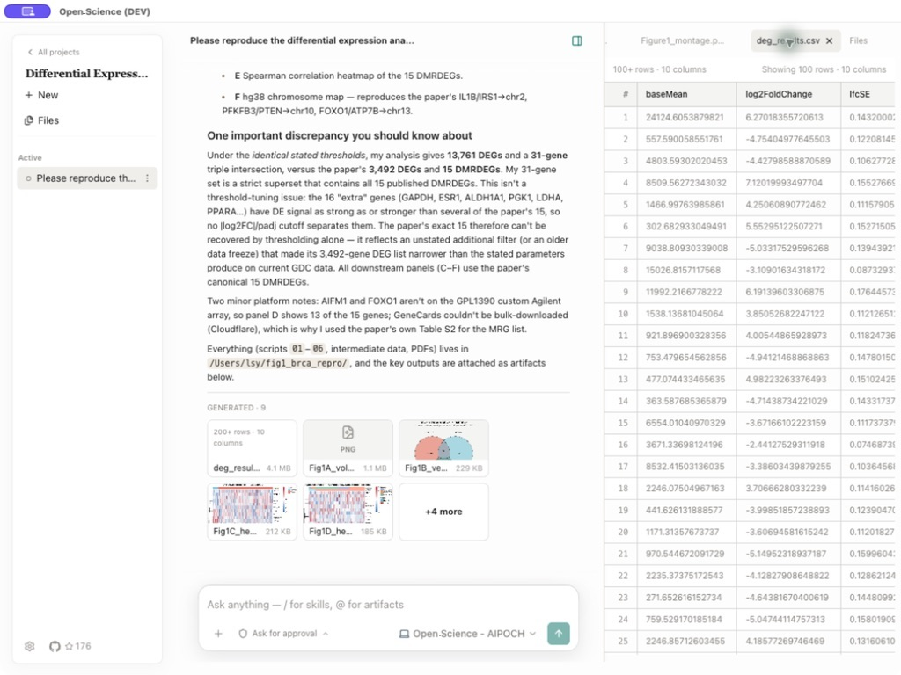
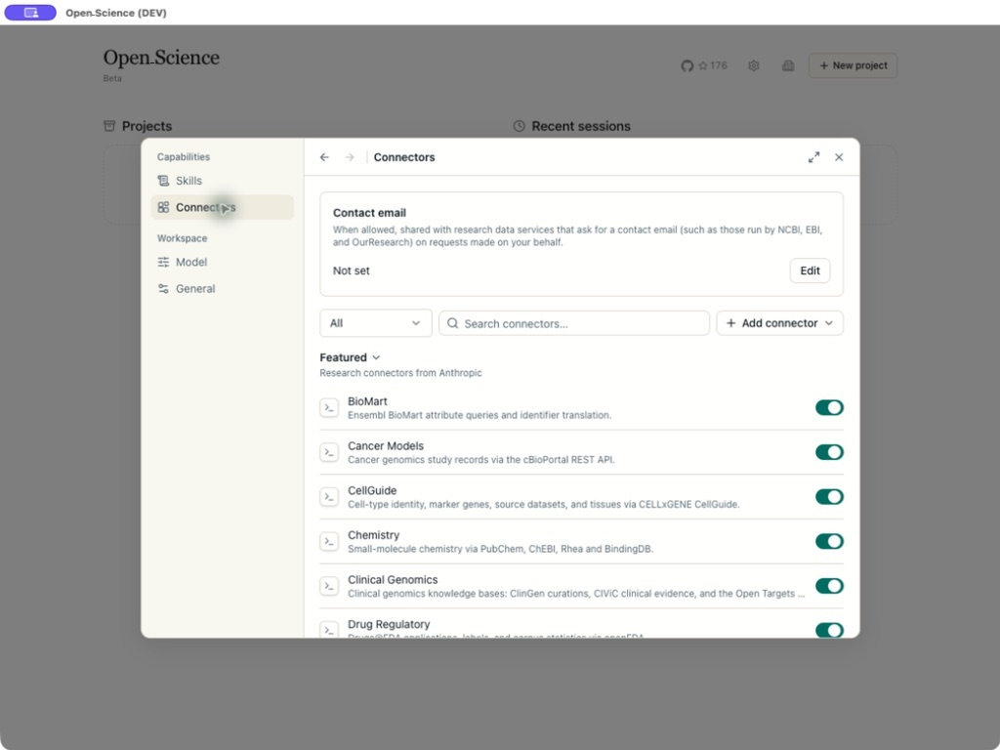

# Open Science - O ambiente de pesquisa com IA de código aberto, equipado com agentes científicos de IA

[](https://github.com/aipoch/open-science/releases/latest)
[](https://github.com/aipoch/open-science/releases/latest)
[](../../LICENSE)
[](https://aipoch.com/open-science)
[](https://discord.gg/zxQAYjReRv)

<p align="center">
  <a href="../../README.md"></a>
  <a href="../zh-Hans/README.md"></a>
  <a href="../zh-Hant/README.md"></a>
  <a href="../ja/README.md"></a>
  <a href="../ko/README.md"></a>
  <a href="../fr/README.md"></a>
  <a href="../pt-BR/README.md"></a>
  <a href="../ru/README.md"></a>
  <a href="../de/README.md"></a>
  <a href="../es/README.md"></a>
</p>

> Este documento é uma tradução para o português do Brasil do `README.md` em inglês. Em caso de divergência, prevalece a [versão em inglês](../../README.md).

O Open Science é um ambiente de pesquisa com IA de código aberto, local-first e independente de modelo, desenvolvido pela [AIPOCH](https://aipoch.com/open-science) para cientistas e pesquisadores. Ele permite realizar pesquisas reproduzíveis e inspecionáveis com agentes científicos de IA, execução em Python e R, conectores de dados científicos e compatibilidade multiplataforma com macOS, Windows e Linux. Crie um projeto, descreva seu objetivo de pesquisa em linguagem natural e deixe que os agentes leiam arquivos, pesquisem na web, executem código, consultem fontes de dados científicos e produzam relatórios, tabelas e figuras com proveniência rastreável, tudo em um único espaço de trabalho.

O Open Science atende a pesquisas computacionais e intensivas em dados em diversas áreas, como aprendizado de máquina, estatística, ciências da vida, química, ciência dos materiais, física e ciências ambientais. Ele apoia o processo de pesquisa desde a revisão da literatura e a formulação de hipóteses até a execução de código, a análise de dados, a simulação, a visualização e a produção de resultados rastreáveis.

> 💡 **[Open Science v0.24.0 lançado](https://github.com/aipoch/open-science/releases/latest)** _(última atualização: agosto de 2026)_. O Open Science v0.24.0 torna mais rápido alternar entre projetos e mais seguro executar código: um seletor rápido de projetos no menu do espaço de trabalho; acesso à rede do Notebook e de computação limitado aos domínios aprovados, com aprovação de novos destinos diretamente na conversa (no Windows, após concluir a configuração de administrador); credenciais compartilhadas em todo o dispositivo que podem ser vinculadas a Conectores personalizados; permissões padrão seguras com restauração em um clique; e interface em alemão — além de gerações imutáveis de arquivos para execuções do Notebook e de computação, tarefas remotas de computação mais robustas e uma ampla série de correções em ambientes de execução, Conectores e armazenamento. Consulte as [notas da versão mais recente](https://github.com/aipoch/open-science/releases/latest) para ver todos os detalhes.

<p align="center">
 
</p>

## Sumário

- [Início rápido](#-início-rápido)
- [Visão geral do produto](#visão-geral-do-produto)
- [Por que usar o Open Science](#por-que-usar-o-open-science)
- [Princípios de design](#princípios-de-design)
- [Principais recursos](#principais-recursos)
- [Provedores de modelos](#provedores-de-modelos)
- [Dados, permissões e confiança](#dados-permissões-e-confiança)
- [Status do projeto](#status-do-projeto)
- [Desenvolvimento e empacotamento](#desenvolvimento-e-empacotamento)
- [Roadmap](#roadmap)
- [Relação com o ecossistema AIPOCH](#relação-com-o-ecossistema-aipoch)
- [O que o Open Science não é](#o-que-o-open-science-não-é)
- [Perguntas frequentes](#perguntas-frequentes)
- [Participe](#participe)
- [Licença](#licença)
- [Histórico de estrelas](#histórico-de-estrelas)

## 🚀 Início rápido

Comece a usar o Open Science em três etapas: baixe o instalador da sua plataforma, conclua a configuração guiada do primeiro acesso e crie um projeto de pesquisa.

### 1. Baixe o aplicativo

Acesse a [versão mais recente](https://github.com/aipoch/open-science/releases/latest), expanda **Assets** e escolha o instalador adequado ao seu computador:

| Seu computador                          | Escolha                                      |
| --------------------------------------- | -------------------------------------------- |
| macOS - Apple Silicon (M1 ou mais novo) | O DMG do macOS para Apple Silicon / ARM64    |
| macOS - Intel                           | O DMG do macOS para Intel / x64              |
| Windows x64                             | O instalador para Windows x64                |
| Linux x64                               | O AppImage ou o pacote Debian para Linux x64 |

Confira os arquivos e as informações de verificação publicados na página da versão. Se precisar validar um pacote antes da instalação, consulte [Como verificar o download](../../SECURITY.md#verifying-your-download).

> Se o macOS ou o Windows exibir um aviso de desenvolvedor não identificado ou editor desconhecido, confirme que o pacote veio da página oficial de Releases antes de continuar.

### 2. Conclua a configuração inicial

O primeiro acesso tem cinco etapas guiadas:

1. **Ambiente** verifica compatibilidade, armazenamento do aplicativo, armazenamento seguro de credenciais e acesso à rede.
2. **Localização dos dados** define onde serão armazenados artefatos grandes, Notebooks, uploads e ambientes.
3. **Ambiente de execução do agente** seleciona e prepara Claude Code, OpenCode, Codex ou CodeBuddy. Os ambientes gerenciados pelo aplicativo podem ser instalados sem Node.js, npm ou senha de administrador.
4. **Provedor do modelo** conecta e testa o modelo que você deseja usar. Escolha um provedor integrado, um Gateway Personalizado ou o login de uma assinatura Claude ou Codex existente.
5. **Ambiente de execução do Notebook** prepara, opcionalmente, ambientes Python e R gerenciados pelo aplicativo ou habilita interpretadores detectados e registrados manualmente para qualquer uma das linguagens.

<table>
  <tr>
    <td width="50%"></td>
    <td width="50%"></td>
  </tr>
  <tr>
    <td align="center"><sub>Verificações de compatibilidade do host, armazenamento e rede</sub></td>
    <td align="center"><sub>Validação do provedor, da chave de API, do endpoint e do modelo</sub></td>
  </tr>
</table>

A execução de Notebooks é opcional. Todas as verificações obrigatórias do ambiente e do ambiente de execução do agente precisam ser concluídas com sucesso antes que `Continuar` seja habilitado, e a conexão com o modelo precisa ser validada antes de concluir a configuração. As configurações do Notebook e da localização dos dados podem manter os valores padrão e ser alteradas depois em Configurações. Enquanto um kernel estiver em execução, a visualização **Variáveis** permite inspecionar o namespace ativo do Python ou R — nomes, tipos, dimensões e prévias — somente para leitura e com atualização após cada execução.

### 3. Inicie um projeto de pesquisa

1. Clique em **Novo projeto** e dê ao projeto um nome de pesquisa estável e, se quiser, uma descrição.
2. Abra uma sessão e descreva o objetivo, os dados de entrada, as restrições, os resultados desejados e como o resultado deve ser verificado.
3. Anexe os arquivos de origem, selecione um modelo validado e escolha um modo de aprovação.
4. Envie a tarefa. Examine a atividade das ferramentas do agente, aprove as ações sensíveis e abra os artefatos gerados no painel de visualização.
5. Para explorar outra direção, edite uma mensagem anterior do usuário e reenvie-a em uma nova ramificação; use os controles de revisão da mensagem para voltar a qualquer um dos caminhos.
6. Abra a visualização **Proveniência** de um artefato para consultar suas versões e as evidências disponíveis para o resultado selecionado.
7. Continue o trabalho em sessões futuras. Use `@` para referenciar um arquivo existente do projeto e `/` para selecionar explicitamente uma habilidade habilitada.

> As capturas de tela deste README ilustram o fluxo de trabalho. Rótulos, catálogos e outros detalhes da interface podem ser diferentes na versão instalada.

## Visão geral do produto

O Open Science organiza a pesquisa em projetos e sessões para que cada resultado permaneça ligado às evidências que o produziram. As seções a seguir apresentam o espaço de trabalho, a proveniência dos artefatos, as visualizações, as habilidades científicas e os conectores de dados.

### Um único espaço de trabalho, da tarefa aos artefatos rastreáveis

Os projetos mantêm juntos as sessões relacionadas, os uploads, os arquivos gerados e o estado das visualizações. A conversa registra a resposta do agente e os comandos, leituras de arquivos, edições, pesquisas e chamadas de conectores que a produziram. Cada artefato gerado é armazenado como uma versão imutável com checksum. A visualização **Proveniência** mostra as evidências que o Open Science conseguiu verificar no momento da criação: o código produtor e o histórico de execução, as entradas referenciadas, um inventário observado do ambiente, a ramificação da conversa que gerou o artefato e eventuais apontamentos do revisor vinculados àquela versão. Evidências ausentes são apresentadas como indisponíveis, sem suposições.

<table>
  <tr>
    <td width="50%"></td>
    <td width="50%"></td>
  </tr>
  <tr>
    <td align="center"><sub>Uploads e arquivos gerados organizados por projeto e sessão</sub></td>
    <td align="center"><sub>Visualizações nativas mantêm os dados e o histórico da pesquisa lado a lado</sub></td>
  </tr>
</table>

Relatórios, figuras e tabelas gerados permanecem vinculados à sessão e também são reunidos na biblioteca de arquivos do projeto. As abas de visualização mantêm o resultado ativo visível quando o painel muda de tamanho, e nomes longos preservam o sufixo e a extensão que permitem identificá-los. O Open Science visualiza dados científicos comuns, PDFs, documentos do Office (DOCX, XLSX, PPTX), imagens (com zoom e deslocamento), código-fonte com realce de sintaxe, estruturas e reações moleculares e o histórico do Notebook. Os limites da visualização não truncam o arquivo original: o artefato completo continua disponível para o agente e para ferramentas externas. Use `Cmd/Ctrl+F` para pesquisar transcrições, saídas do Notebook e páginas renderizadas em todo o espaço de trabalho, ou `Cmd/Ctrl+K` para abrir a paleta de comandos do projeto. O modo escuro completa o ambiente: altere o tema em **Configurações → Geral** e toda a interface do aplicativo, a transcrição e a paleta do renderizador mudam sem piscar. A interface também está disponível em alemão, espanhol, francês, chinês simplificado e tradicional, japonês, coreano, português do Brasil e russo, com seletor de idioma em tempo de execução nas Configurações.

### Crie uma ramificação da conversa sem perder o original

Edite uma mensagem concluída do usuário para reenviar um prompt revisado a partir daquele ponto. O Open Science cria uma nova ramificação de mensagens em vez de excluir as interações posteriores, e os controles de revisão permitem alternar entre os caminhos original e alternativo. A ramificação selecionada, a atividade das ferramentas, os anexos e os artefatos gerados persistem ao trocar de projeto e reiniciar o aplicativo. A proveniência continua vinculada à ramificação exata que produziu cada versão do artefato; assim, explorar outra hipótese não confunde o registro do resultado anterior.

### Habilidades científicas e conectores de dados

O Open Science inclui um catálogo crescente de **18 habilidades em destaque**, baseadas em arquivos: AlphaFold2, Boltz, Borzoi, Chai-1, DiffDock, Environment & Packages, ESM-2, ESMFold2, Evo 2, Indication Dossier, LigandMPNN, Literature Review, OpenFold3, ProteinMPNN, scGPT, scvi-tools, SolubleMPNN e **Remote Compute (SSH)**, usada para enviar e coletar trabalhos de longa duração em clusters HPC remotos. Você pode criar habilidades pessoais, enviar pacotes `SKILL.md`/ZIP/`.skill`, visualizar e importar habilidades compatíveis do GitHub com acesso autenticado opcional ou importar habilidades já instaladas nos diretórios globais dos seus agentes. O agente também pode solicitar a importação de um pacote a partir de um anexo da sessão ou de uma URL pública do GitHub, com visualização e confirmação controladas pelo aplicativo antes que qualquer arquivo seja gravado. As habilidades habilitadas podem ser selecionadas diretamente no compositor com `/`.

O aplicativo também inclui **24 conectores de pesquisa integrados**: Literature Graph, PubMed, bioRxiv, Genes & Ontologies, Genomes, BioMart, Variants, Human Genetics, Clinical Genomics, Structures & Interactions, Protein Annotation, Expression, Omics Archives, CellGuide, Regulation, RNA, Chemistry, ChEMBL, ZINC, Molecule Viewer, Clinical Trials, Drug Regulatory, Cancer Models e Research Resources. Conectores integrados e personalizados permanecem protegidos pelo sistema de permissões, com os controles `Permitir sempre`, `Perguntar a cada vez` e `Bloquear` para cada ferramenta. O aplicativo instalado mostra os catálogos atuais de habilidades, conectores e ferramentas.

<table>
  <tr>
    <td width="50%"></td>
    <td width="50%"></td>
  </tr>
  <tr>
    <td align="center"><sub>Habilidades de pesquisa legíveis e reutilizáveis</sub></td>
    <td align="center"><sub>Bancos de dados científicos disponibilizados como ferramentas de agente sujeitas a permissão</sub></td>
  </tr>
</table>

## Por que usar o Open Science

O Open Science reúne tarefas de pesquisa, execução, arquivos e evidências em um único espaço de trabalho local para desktop, que pode ser inspecionado.

O trabalho de pesquisa costuma ficar dividido entre janelas de chat, Notebooks, scripts locais, bancos de dados científicos, navegadores de arquivos e ferramentas de relatório. O contexto se perde a cada transferência, e a resposta muitas vezes fica separada do código e dos arquivos que a produziram.

O Open Science reúne todas essas partes em um único espaço de trabalho inspecionável:

- **Trabalho que persiste.** Projetos, sessões, rascunhos, arquivos, visualizações e histórico de execução sobrevivem às reinicializações do aplicativo.
- **Execução, não apenas sugestões.** Com a aprovação do usuário, o agente pode executar comandos, Python e R, editar arquivos, pesquisar, chamar conectores e gerar artefatos.
- **Caminhos alternativos sem perder trabalho.** Revise um prompt anterior em uma nova ramificação de mensagens e alterne entre as direções de pesquisa resultantes.
- **Resultados rastreáveis.** Versões imutáveis dos artefatos preservam as evidências de produção que o Open Science consegue verificar e identificam explicitamente as que não consegue.
- **Várias opções de modelo.** Use um provedor de nuvem integrado, um gateway personalizado compatível ou uma assinatura Claude ou Codex; escolha no compositor o modelo e o nível de raciocínio de cada sessão.
- **Controle local-first.** O aplicativo é executado e o estado do projeto é armazenado no seu computador; chamadas externas passam por serviços que você configura ou aprova explicitamente.
- **Inspecionabilidade.** O código-fonte, as habilidades, as definições dos conectores, a atividade das ferramentas, os arquivos gerados e a proveniência dos artefatos ficam disponíveis para análise.
- **Extensibilidade.** Adicione habilidades e conectores MCP sem depender do roadmap de plugins de uma plataforma fechada.
- **Sem licença por usuário.** O Open Science é um software Apache-2.0. Você paga apenas pelo modelo ou pela infraestrutura que escolher usar.

O Open Science é um produto independente, desenvolvido do zero. Não é um proxy, um cliente não oficial nem uma nova aparência para outro aplicativo de pesquisa com IA.

## Princípios de design

O Open Science se baseia em sete princípios de design que orientam a integração entre código, dados, modelos e supervisão humana: abertura por padrão, compatibilidade explícita com vários provedores, controle local-first dos dados, supervisão humana, registros de pesquisa duráveis, recursos combináveis e limites científicos honestos.

- **Aberto por padrão.** Código-fonte, formatos, conectores e habilidades devem continuar inspecionáveis e permitir forks.
- **Vários provedores com compatibilidade explícita.** O aplicativo valida a configuração do provedor e deixa claros os requisitos do endpoint, em vez de tratar todos os protocolos de API como intercambiáveis.
- **Local-first e consciente dos dados.** Mantenha o estado do projeto local, torne visíveis os fluxos de dados externos e deixe a autonomia como opção.
- **Supervisão humana.** Edições de arquivos, comandos, acesso à rede e chamadas de conectores são controlados por perfis de aprovação explícitos.
- **Registros de pesquisa duráveis.** Sessões, atividade das ferramentas, histórico do Notebook e versões imutáveis dos artefatos devem continuar disponíveis para análise após o término da execução, com indicação clara das evidências indisponíveis.
- **Recursos combináveis.** Habilidades, conectores, modelos, visualizações e futuros backends de computação devem ser partes substituíveis, não uma caixa-preta única.
- **Limites científicos honestos.** O resultado gerado não substitui o julgamento especializado, a revisão estatística nem a validação com evidências primárias.

## Principais recursos

O Open Science combina gerenciamento de projetos, execução de agentes com vários modelos, Notebooks Python e R, conectores de dados científicos, versões imutáveis de artefatos com proveniência e controles de supervisão humana baseados em permissões, tudo em um único espaço de trabalho local. O aplicativo instalado e as [notas da versão mais recente](https://github.com/aipoch/open-science/releases/latest) são as fontes oficiais para catálogos em evolução, detalhes de empacotamento e opções recém-adicionadas.

| Área                              | Recurso principal                                                                                                                                                                                                                                                                                                                                                                                                                                                                                                                                                                                                                                                                                                                                                                                                                                                                                                                                                                                                                                                                                                                                                                                                                                                                                                                                                                                                                                                                                                                                                                                                                                                                                                                                                                                                                                                                                                                                                                                                                                                                                                                                                                                                                                                                                                                                                                                                                                                                                                                                                                                                                                                                                                                                                                                                                                                                                                                                                                                                                                                                               |
| --------------------------------- | ----------------------------------------------------------------------------------------------------------------------------------------------------------------------------------------------------------------------------------------------------------------------------------------------------------------------------------------------------------------------------------------------------------------------------------------------------------------------------------------------------------------------------------------------------------------------------------------------------------------------------------------------------------------------------------------------------------------------------------------------------------------------------------------------------------------------------------------------------------------------------------------------------------------------------------------------------------------------------------------------------------------------------------------------------------------------------------------------------------------------------------------------------------------------------------------------------------------------------------------------------------------------------------------------------------------------------------------------------------------------------------------------------------------------------------------------------------------------------------------------------------------------------------------------------------------------------------------------------------------------------------------------------------------------------------------------------------------------------------------------------------------------------------------------------------------------------------------------------------------------------------------------------------------------------------------------------------------------------------------------------------------------------------------------------------------------------------------------------------------------------------------------------------------------------------------------------------------------------------------------------------------------------------------------------------------------------------------------------------------------------------------------------------------------------------------------------------------------------------------------------------------------------------------------------------------------------------------------------------------------------------------------------------------------------------------------------------------------------------------------------------------------------------------------------------------------------------------------------------------------------------------------------------------------------------------------------------------------------------------------------------------------------------------------------------------------------------------------- |
| **Projetos e sessões**            | Crie, renomeie e exclua projetos; mantenha várias sessões, inclusive fixadas; transforme prompts concluídos em ramificações de mensagens persistentes e selecionáveis sem excluir o caminho posterior original; mantenha conversas laterais persistentes dentro de uma sessão; gere e edite detalhes da sessão (título e descrição); restaure trabalhos recentes, rascunhos, histórico da conversa e estado da visualização.                                                                                                                                                                                                                                                                                                                                                                                                                                                                                                                                                                                                                                                                                                                                                                                                                                                                                                                                                                                                                                                                                                                                                                                                                                                                                                                                                                                                                                                                                                                                                                                                                                                                                                                                                                                                                                                                                                                                                                                                                                                                                                                                                                                                                                                                                                                                                                                                                                                                                                                                                                                                                                                                    |
| **Fluxo de trabalho do agente**   | Tarefas em linguagem natural, respostas transmitidas em tempo real, cartões tipados de atividade das ferramentas agrupados por títulos que indicam a finalidade declarada, indicador em tempo real de uso do contexto com estimativas por categoria, compactação do contexto sob demanda e persistência entre reinicializações; controles de interrupção, pausas para aprovação e confirmação, com preferência memorizada, antes de fechar ou sair durante uma tarefa em execução; fila de mensagens no compositor para preparar mensagens de acompanhamento durante uma interação em andamento; histórico unificado para desfazer e refazer rascunhos; criação de uma nova sessão a partir de mensagens concluídas do agente; notificações no desktop com o motivo da atenção, indicadores persistentes de conversas não lidas e sinalização nativa para aprovações bloqueantes; central de mensagens de notificação entre superfícies, com ícones codificados por tipo e estado, estado de leitura persistente e preservação de destinos excluídos; cartões estruturados para esclarecimentos do agente com várias perguntas e revisão de cada resposta; anotações em textos, imagens e PDFs — trechos ou regiões selecionados, com um clique para localizá-los no documento de origem — que enviam o contexto selecionado à conversa; marcadores de alteração da configuração do agente entre interações na linha do tempo; linhas expandidas de carregamento de habilidades que exibem o documento carregado; contexto de leitura da sessão que vincula até três PDFs para que o Agente possa ler a página atual, percorrer o documento inteiro e pesquisá-lo; memória persistente do Agente que recupera conhecimento específico do projeto entre sessões; visualizações seguras e isoladas no aplicativo para links de fontes nas respostas do agente; status da sessão em tempo real no painel inicial; metadados de duração das mensagens com popovers de tempo decorrido e uso; uso de tokens por interação, com detalhes por chamada de modelo e gráfico da janela de contexto de cada chamada; identificação do framework do agente e do modelo nas interações concluídas; paleta de comandos do projeto; leitura de frames, ações do projeto e contexto do agente no escopo do projeto; seletor rápido de projetos no menu do espaço de trabalho, que lista outros projetos ativos com prévias de título e descrição; linhas refinadas na barra lateral de sessões, com prévias do título e da descrição ao passar o cursor; referências (`#`) a outras sessões no compositor, com acesso de leitura limitado à interação; avisos de conversas laterais inseridos na interação principal em andamento; busca por número da sessão na pesquisa global; planos de sessão sujeitos a revisão, com contratos de execução duráveis e comandos CLI para exibir, aprovar e rejeitar planos; renderização suave das respostas em tempo real; painéis laterais recolhíveis; atalho de teclado para nova conversa; e recuperação de sessões interrompidas pela reinicialização do aplicativo. |
| **Delegação a subagentes**        | Delegação de nível de produção a subagentes, com mensagens e recuperação persistentes.                                                                                                                                                                                                                                                                                                                                                                                                                                                                                                                                                                                                                                                                                                                                                                                                                                                                                                                                                                                                                                                                                                                                                                                                                                                                                                                                                                                                                                                                                                                                                                                                                                                                                                                                                                                                                                                                                                                                                                                                                                                                                                                                                                                                                                                                                                                                                                                                                                                                                                                                                                                                                                                                                                                                                                                                                                                                                                                                                                                                          |
| **Modelos**                       | Provedores de nuvem integrados, gateways personalizados compatíveis, login com assinaturas Claude e Codex, validação de conexão, entrada multimodal de imagens por modelo, seletor combinado no compositor de cada sessão para o modelo e o nível de raciocínio compatível, cartão consolidado de modelos por função para as políticas de subagente, revisor e visão, padrões nas Configurações para novas sessões e um seletor dedicado do modelo de visão, com retransmissão persistente das evidências de imagem para backends que aceitam apenas texto. Os provedores e formatos de API disponíveis são validados de acordo com o backend de agente selecionado.                                                                                                                                                                                                                                                                                                                                                                                                                                                                                                                                                                                                                                                                                                                                                                                                                                                                                                                                                                                                                                                                                                                                                                                                                                                                                                                                                                                                                                                                                                                                                                                                                                                                                                                                                                                                                                                                                                                                                                                                                                                                                                                                                                                                                                                                                                                                                                                                                            |
| **Backend de agente**             | Backend selecionável de framework de agente — Claude Code, OpenCode, Codex ou um ambiente de execução do CodeBuddy sem necessidade de login —, permitindo que o mesmo espaço de trabalho use mais de uma implementação de agente subjacente; opções de provedor e modelo validadas conforme o backend selecionado; backends gerenciados pelo aplicativo que podem ser instalados, alternados e removidos nas Configurações; e repetição de contexto consciente do agente, respeitando o caminho de contexto de cada framework após trocas ou retomadas.                                                                                                                                                                                                                                                                                                                                                                                                                                                                                                                                                                                                                                                                                                                                                                                                                                                                                                                                                                                                                                                                                                                                                                                                                                                                                                                                                                                                                                                                                                                                                                                                                                                                                                                                                                                                                                                                                                                                                                                                                                                                                                                                                                                                                                                                                                                                                                                                                                                                                                                                         |
| **Especialistas**                 | Perfis pessoais de agentes especialistas com recursos definidos, transferência imediata durante a execução pelo agente principal, personalização por conversa, importação e exportação de pacotes, identidades imutáveis de invocação, IDs gerados a partir do nome com substituições validadas e um Marketplace de Especialistas com escopo definido, verificação de pacotes assinados, fontes oficiais e do GitHub aprovadas pelo usuário, fallback por CDN, progresso de download e resolução de conflitos entre habilidades na importação. O Marketplace separa as visualizações Instalados e Marketplace, oferece uma grade de cards para navegação, chips de filtro e uma única entrada principal com caminho explícito de retorno, abre imediatamente listagens verificadas em cache com atualização manual, permite instalação direta pelos detalhes e oferece ícones compartilhados de recursos (64 glifos integrados), edição rápida da aparência e navegação pelas linhas de recursos.                                                                                                                                                                                                                                                                                                                                                                                                                                                                                                                                                                                                                                                                                                                                                                                                                                                                                                                                                                                                                                                                                                                                                                                                                                                                                                                                                                                                                                                                                                                                                                                                                                                                                                                                                                                                                                                                                                                                                                                                                                                                                               |
| **Organização de recursos**       | Tags compartilhadas por habilidades, conectores e especialistas executáveis, com uma tag protegida de Favoritos, menus de atribuição, badges, filtros, navegador pesquisável de tags nas Configurações e ordenação persistente por arraste ou teclado.                                                                                                                                                                                                                                                                                                                                                                                                                                                                                                                                                                                                                                                                                                                                                                                                                                                                                                                                                                                                                                                                                                                                                                                                                                                                                                                                                                                                                                                                                                                                                                                                                                                                                                                                                                                                                                                                                                                                                                                                                                                                                                                                                                                                                                                                                                                                                                                                                                                                                                                                                                                                                                                                                                                                                                                                                                          |
| **Execução**                      | Kernels persistentes de Python, R e REPL no plano de controle, com histórico durável de código e saída, além de comandos sem estado executados na linha de comando e registrados no mesmo histórico de execução; acesso externo à rede dos ambientes de execução do Notebook e de computação limitado aos padrões do Open Science e aos domínios aprovados pelo usuário, com destinos bloqueados apresentados para aprovação diretamente na conversa; inferência REPL limitada para avaliação orientada pelo agente; ambientes gerenciados pelo aplicativo com provisionamento offline; uso de interpretadores Python e R fornecidos pelo usuário; hosts remotos de computação SSH com autenticação por chave ou senha, inclusive no Windows, e credenciais armazenadas com criptografia do sistema operacional como destinos adicionais de execução; terminal do usuário compartilhado com o agente, com sugestões em tempo real de nomes de variáveis do kernel ativo durante a digitação; inventário somente leitura dos pacotes instalados por ambiente de execução; navegador somente leitura das variáveis ativas dos kernels Python e R em execução; acesso de leitura aos artefatos do Notebook para inspeção de arquivos pelo agente; progresso da instalação de pacotes com tempo decorrido na atividade da sessão; e carregamento progressivo do histórico de Notebooks de longa duração. O gerenciamento de pacotes para ambientes R externos continua manual.                                                                                                                                                                                                                                                                                                                                                                                                                                                                                                                                                                                                                                                                                                                                                                                                                                                                                                                                                                                                                                                                                                                                                                                                                                                                                                                                                                                                                                                                                                                                                                                                                      |
| **Entradas e arquivos**           | Anexos de até 10 GB por arquivo com upload por streaming; biblioteca no nível do projeto com paginação indexada, agrupamento por sessão, pesquisa de nomes de arquivo restrita aos arquivos de origem, visualizações em grade e lista, modal ampliado para projetos grandes, visualização dividida do arquivo ao lado da sessão, cartões de artefatos gerados, referências `@` a uploads e saídas existentes, menções `@path` para conceder acesso a pastas locais com navegação entre unidades, barra de caminho editável e seletor de unidade, download e exportação de arquivos, downloads seletivos de artefatos da sessão, conversão de colagens longas de texto simples em anexos com restauração exata, exportação da conversa como Markdown ou PDF e exportação da sessão como `.ipynb`, por aba ou em lote.                                                                                                                                                                                                                                                                                                                                                                                                                                                                                                                                                                                                                                                                                                                                                                                                                                                                                                                                                                                                                                                                                                                                                                                                                                                                                                                                                                                                                                                                                                                                                                                                                                                                                                                                                                                                                                                                                                                                                                                                                                                                                                                                                                                                                                                                            |
| **Artefatos e proveniência**      | Versões imutáveis de artefatos no escopo da sessão, com conteúdo identificado por checksum e, quando disponíveis, código produtor, histórico de execução, referências exatas das entradas, inventário do ambiente, contexto da ramificação de mensagens produtora, acesso à linhagem do artefato e evidências do revisor vinculadas à versão, além de navegação entre versões e links diretos entre evidências relacionadas.                                                                                                                                                                                                                                                                                                                                                                                                                                                                                                                                                                                                                                                                                                                                                                                                                                                                                                                                                                                                                                                                                                                                                                                                                                                                                                                                                                                                                                                                                                                                                                                                                                                                                                                                                                                                                                                                                                                                                                                                                                                                                                                                                                                                                                                                                                                                                                                                                                                                                                                                                                                                                                                                    |
| **Formatos de visualização**      | Visualizações responsivas em várias abas para dados científicos comuns, PDFs com texto selecionável, seleção de áreas, navegação pelo sumário e por miniaturas, pesquisa no documento e navegação entre páginas, documentos do Office (DOCX, XLSX, PPTX), imagens, inclusive TIFF, com zoom e deslocamento, código-fonte com realce de sintaxe, estruturas e reações moleculares e histórico do Notebook; podem ser exibidas em linha ou em tela cheia, com ações no menu de contexto das abas (fechar, fechar outras, baixar, copiar o caminho e salvar como artefato) e navegação contextual de volta à conversa que produziu o artefato.                                                                                                                                                                                                                                                                                                                                                                                                                                                                                                                                                                                                                                                                                                                                                                                                                                                                                                                                                                                                                                                                                                                                                                                                                                                                                                                                                                                                                                                                                                                                                                                                                                                                                                                                                                                                                                                                                                                                                                                                                                                                                                                                                                                                                                                                                                                                                                                                                                                     |
| **Gerenciamento de dados locais** | Dados locais do projeto e do aplicativo, localização de armazenamento configurável, que também inclui os caches de carga de trabalho do Notebook, migração guiada e configurações globais de proxy nos modos sistema, manual e direto; painel de uso de tokens com resumos por período, mapa de calor de atividade de 30 dias, gráficos diários de entrada, cache e saída, atribuição de uso por execução e cobertura das chamadas de modelo fora da conversa principal, incluindo conversas laterais, delegação e compactação.                                                                                                                                                                                                                                                                                                                                                                                                                                                                                                                                                                                                                                                                                                                                                                                                                                                                                                                                                                                                                                                                                                                                                                                                                                                                                                                                                                                                                                                                                                                                                                                                                                                                                                                                                                                                                                                                                                                                                                                                                                                                                                                                                                                                                                                                                                                                                                                                                                                                                                                                                                 |
| **Habilidades**                   | **18 habilidades integradas em destaque**; habilidades pessoais com nomes imutáveis em minúsculas e separados por hífen; criação conversacional de habilidades em linguagem natural dentro de uma sessão; opção de salvar uma interação concluída como habilidade; suporte direto à pasta de habilidades do usuário com validação externa de pacotes; gerenciamento em massa para habilitar e desabilitar com filtros de origem, status e texto; envio de pacotes; visualização e importação autenticadas do GitHub; importação de habilidades globais instaladas com visualização dos candidatos; importações de pacotes solicitadas pelo agente a partir de anexos da sessão ou URLs do GitHub; APIs JavaScript do host em camelCase para scripts de habilidades, com validação estruturada; fluxos de trabalho de figuras sensíveis à proveniência, com auxiliares registrados de estilo, composição e narrativa de artigos científicos; controles para habilitar e desabilitar; e seleção explícita com `/` em uma sessão. O painel Habilidades reformulado unifica a filtragem do agente principal e dos especialistas, mostra pilhas de avatares dos usuários reais com um popover limitado "Usado por", consolida as ações por linha e permite exclusão em massa com confirmação, protegendo habilidades integradas e vinculadas a especialistas.                                                                                                                                                                                                                                                                                                                                                                                                                                                                                                                                                                                                                                                                                                                                                                                                                                                                                                                                                                                                                                                                                                                                                                                                                                                                                                                                                                                                                                                                                                                                                                                                                                                                                                                                        |
| **Conectores**                    | **24 conectores de pesquisa integrados** com status do ambiente de execução e superfícies de recuperação; conectores MCP locais e remotos personalizados com nomes imutáveis de invocação em minúsculas, separados dos nomes de exibição editáveis; IDs locais gerados a partir do nome com substituições validadas; metadados de contato; permissões por conector e por ferramenta; e importação e exportação de configurações padrão de clientes MCP com placeholders para credenciais. As interações com o catálogo seguem os mesmos padrões compactos de gerenciamento das habilidades.                                                                                                                                                                                                                                                                                                                                                                                                                                                                                                                                                                                                                                                                                                                                                                                                                                                                                                                                                                                                                                                                                                                                                                                                                                                                                                                                                                                                                                                                                                                                                                                                                                                                                                                                                                                                                                                                                                                                                                                                                                                                                                                                                                                                                                                                                                                                                                                                                                                                                                     |
| **Controles de segurança**        | Perfis de conversa `Solicitar aprovação`, `Aprovar automaticamente as edições` e `Acesso completo`; caixas de diálogo de aprovação com visualização prévia do código e decisões por chamada ou conversa; recusas limitadas à interação que bloqueiam novas tentativas ou alternativas para a operação recusada; permissões persistentes com escopo global, de projeto e de sessão, com filtros, revogação por linha e por família e opção Desfazer; gerenciamento centralizado de credenciais para tokens do GitHub, chaves de conectores e logins de conectores, com status de integridade e recuperação guiada; credenciais compartilhadas em todo o dispositivo (chaves de API, tokens de acesso e logins OAuth) que os Conectores personalizados podem usar sem armazenar cópias próprias; ação de restauração dos padrões que repõe as permissões padrão seguras ausentes; além de políticas por Conector e por ferramenta.                                                                                                                                                                                                                                                                                                                                                                                                                                                                                                                                                                                                                                                                                                                                                                                                                                                                                                                                                                                                                                                                                                                                                                                                                                                                                                                                                                                                                                                                                                                                                                                                                                                                                                                                                                                                                                                                                                                                                                                                                                                                                                                                                                |
| **Revisão e verificação**         | Revisor opcional que audita uma interação concluída com base na própria transcrição, no log de execução e nos artefatos, apresenta apontamentos classificados como sucesso, alerta ou falha e pode executar um ciclo limitado de correções; política configurável do modelo revisor, que acompanha o modelo ativo ou fixa um provedor, modelo e nível de raciocínio dedicados; e snapshots persistentes da avaliação do revisor com atribuição das correções.                                                                                                                                                                                                                                                                                                                                                                                                                                                                                                                                                                                                                                                                                                                                                                                                                                                                                                                                                                                                                                                                                                                                                                                                                                                                                                                                                                                                                                                                                                                                                                                                                                                                                                                                                                                                                                                                                                                                                                                                                                                                                                                                                                                                                                                                                                                                                                                                                                                                                                                                                                                                                                   |
| **Distribuição e suporte**        | Instaladores para macOS, Windows e Linux; assistente simplificado de primeiro acesso para ambiente, localização dos dados, ambiente de execução do agente, provedor do modelo e ambiente de execução do Notebook; interface localizada em alemão, espanhol, francês, chinês simplificado e tradicional, japonês, coreano, português do Brasil e russo, com um README traduzido para cada idioma compatível e outros guias de contribuição multilíngues; orientações de atualização com lembretes em destaque; diagnósticos locais; e links da comunidade.                                                                                                                                                                                                                                                                                                                                                                                                                                                                                                                                                                                                                                                                                                                                                                                                                                                                                                                                                                                                                                                                                                                                                                                                                                                                                                                                                                                                                                                                                                                                                                                                                                                                                                                                                                                                                                                                                                                                                                                                                                                                                                                                                                                                                                                                                                                                                                                                                                                                                                                                       |

## Provedores de modelos

No produto, o Open Science é independente de modelo: conecte-o aos principais provedores de LLM na nuvem, a um gateway personalizado ou reutilize uma assinatura Claude ou Codex existente. A disponibilidade dos provedores depende atualmente do backend de agente selecionado e dos protocolos de API compatíveis. Há quatro formas de conectar um modelo:

| Modo do provedor                   | Como funciona                                                                                                                                                                                                                                                                                                                                                  |
| ---------------------------------- | -------------------------------------------------------------------------------------------------------------------------------------------------------------------------------------------------------------------------------------------------------------------------------------------------------------------------------------------------------------- |
| **Provedores de nuvem integrados** | Escolha um provedor na lista exibida pelo aplicativo instalado e autentique-se com a chave solicitada.                                                                                                                                                                                                                                                         |
| **Gateway Personalizado**          | Informe uma URL base compatível, uma chave de API e o ID exato do modelo. O formato de API padrão (Messages, Chat Completions ou Responses) é derivado do framework de agente ativo; assim, um novo gateway personalizado funciona sem configuração adicional.                                                                                                 |
| **Assinatura Codex**               | Selecione o framework de agente Codex e escolha Assinatura Codex como tipo de provedor.                                                                                                                                                                                                                                                                        |
| **Assinatura Claude**              | Entre com uma assinatura Claude em um de dois modos: **compartilhado** (login pelo navegador que armazena credenciais no perfil padrão `~/.claude`) ou **isolado** (execução de `claude setup-token`, gerenciada pelo aplicativo em um `CLAUDE_CONFIG_DIR` próprio, completamente isolado de `~/.claude/`, com fluxo pelo navegador e opção de colar o token). |

O provedor legado **Local Claude** foi removido. As entradas Local Claude armazenadas anteriormente
são descartadas durante a atualização; adicione **Assinatura Claude** e autentique-se pelo login
compartilhado no navegador ou pelo fluxo isolado `claude setup-token`.

Os provedores de nuvem integrados incluem atualmente OpenAI, Anthropic, Grok (xAI), DeepSeek, Zhipu AI (GLM) com endpoint dedicado ao GLM Coding Plan, Kimi (Moonshot), MiniMax, StepFun com endpoint dedicado à assinatura Step Plan, Xiaomi MIMO, SenseNova, Volcengine Ark, Bailian (Alibaba Cloud) com endpoint dedicado à assinatura Bailian for Plan, Tencent TokenHub e endpoints dedicados às assinaturas Tencent Coding Plan e Token Plan, OpenCode Go, OpenCode Zen e o gateway agregador OpenRouter, entre outros; alguns são específicos de determinadas regiões.

Os provedores, modelos disponíveis e endpoints regionais podem evoluir independentemente deste README. Considere o seletor de provedores e o teste de conexão no aplicativo instalado como fontes oficiais.

## Dados, permissões e confiança

O Open Science armazena no computador local os dados do projeto, as configurações, as versões dos artefatos e as evidências de proveniência. As chaves de API ficam armazenadas localmente e usam o armazenamento seguro de credenciais do sistema operacional quando disponível. Os logs são locais e não são enviados automaticamente.

Ainda pode haver fluxos externos de dados, que devem ser analisados:

- As requisições ao modelo enviam o prompt e o contexto necessário ao provedor selecionado.
- Pesquisas na web e conectores remotos enviam os parâmetros exibidos a serviços externos.
- Conectores locais podem executar comandos confiáveis no computador.
- Anexos, referências `@`, logs e relatórios gerados podem conter dados de pesquisa confidenciais.

Escolha o perfil de permissão mais restrito que atenda à tarefa:

| Modo                                 | Comportamento                                                                                              | Uso recomendado                                                       |
| ------------------------------------ | ---------------------------------------------------------------------------------------------------------- | --------------------------------------------------------------------- |
| `Solicitar aprovação`                | Solicita aprovação antes de edições, comandos, acesso à rede e chamadas de conectores                      | Novos fluxos de trabalho, dados confidenciais e scripts desconhecidos |
| `Aprovar automaticamente as edições` | Permite automaticamente edições no espaço de trabalho; solicita aprovação para comandos, rede e conectores | Edição confiável de arquivos com acesso externo controlado            |
| `Acesso completo`                    | Permite automaticamente edições, comandos, acesso à rede e conectores                                      | Trabalho não assistido, totalmente confiável e com escopo claro       |

Confira os parâmetros dos conectores e a atividade das ferramentas antes de aprovar. Nunca inclua chaves de API, tokens de acesso, identificadores de pacientes, dados não publicados ou caminhos locais confidenciais em capturas de tela ou logs de issues públicas.

## Status do projeto

O Open Science é um aplicativo para desktop em desenvolvimento ativo, disponível para macOS, Windows e Linux. O desenvolvimento se concentra em fluxos de pesquisa local-first confiáveis, recursos científicos extensíveis, artefatos de pesquisa rastreáveis e execução controlada pelo usuário.

Consulte a [versão mais recente](https://github.com/aipoch/open-science/releases/latest) para obter os downloads atuais e as alterações específicas de cada versão. Para ver os recursos entregues, parciais e planejados, consulte o [Mapa de recursos](../../ROADMAP.md#capability-map).

O Open Science auxilia na execução e no registro da pesquisa; os pesquisadores continuam responsáveis pelos métodos, pela interpretação, pela privacidade e pela validade científica.

## Desenvolvimento e empacotamento

O Open Science é um aplicativo Electron desenvolvido com React, TypeScript, Prisma/SQLite e um ambiente de execução de agente baseado em ACP.

Pré-requisitos para desenvolvimento a partir do código-fonte:

- Node.js 22 (consulte [`.nvmrc`](../../.nvmrc)) com npm
- Git
- Python 3 somente se você quiser executar Notebooks

```bash
git clone https://github.com/aipoch/open-science.git
cd open-science
npm install
npm run dev
```

`npm install` gera automaticamente o cliente Prisma e instala as dependências nativas do Electron. `npm run dev` cria os pacotes do processo principal e do preload do Electron, inicia o renderizador e abre o aplicativo para desktop. Os dados de desenvolvimento ficam isolados em `~/.open-science-project`.

Comandos úteis:

| Comando                | Finalidade                                                                    |
| ---------------------- | ----------------------------------------------------------------------------- |
| `npm run dev`          | Inicia o aplicativo de desenvolvimento                                        |
| `npm run dev:web`      | Inicia o aplicativo de desenvolvimento e a interface web local (127.0.0.1)    |
| `npm run dev:headless` | Inicia o backend de desenvolvimento e a interface web, sem janela do Electron |
| `npm run lint`         | Executa o ESLint                                                              |
| `npm run typecheck`    | Verifica os tipos do processo principal e do renderizador                     |
| `npm test`             | Executa a suíte Vitest                                                        |
| `npm run build`        | Verifica os tipos e compila o aplicativo                                      |
| `npm run build:web`    | Compila a interface web local opcional                                        |
| `npm run build:mac`    | Empacota builds para macOS                                                    |
| `npm run build:win`    | Empacota builds para Windows                                                  |
| `npm run build:linux`  | Empacota builds para Linux                                                    |

Os pacotes gerados são gravados em `dist/`.

### Interface web local e modo headless

Opcionalmente, o backend do aplicativo para desktop pode disponibilizar o mesmo renderizador em um navegador no computador local. Esse recurso vem desativado por padrão e escuta apenas em `127.0.0.1`.

```bash
npm run build:web
npm run dev:web
```

Abra a URL autenticada exibida pelo aplicativo. Use `npm run dev:headless` para iniciar o backend, o ícone da bandeja, o ambiente de execução do agente e o serviço web local sem abrir uma janela do Electron. Defina `OPEN_SCIENCE_WEB_PORT` para escolher a porta (padrão: `44100`). Encerrar explicitamente o aplicativo ainda finaliza normalmente os processos do agente e do Notebook.

### Acesso remoto por dispositivos móveis

A mesma interface web local pode ser acessada por um celular ou tablet por meio do pareamento com o Remote.It. Pareie um navegador usando um código de seis dígitos do Open Science e aprove-o uma vez no desktop; depois disso, o espaço de trabalho continua acessível sem expor diretamente o servidor de loopback. A confiança no navegador pode ser revogada, e mudanças de modo ou o encerramento do serviço invalidam imediatamente as sessões remotas ativas.

### CLI e SDK em modo headless

A CLI headless e o SDK Node.js sem dependências usam o mesmo daemon local, os mesmos projetos, sessões, credenciais e permissões das interfaces para desktop e web. As instruções detalhadas ficam junto ao pacote publicável, mantendo uma única referência de comandos:

- [Guia da CLI](../../packages/open-science/CLI.md) - instalação, ciclo de vida do serviço, automação de tarefas,
  artefatos, formatos de saída e códigos de saída
- [Visão geral do pacote SDK](../../packages/open-science/README.md) - início rápido com Node.js e ponto de entrada do pacote

## Roadmap

O roadmap do produto e o status dos recursos são mantidos em [ROADMAP.md](../../ROADMAP.md). Este README não duplica deliberadamente a lista dinâmica de prioridades ou metas de versão.

## Relação com o ecossistema AIPOCH


A [AIPOCH](https://aipoch.com/) ([organização no GitHub](https://github.com/aipoch)) desenvolve o [Open Science](https://aipoch.com/open-science) como a camada de orquestração para desktop de fluxos abertos de IA científica.

- [aipoch/medical-research-skills](https://github.com/aipoch/medical-research-skills) é uma coleção mais ampla de mais de 500 habilidades de pesquisa médica e científica baseadas em arquivos. Todas podem ser inspecionadas, importadas e combinadas com o Open Science a partir do GitHub.
- O Open Science fornece o espaço de trabalho de projetos e sessões, o ambiente de execução do agente, a execução, os artefatos, as visualizações, as permissões e os conectores que transformam essas instruções em um fluxo interativo.

Habilidades e conectores podem executar código ou enviar dados externamente. Examine o código-fonte, a licença, os scripts e o comportamento de rede antes de habilitá-los.

## O que o Open Science não é

O Open Science é uma ferramenta para executar e registrar pesquisas, não uma interface genérica de chat, um cliente não oficial ou um substituto para a revisão científica.

- **Não é apenas uma interface de chat.** O produto é organizado em torno de projetos persistentes, execução, arquivos, artefatos e atividade de ferramentas que pode ser analisada.
- **Não é um cliente não oficial de outro produto.** É uma implementação independente, com código, modelo de dados, interface e roadmap próprios.
- **Não substitui o julgamento científico.** Os resultados ainda exigem revisão do domínio, validação estatística e verificação com fontes primárias.

## Perguntas frequentes

### O que devo fazer ao abrir o Open Science pela primeira vez?

R: Conclua as cinco etapas da configuração: **Ambiente**, **Localização dos dados**, **Ambiente de execução do agente**, **Provedor do modelo** e **Ambiente de execução do Notebook**. Corrija as linhas obrigatórias marcadas como `Ação necessária`, instale ou repare o agente selecionado quando essa opção for oferecida e teste a conexão com o modelo. A configuração do Notebook e uma localização de dados personalizada são opcionais.

### O que é uma chave de API e onde posso consegui-la?

R: Uma chave de API é uma credencial secreta emitida por um provedor de modelos. Crie ou copie uma no console de desenvolvedor ou de API desse provedor. O provedor pode cobrar pelas requisições feitas com a chave. Trate-a como uma senha: nunca a compartilhe nem a adicione a um repositório.

### Preciso de uma chave de API?

R: Não, se você reutilizar o login de uma assinatura existente: uma assinatura Claude com login compartilhado pelo navegador ou com o fluxo isolado `claude setup-token` gerenciado pelo aplicativo, ou uma assinatura ChatGPT/Codex no backend Codex. Provedores de nuvem integrados e gateways personalizados exigem chaves próprias.

### Quais provedores de modelos posso usar?

R: Abra o seletor de provedores durante a configuração ou em `Configurações → Modelo` para ver as opções compatíveis com o aplicativo instalado e o backend de agente selecionado. Você pode usar um provedor de nuvem integrado, um Gateway Personalizado compatível, uma assinatura Claude com login compartilhado ou isolado, ou uma assinatura Codex no backend Codex.

### Por que o teste de conexão com o modelo falha?

R: Confira se a chave de API tem caracteres ausentes ou espaços, verifique a URL base e a região, use o ID exato do modelo informado pelo provedor e confirme o acesso à rede e o saldo da conta. Para uma assinatura Claude, tente novamente o login compartilhado pelo navegador ou atualize a credencial isolada `claude setup-token`, conforme o modo selecionado.

### Por que `Continuar` fica desabilitado durante a configuração?

R: A etapa atual ainda não cumpriu a condição obrigatória. Dependendo da etapa ativa, corrija as linhas do ambiente marcadas como `Ação necessária`, instale ou repare o ambiente de execução do agente selecionado ou valide o provedor do modelo. A configuração do Notebook é opcional e afeta apenas a execução de Notebooks.

### A configuração terminou. Como inicio uma tarefa de pesquisa?

R: Crie ou abra um projeto, inicie uma sessão, anexe os arquivos de origem e descreva o objetivo, as restrições, o resultado esperado e os critérios de validação. Use `@` para referenciar um arquivo do projeto e `/` para selecionar uma habilidade habilitada.

### Como executo trabalhos em um cluster HPC remoto?

R: Habilite a habilidade **Remote Compute (SSH)** em **Configurações → Habilidades**, cadastre o cluster em **Configurações → Computação**, inicie uma sessão e selecione a habilidade com `/remote-compute-ssh`. Ela cuida do cadastro do host, de comandos curtos por SSH e do envio totalmente assíncrono de trabalhos. Quando o trabalho termina, o aplicativo inicia automaticamente uma interação de análise; você não precisa criar um loop de polling.

### Existe uma interface de linha de comando?

R: Sim. Instale-a com um clique em **Configurações → Geral → Ferramenta de linha de comando → Comando de instalação**. Isso adiciona `open-science` ao seu PATH, sem exigir uma instalação separada do Node.js. A CLI controla o serviço local e envia tarefas de pesquisa sem abrir o navegador:

```bash
# Inicie o serviço em segundo plano
open-science start --no-open

# Crie um projeto e execute uma tarefa pelo nome exato
open-science project create "Systematic review"
open-science run --project "Systematic review" \
  --prompt-file ./task.md \
  --approval-profile auto \
  --skill literature-review \
  --wait --json

# Baixe um artefato gerado
open-science artifacts list <session-id> --json
open-science artifacts download <artifact-id> --output ./report.md
```

Consulte o [guia da CLI](../../packages/open-science/CLI.md) para ver a referência completa de comandos, os formatos de saída JSON/JSONL, os códigos de saída e as opções do serviço headless.

### Como verifico a origem de um resultado gerado?

R: Abra o artefato gerado e selecione **Proveniência**. Escolha uma versão para examinar a identidade do conteúdo e, quando disponíveis, o código produtor, o histórico de execução, as entradas, o inventário do ambiente, o contexto da conversa produtora e as evidências do revisor. As evidências que o Open Science não conseguiu verificar são identificadas como indisponíveis.

### Posso revisar uma solicitação anterior sem perder o restante da conversa?

R: Sim. Edite uma mensagem concluída do usuário e reenvie-a para criar uma nova ramificação a partir daquele ponto. As interações posteriores originais continuam disponíveis, e as setas de revisão ao lado da mensagem alternam entre os caminhos.

### Meus dados de pesquisa permanecem no meu computador?

R: Projetos, sessões, arquivos, configurações e credenciais configuradas são armazenados localmente por padrão. O conteúdo necessário para requisições ao modelo, pesquisas na web ou chamadas de conectores ainda pode ser enviado ao serviço externo selecionado; por isso, examine entradas confidenciais e as políticas do provedor antes de executar uma tarefa.

## Participe

O Open Science recebe relatos de bugs, propostas de recursos, discussões de design, perguntas da comunidade e contribuições pelo GitHub, Discord, X e site da AIPOCH. Escolha o canal mais adequado ao seu objetivo e consulte as orientações de contribuição e o lembrete de segurança para publicações antes de compartilhar detalhes do projeto.

| Canal                                                                    | Use para                                                                     |
| ------------------------------------------------------------------------ | ---------------------------------------------------------------------------- |
| [GitHub Issues](https://github.com/aipoch/open-science/issues)           | Bugs, falhas reproduzíveis e propostas concretas de recursos                 |
| [GitHub Discussions](https://github.com/aipoch/open-science/discussions) | Dúvidas de design, propostas para o roadmap e conversas técnicas mais longas |
| [Discord](https://discord.gg/zxQAYjReRv)                                 | Ajuda da comunidade, coordenação entre colaboradores e conversas informais   |
| [X / @aipoch_ai](https://x.com/aipoch_ai)                                | Anúncios de versões e atualizações públicas sobre o desenvolvimento          |
| [Site do Open Science](https://aipoch.com/open-science)                  | Visão geral oficial do produto e downloads                                   |

Antes de abrir uma issue pública, remova de logs e capturas de tela chaves de API, tokens, caminhos de arquivos privados, dados não publicados, identificadores de pacientes e outros materiais confidenciais. Consulte [CONTRIBUTING.md](../../CONTRIBUTING.md) para conhecer o fluxo de desenvolvimento.

> ⭐ **Dê uma estrela ao repositório:** se este projeto foi útil para você, agradecemos muito se puder dar uma estrela no GitHub. Isso incentiva a continuidade do desenvolvimento. Leva apenas um segundo, mas tem um impacto significativo no projeto.

## Licença

Licença Apache 2.0 - consulte [LICENSE](../../LICENSE).

## Histórico de estrelas

<a href="https://star-history.dera.page/#aipoch/open-science&type=date&legend=top-left">
 <picture>
   <source media="(prefers-color-scheme: dark)" srcset="https://star-history.dera.page/svg?repos=aipoch/open-science&type=date&theme=dark&legend=top-left" />
   <source media="(prefers-color-scheme: light)" srcset="https://star-history.dera.page/svg?repos=aipoch/open-science&type=date&legend=top-left" />
   
 </picture>
</a>
